#### LINKOSI CLOTHING

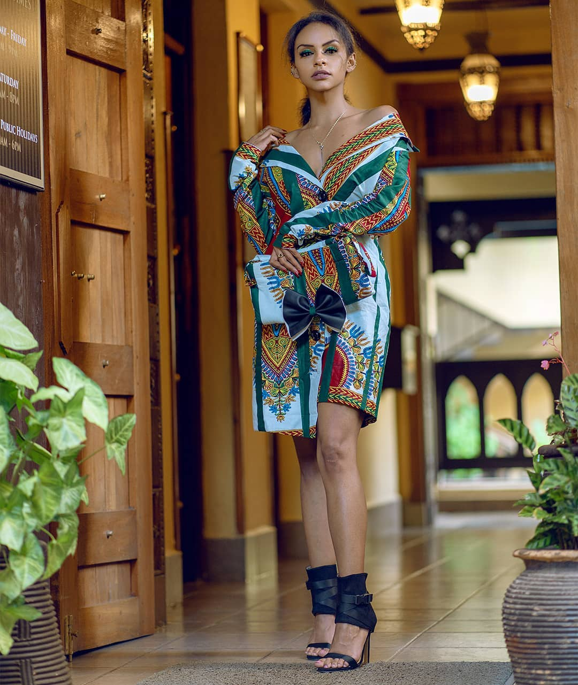

Linkosi Clothing was founded in 2019 by its CEO, Linkosi. I interviewed him about his inspiration behind the clothing brand and here is what he had to say and i quote,"I was inspired by the repetition of similar designs and i thought of coming up with something creative and unique at least to erase the rate of common attires." With that dream in mind, he went ahead to put it into reality and created a brand for himself, Linkosi Clothing, otherwise known as L&C, which is one of the leading fashion brands in Kenya which managed to scope an award for _**THE BEST CLOTHLINE BRAND OF THE YEAR IN 2019**_ at the XTREEM AWARDS

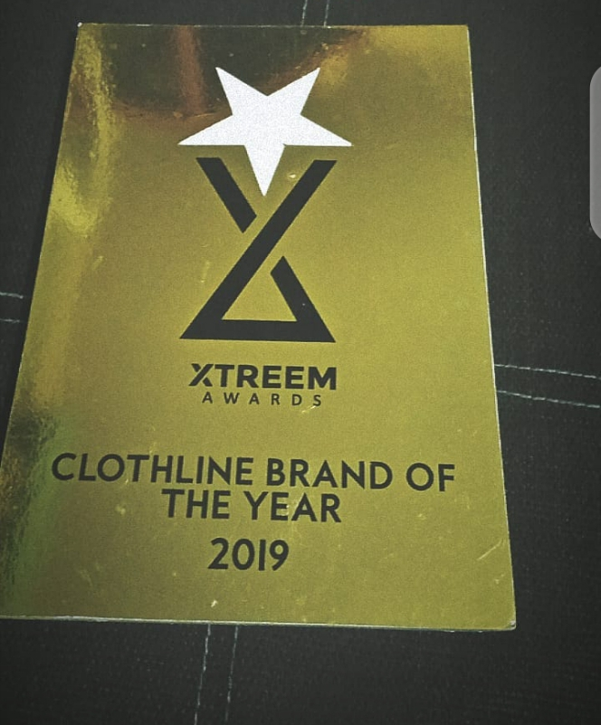

L&C offers a variety of outfits suitable for all occassions, whether its a chic style wear, dinner wear, casual wear, u name it, they got you covered. And Yes, they do not only focus on female outfits but also creative and well designed male outfits. So, next time ladies you wanna purchase an outfit for your man,

And gentlemen, you wanna purchase an outfit for your lady, hit up L&C and get amazing outfit designs that will blow your mind and ensure you've added ganster points to your other half.

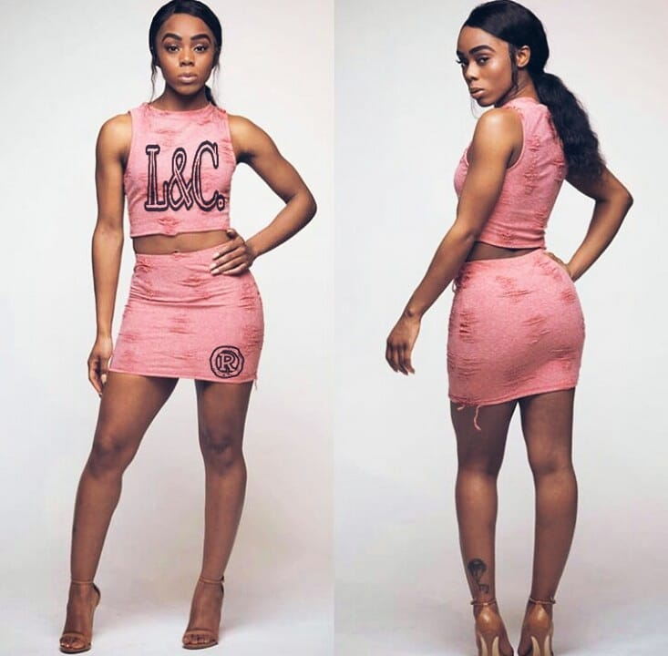

I absolutely love all their outfits but am a sucker for croptops, because anything with them in it is a total vibe. But loving croptops is not for everyone of course, so if its not your thing,

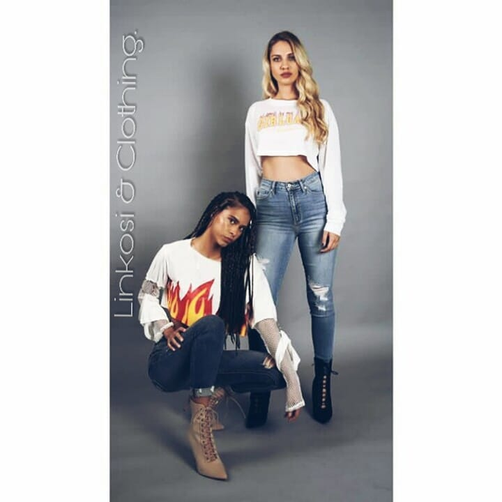

L&C definitely has a wide array of other outfit choices lined up just for you such as:

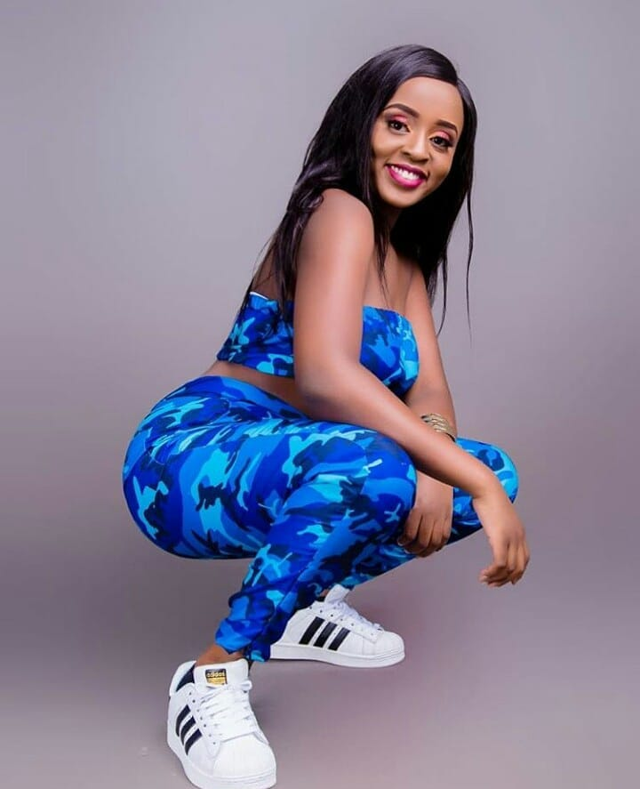

#### 2 piece girly outfits and suits

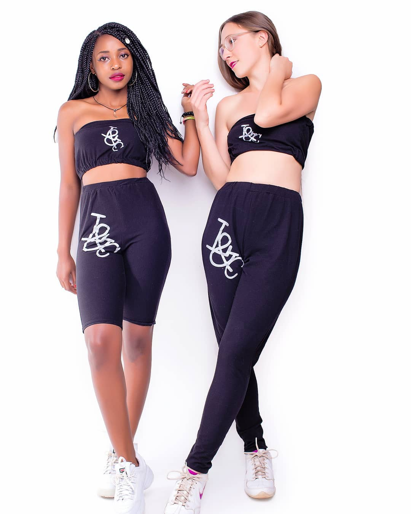

#### Sleevless combat, styled with an iconic modern sense check on street style

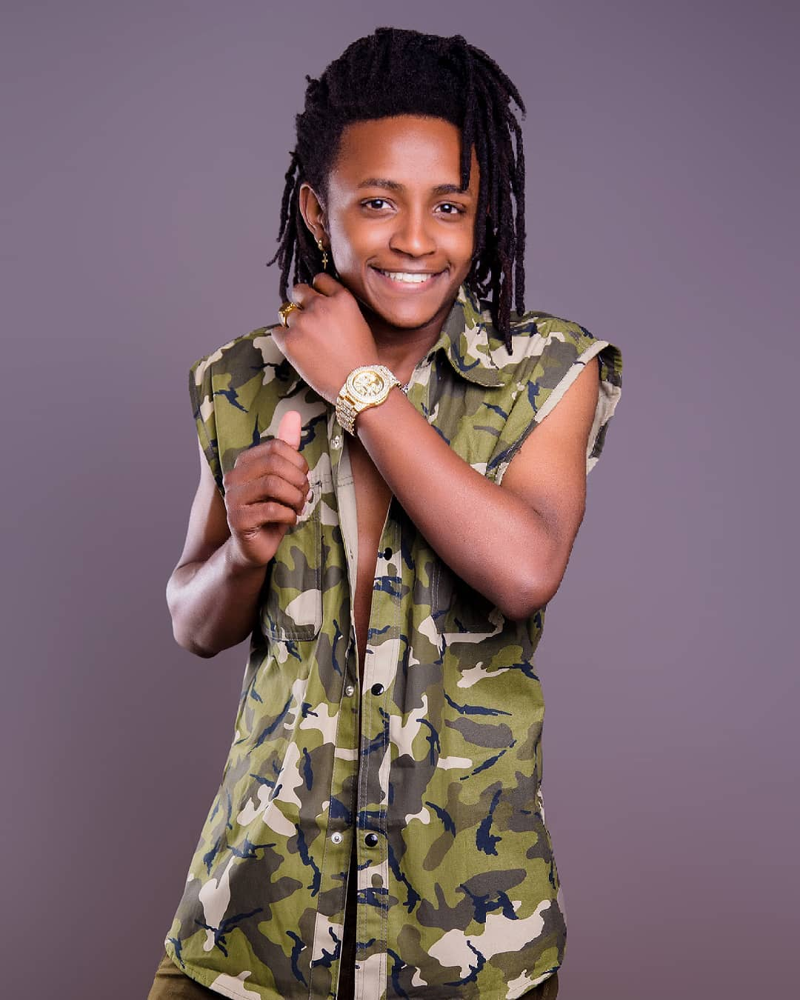

#### 2 Coloured mix and match modern creative jacket

#### Vivid ankara prints adorned with floral embellishments and fringing

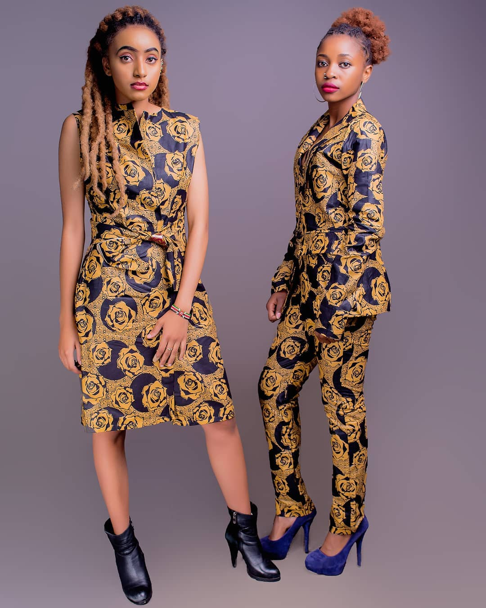

Aside from all these amazing designs, L&C recently launched a series known as _**THE C SERIES**_. What is the C SERIES?
The C series is an introduction that focuses much on the voice of the woman in the society. However, it does not only focus on this but also adds unity and celebrating diversity.

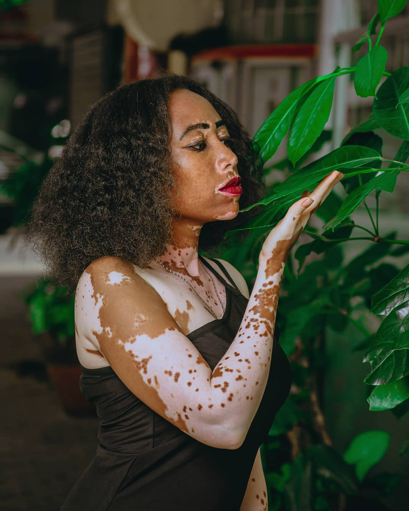

All this is gonna be incorporated in the different outfit designs. The main idea behind this, is to create awareness that people come from different backgrounds and each of us needs to be appreciated and celebrated. So what are you waiting for, support the movement in solidarity by getting yourself an outfit such as the ones below today before the end of the series in October.

An introduction of the Outwear, Casual Wear and Street Style Design;

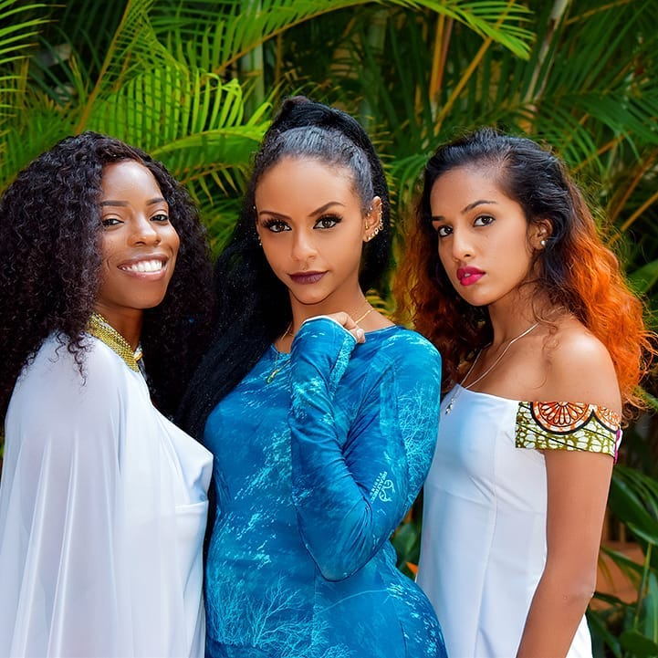

_**Q/A PORTION**_

#### Who are the brains behind L&C?

So i asked Linkosi if he had a team who come up with these amazing ideas and he said,"No, i do not have a team. I do more research as an individual and come up with the ideas." A pretty outstanding guy, don't you think?

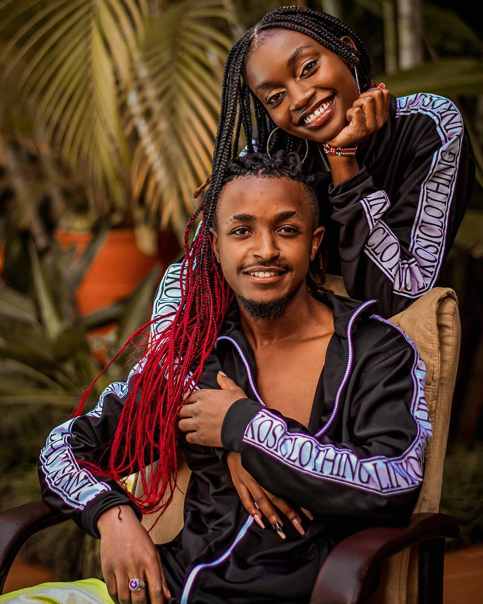

#### What are your future plans for L&C?

I also asked what L&C had to offer us in future and he said,"Nothing will remain constant, roots will be extended from garments to accesories, shoes and many more."
So ya'll better stay tuned for more uniqueness and creativity and lets go shop at Linkosi Clothing located at Outer Ring Road in Nairobi. I promise you, you won't be disappointed because you are sure to get quality clothes at an affordable price.

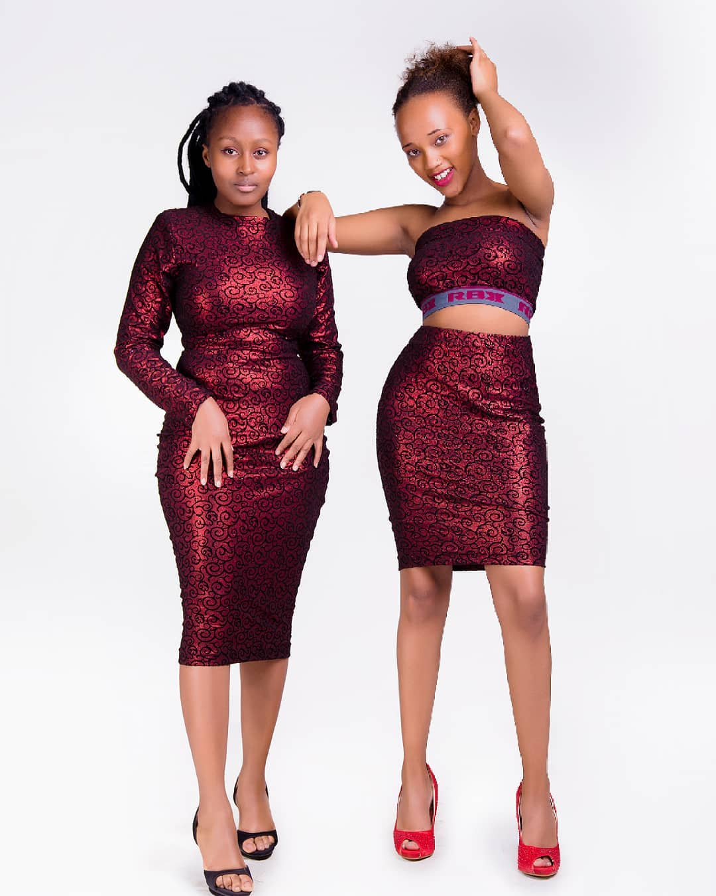
