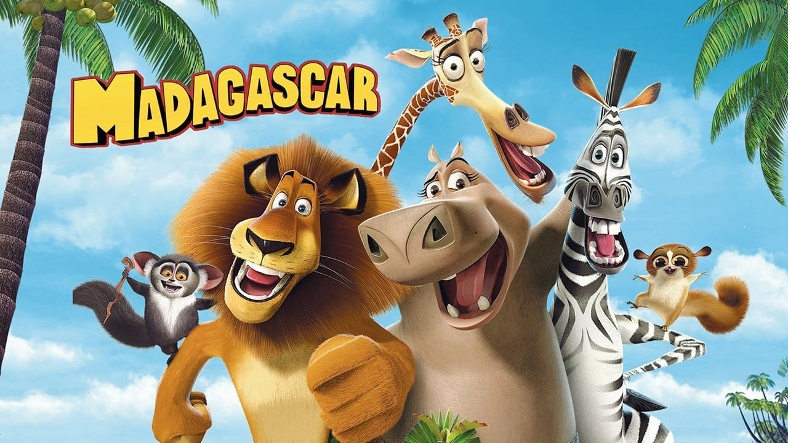
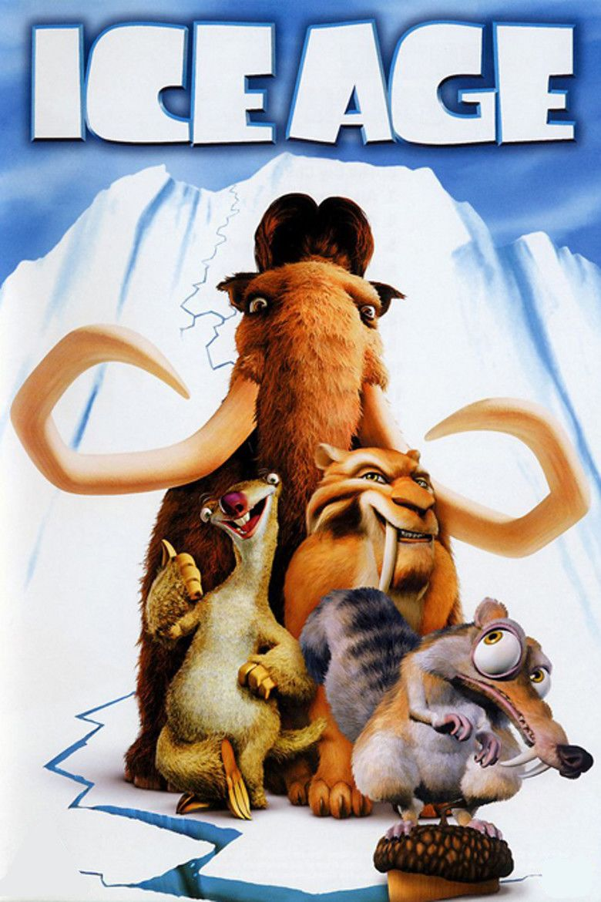
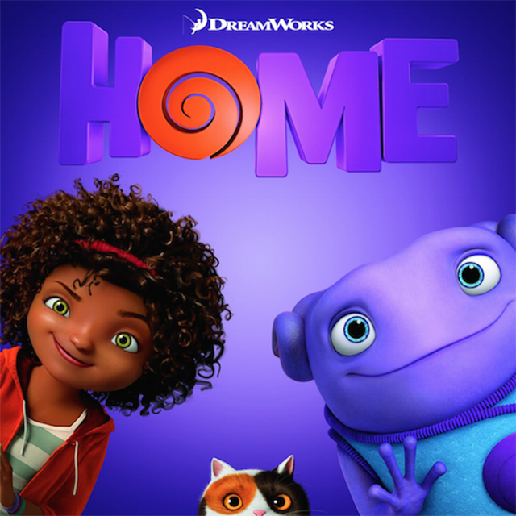
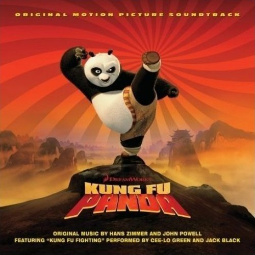
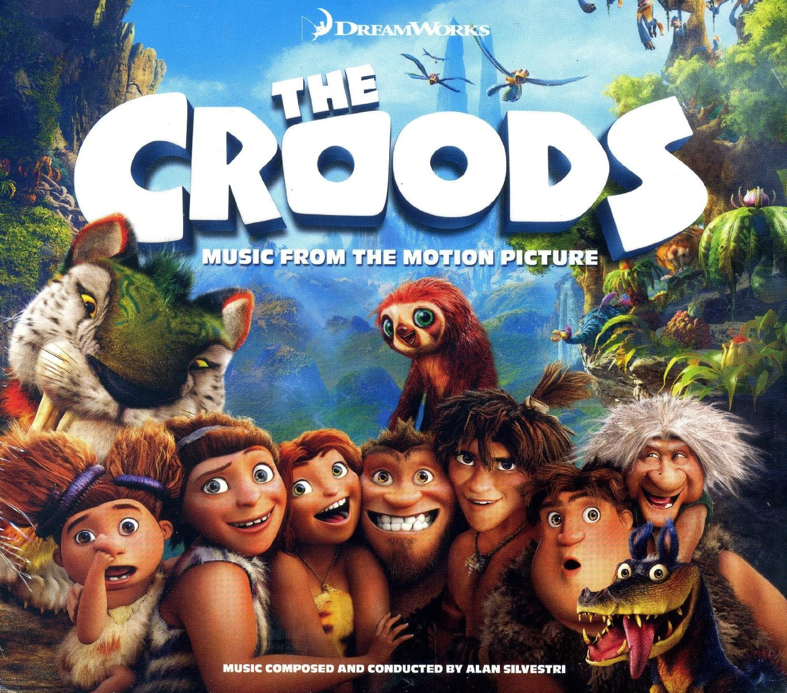
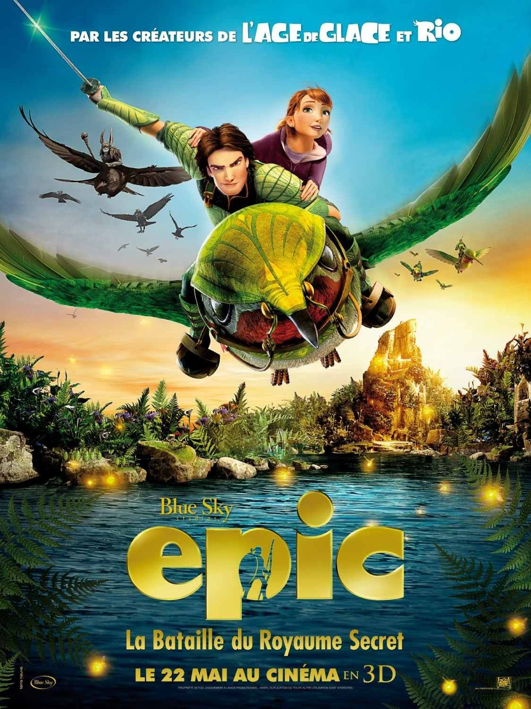
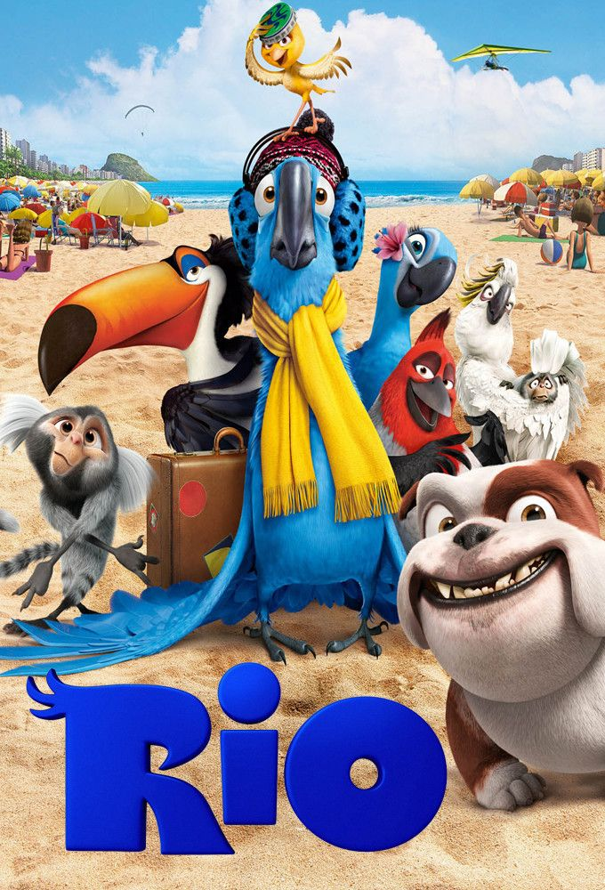
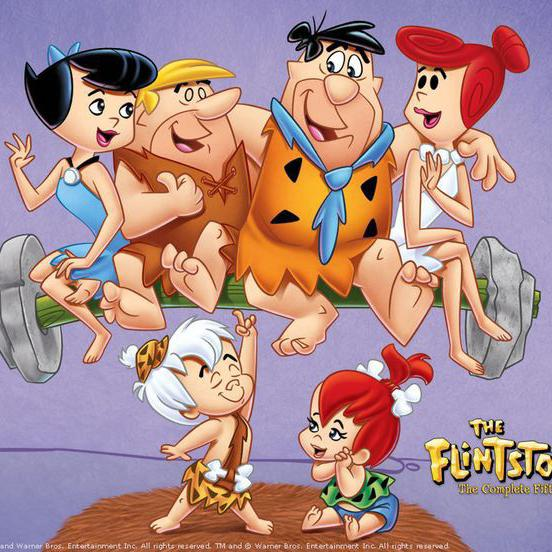
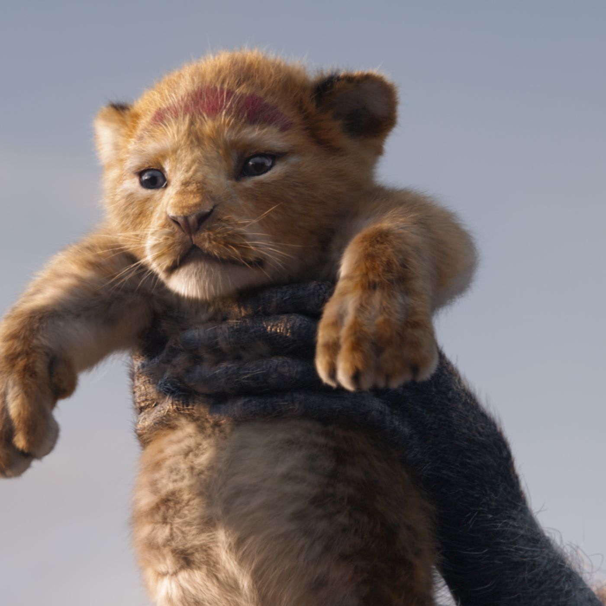

#### LEGENDARY ANIMATIONS

Animations are funny films that many people love to watch and indeed they offer an entertaining experience. The following are the most epic animations that most of us watched while we were still young.

_**SHREK**_

Shrek is one of the most legendary animations to be created. It was created in 2001 by Andrew Adamson and Vicky Jenson. Its narrative is about an ogre named shrek who embarks on a journey with a donkey to rescue a princess, Fiona from a vile lord and regain his swamp.

_**MADAGASCAR**_

Madagascar is another great animation that was created in 2005 by Tom McGrath and Eric Darnell. Its narrative is about four spolied animals from the New York Central Zoo escape with the unintentional help of four fugitive penguins. They subsequently find themselves in Madagascar amidst happy lemurs.

_**ICE AGE**_

Ice age is 20th century studios animation that was created in 2002 by Chris Wedge. Its narrative is about Manny the mammoth, Sid the loquacious sloth and Diego the sabre-toothed tiger who go on a comical quest to return a human baby back to his father, across a world on the brink of an ice age.

_**CARS**_

Cars is an animation from the film series cars and it was created in 2006 by John Lasseter. Its narrative is about Lightning McQueen, a racing car, learns a hard lesson in life when he damages a lot of property in Radiator Springs. His task is to repair the damage done before he can get back on the road.

_**HOME**_

Home is an animation that was created by Tim Johson in 2015. Its narrative is about Oh, a loveable misfit alien who is on the run from his own alien race, takes shelter on planet earth and befriends Tip, an adventurous young girl who is on a quest to find her displaced mother Lucy.

_**KUNG FU PANDA**_

Kung Fu Panda is from the film series Kung Fu Panda and was created in 2008 by Mark Osborne and John Stevenson. Its narrative is about an obese panda Po, a kung fu enthusiast, gets selected as the dragon warrior and he decides to team up with the furious five and destroy the evil forces that threaten the valley of peace.

_**THE CROODS**_

The croods was created in 2013 by Chris Sanders and Kirk DeMicco. Its narrative is about Grug and his family who embark on a journey to search for a new place to live after their cave is destroyed. A young boy helps them trek through unknown places to find new shelter.

_**EPIC**_

Epic is an animation created in 2013 by Chris Wedge. Its narrative is about Mary, a 17 year old teenager who shrinks in size and discovers a world inhabited by strange creatures. Soon she finds herself reluctantly pulled into a battle between good and evil forces.

_**RIO**_

Rio was created in 2011 by Carlos Saldanha. Its narrative is about a bookshop owner, Linda, who nurtures Blu , a macaw after smugglers lose him in Minnesota. When she takes him to Rio to help review his dying species, Blu is again abducted by few smugglers.

_**TOY STORY**_

Toy story was created in 1995 by John Lasetter. Its narrative is about a boy called Andy whose favourite toy is Woody and is worried that after Andy receives his birthday gift, a new toy called Buzz Lightyear, his importance may get reduced. He thus hatchesa plan to eliminate Buzz.

_**INSIDE OUT**_

Inside Out was created in 2015 by Pete Docter. Its narrative is about 11 year old Riley who has moved to San Fransico, leaving behind her life in Minnesota. She and her five core emotions, Fear, Anger, Joy, Disgust and Sadness struggle to cope with her new life.

_**HOW TO TRAIN YOUR DRAGON**_

How to train your dragon was created in 2010 by Dean DeBlois and Chris Sanders. Its narrative is about Hiccup, a viking who must kill a dragon to mark his passage into manhood and be initiated into his tribe. However, he ends up doing the exact opposite by befriending a deadly Night Fury.

_**THE FLINSTONES**_

The Flinstones was created in 1994 by Brian Leviant. Its narrative is about Fred Flinstone who helps out his friend, Barney Rubble in his time of need. Barney returns the favour by getting Fred his dream job. However, their friendship suffers.

_**LION KING**_

Lion King was initially created in 1994 but was rebooted in 2019. It was created by Jon Favreau. Its narrative is about a young cub, Simba who idolises his father, Mufasa and takes to his own royal destiny on the plains of Africa. But not everyone in the kingdom celebrates the new cub's arrival. Scar, Mufasa's brother and former heir to the throne has plans of his own. The battle for Pride Rock is soon ravaged with betrayal, tragedy and drama, ultimately resulting in Simbas
's exile. Now with new found friends, Simba must figure out how to grow up and take back what is rightfully his.
