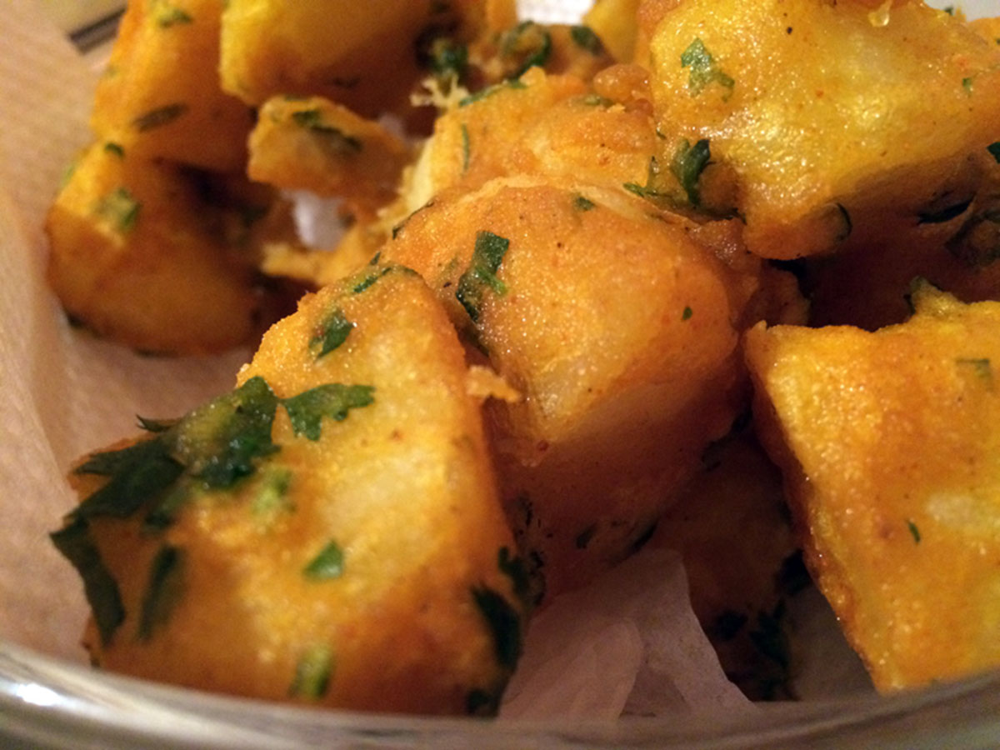

Bhajias and Viazi karai are delicious Swahili dishes that many people would love to know how to make but they do not know how to prepare it. Here's my step by step recipe for how i made bhajias and viazi karai for the first time. The procedure is similar but there are just a few slight differences between making both as you shall see. Bhajias and viazi karai are usually taken with ukwaju but they can be taken with ketchup as well if you lack the ukwaju.

#### HOW TO MAKE BHAJIA

##### INGREDIENTS

5 large potatoes

1 and 1/2 cups of home baking flour

1 tsp red chilli powder

Salt to taste

2 ginger roots

4 cloves of garlic

2 tsp tumeric powder

3 green chillies

Water to make a pancake like batter consistency

Cooking oil enough for deep frying

##### DIRECTIONS

1. Wash and peele all the potatoes.

2. Slice the potatoes into thin slices using a knife. This ensures they cook through.

3. Wash the ginger, garlic and green chillies and crush them into a paste which you will then add to the home baking flour along with the chilli powder, salt and tumeric powder. Mix everything together to ensure that all these ingredients are evenly distributed in the flour.

4. Add water in small amounts while continously stirring until all the flour is well mixed. Once the batter is at a consistency of moderately thick, stop adding water.

5. Pour oil onto a pan and heat on medium heat until it becomes moderately hot. This ensures the bhajias do not get burnt.

6. Take the potato slices and dip them into the batter one vy one making sure they are well coated before adding them to the heated oil.

7. Cook the bhajias for 1 and 1/2 minutes on each side or until the flour is golden brown and crispy on all sides.

8. Serve while hot and enjoy.

#### HOW TO MAKE VIAZI KARAI

##### INGREDIENTS

5 large potatoes

1 and 1/2 cups of home baking flour

1 tbs red chilli powder

Salt to taste

1 tbs turmeric powder

Juice from 5 lemons

Coriander leaves

1 tbs spring onions / 1 spring onion

Cooking oil enough for deep frying

Water to make a pancake like batter consistency

##### DIRECTIONS

1. Wash you potatoes well and the boil them with their skin on until they are completely cooked.

2. Make a paste by mixing the chilli, lemon juice and salt.

3. Add the baking flour, tumeric powder, coriander leaves, spring onions and salt to taste in a bowl. Add enough water to make a pancake batter consistency.

4. Once the potatoes are cooked completely drain all the water and allow them to cool completely before peeling off their skins with a knife.

5. Cut the potatoes into quarter wedges. Take each wedge and then divide into two.

6. Apply the chilli lemon paste in between and then dip them into the batter.

7. Coat the wedges all over with the batter and then deep fry in cooking oil that has been heated to medium heat.

8. Once the batter cooks and turns to a golden brown colour, take them off the hot oil and drain them off the oil.

9. Serve while hot with ukwaju or ketchup and enjoy.

