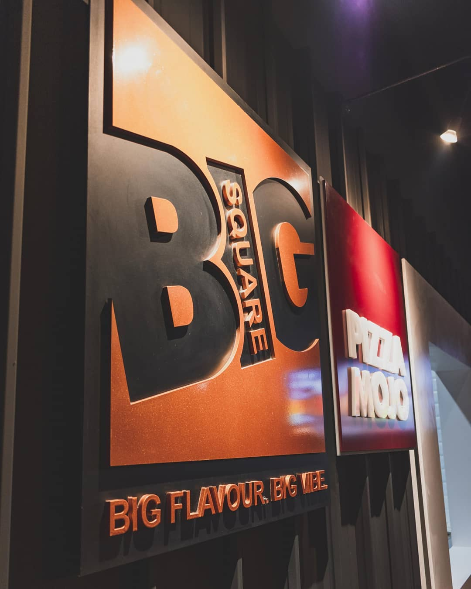
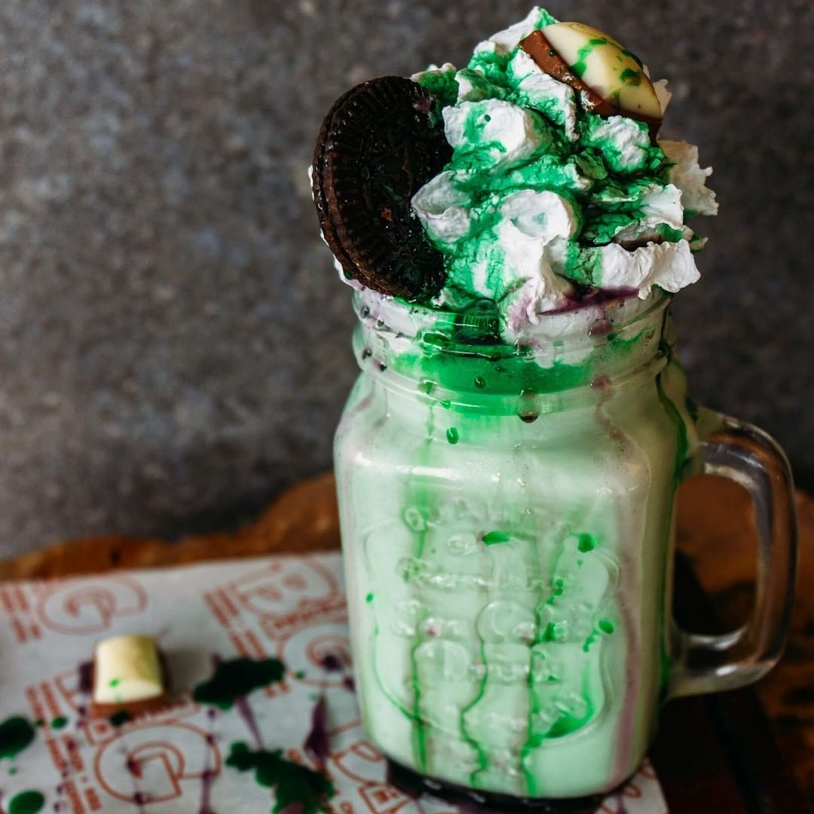
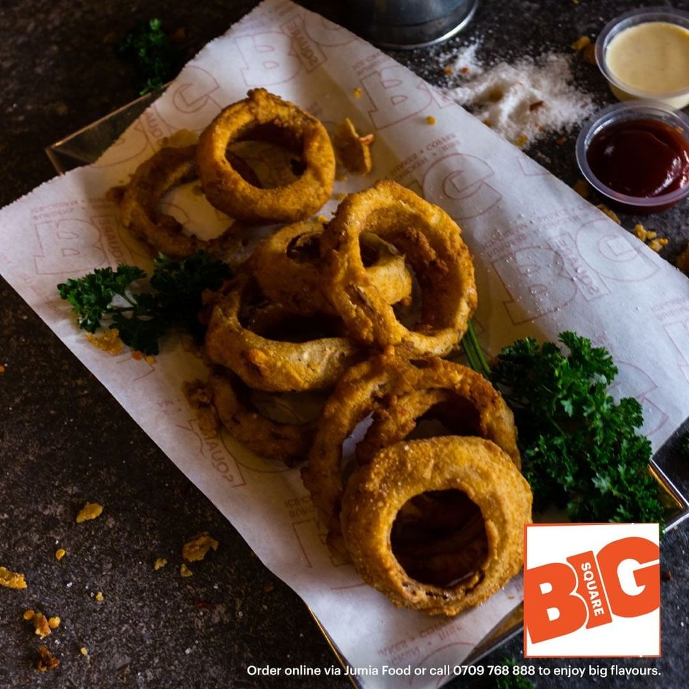

### Big Square

Big Square is a rapidly growing fast food chain restaurant with various openings at different locations in Nairobi and Mombasa and a recently opened location in town at Moi Avenue. The strategic location of the restaurant is great because its kinda hard to miss as your walking down Moi Avenue. The setup of the restaurant also offers you a calming and welcoming vibe especially because of their lighting, and of course it does not lack the key elements for most restaurants aside from the great food which is, WI-FI with a strong connection.

Everything is a treat at Big Square but i especially love their milkshakes specifically their megashakes. Their menu consists of these megashakes:The Green Goblin, The Cherry Cola, The Fudge Surprise and The Berry Mallow.The Green Goblin is by far my favourite megashake at Big Square. It contains vanilla ice cream, milk, mint syrup, blueberry sauce garnished with blueberry and topped with chocolate and oreo cookies. I especially love this milkshake because it leaves a minty yet sugary taste in your mouth with a craving to have more. This shake goes well with most of the foods on the menu, whether its just fries and chicken or a burger or pork ribs and fries or even if you wanted to order it with a side dish such as plain fries or onion rings. Once you finish the megashake, you easily experience a state of satiety and contentment.

I also loved the onion rings @Big Square. Onion Rings is a type of fast food which is usually served either as an appetizer or as a substitute for fries or salad. As a substitute for fries or salad, it can be eaten with a variety of dishes. Here at Big Square, onion rings are served with any of the burger combo meals, the chicken combo meals, the pork rib combo meals or even plainly as a side dish. Onion rings are made using onions, batter or bread crumbs and at Big Square they are served on the table piping hot on a small pan with ketchup and chilli to taste. The onion rings taste really good because the batter around the onion overwhelms the onion flavour so it is not going to leave the eating raw onion aftertaste or smell in your mouth.

#### WHAT TO LOOK OUT FOR

If you decide to have a glass of wine during Happy Hour or just after your meal, the wine menu is only consistent of a specific brand of house wine. There is no variety to choose from so it makes choices based on a person's preferred brand of wine difficult.
