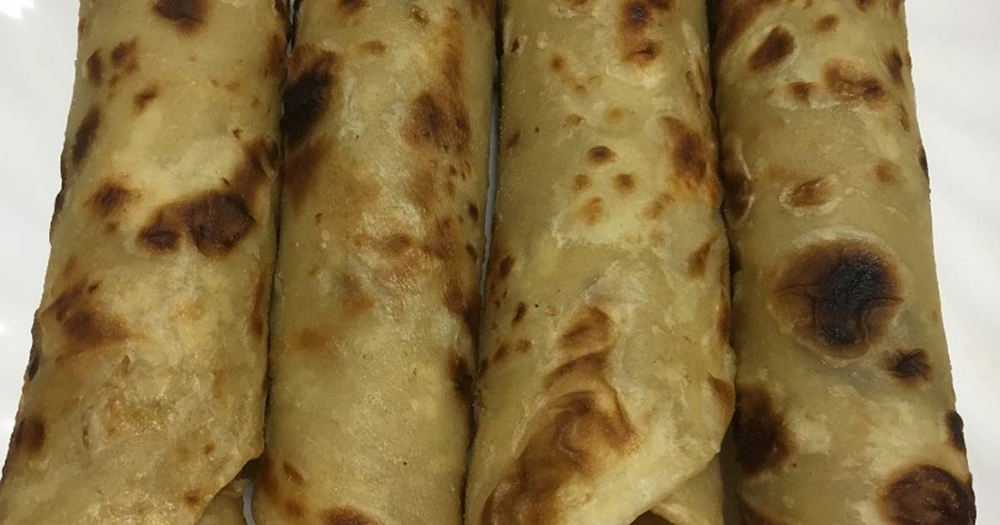
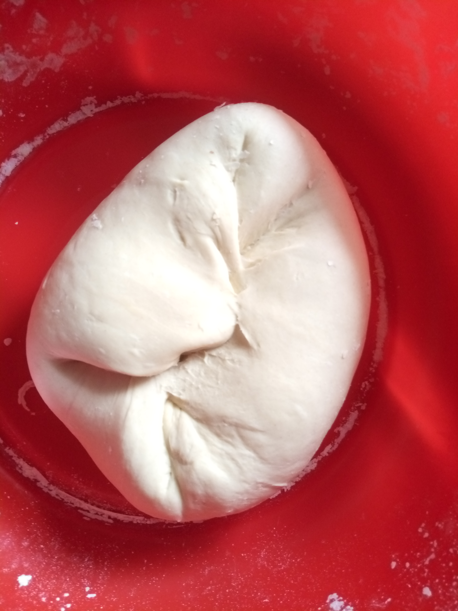
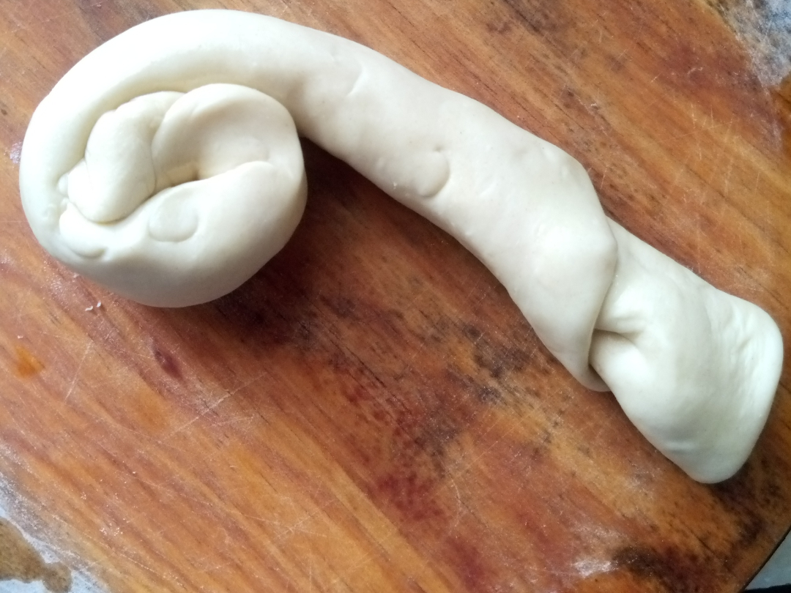
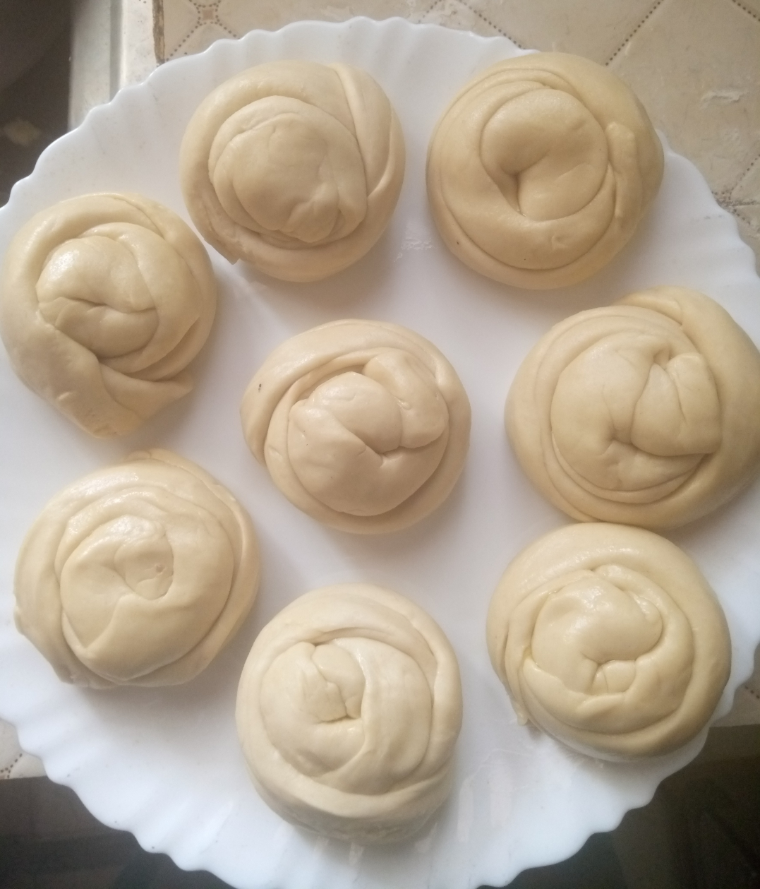
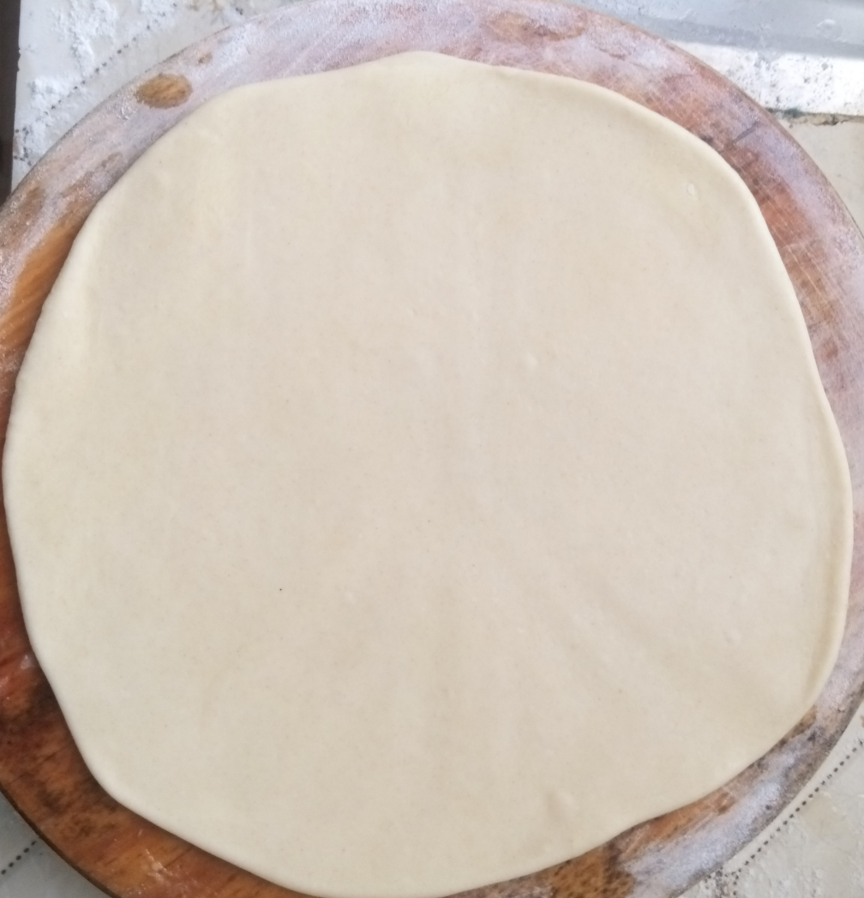
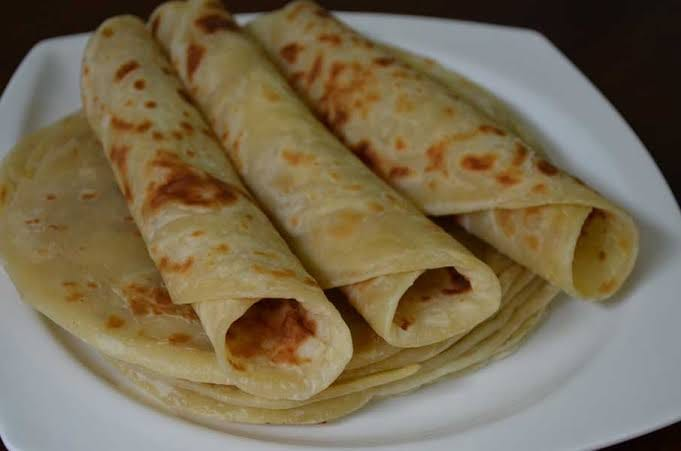

Chapatis commonly known as chapo are an all time favourite african dish that many of us struggle to know how to make perfectly. Well, if your a bachelor/bachelorette and would like to know how to make soft layered chapatis, well i got you covered.

#### HOW TO MAKE SOFT LAYERED CHAPATIS

##### INGREDIENTS

4 cups all purpose flour

1/2 a tablespoon of salt

2 tablespoons of sugar

Warm water

Cooking oil

Melted Margarine (Margarine is also known as blueband)

##### DIRECTIONS

1. In a bowl, pour flour and add the sugar, salt and 2 tablespoons of cooking oil then mix with your hands to form crumbs.  
   Mix it until you feel its kinda rough.

2. Add the warm water bit by bit as you knead the mixture. Knead for at least 5 minutes, if the dough is sticky, add flour bit by bit as you knead.

3. Continue kneading on your bowl for another 3 minutes.

4. The final product is that your dough should not be either firm or sticky but rather soft. Cover your dough and allow it to rest for 30 minutes.

5. After 30 mins, knead again for about 2 minutes and then cut them into balls.

6. Roll out the balls one by one into a circular shape with a rolling pin and them brush them with the melted margarine and fold them.

7. After folding them,this is how the should look like.

8. Once your done with this step, roll the balls out again and use a rolling pin to create their circular shape.

9. In medium heat, place your skillet and let it warm up then add a little bit of oil around the whole skillet. Put your chapati on top and apply oil on the top side then turn and fry both sides until brown. Once cooked, remove and place in a container and cover.

10. Serve while hot with your favourite stew or drink and enjoy.

Please Note!!!
If you want soft chapatis, you can decide to add milk instead of adding warm water. But then again if you choose not to use milk and instead use warm water, kneading thoroughly helps achieve this and also the margarine application step. Also, in the ratio of salt to sugar, sugar should always be more than salt and they should not in any way be equal because the salt will overwhelm the sugar.
