Makeup is nowadays a MUST HAVE tool for all especially for ladies. Makeup is basically cosmetic products that help to enhance a person's beauty and make them more attractive. Most people who have makeup have complete makeup kits and these is my take on the essential products that every kit should have.

#### THEE MAKEUP KIT MUST HAVES!!!

1. Eye shadow palette

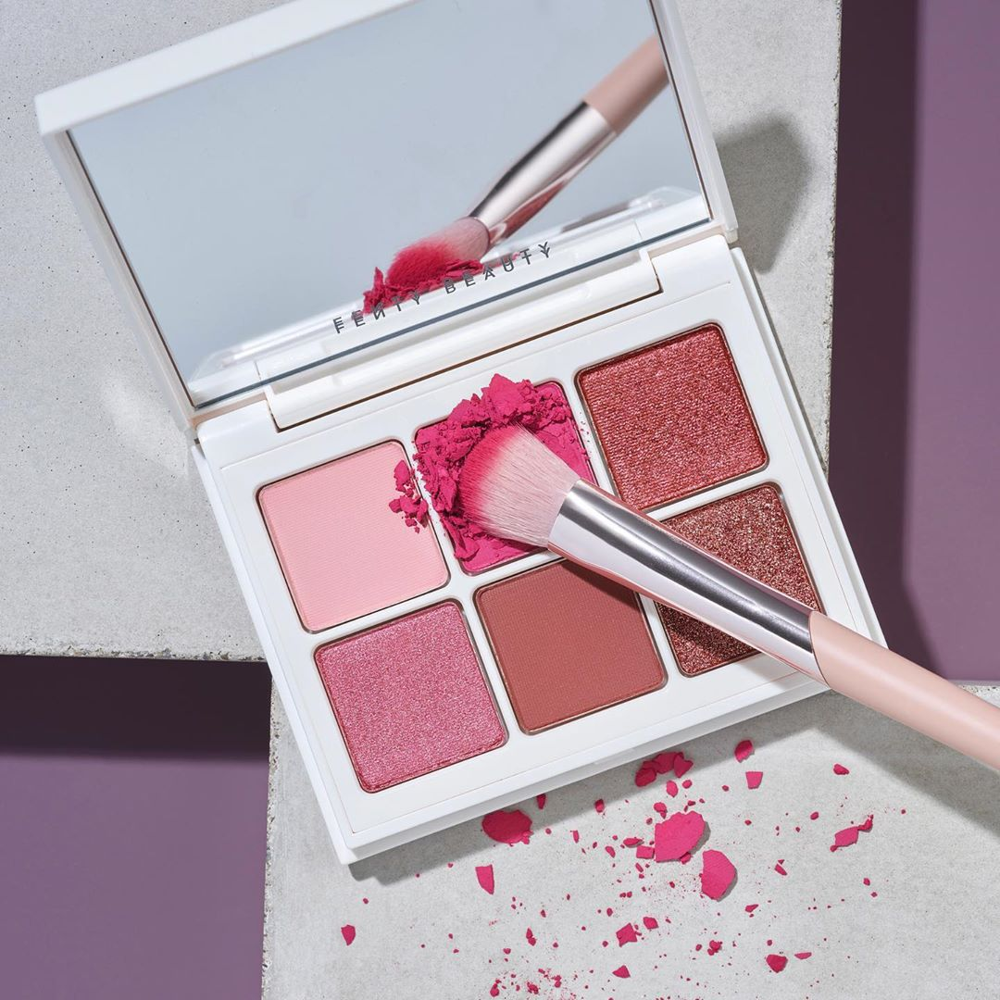

Eye shadow is a makeup product that is usually applied on the eyelids and under the eyes. It makes a person's eye to look unique and attractive. Eye shadow can make one's eye appear larger, compliment one's eye or draw attention to it. It is therefore a must have if one desires to add depth and dimension to one's eye.

2. Lipstick

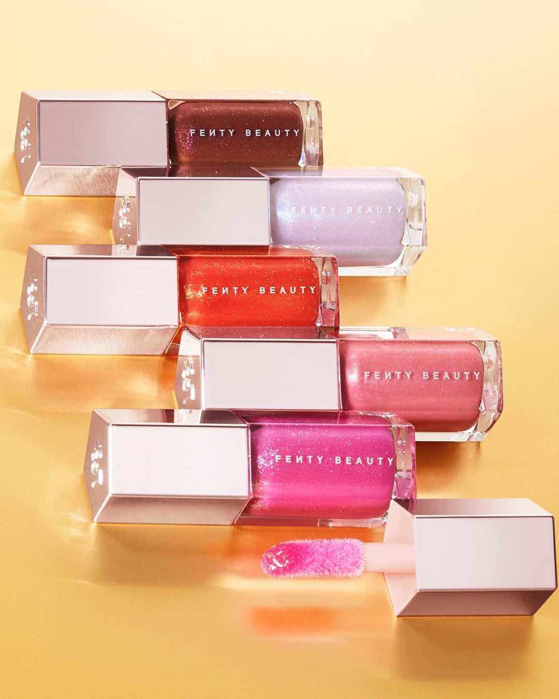

Lipstick is a cosmetic product that is coloured and is applied on the lips from a small solid stick. Lipstick is a girl's best friend and it exists in many colours and types. Some lipsticks are also lip balms to add colour and hydration. Many women wear lipstick when they leave home and they continue wearing it all day long. However, there are many lipsticks which contain lead which is extremely harmful and can cause irritation and chapping on the lips, this is why you need to prep your lips before you apply lipstick and you should also not go to bed with lipstick still on your lips.

3. Makeup brushes

A makeup brush is a tool with bristles and is used in makeup application and when the cosmetic products are applied using the appropriate brush, they blend betterinto the skin. Makeup brushes are of different sizes and each has its different purpose, some of these brushes are; contour brush, blush brush, concealer brush, foundation brush and the bronzer brush among others. When picking a makeup brush, choose one that is full, soft and rounded for application of powder because it is able to gather a good deal of powder and the application on your face is with ease.

4. Blush

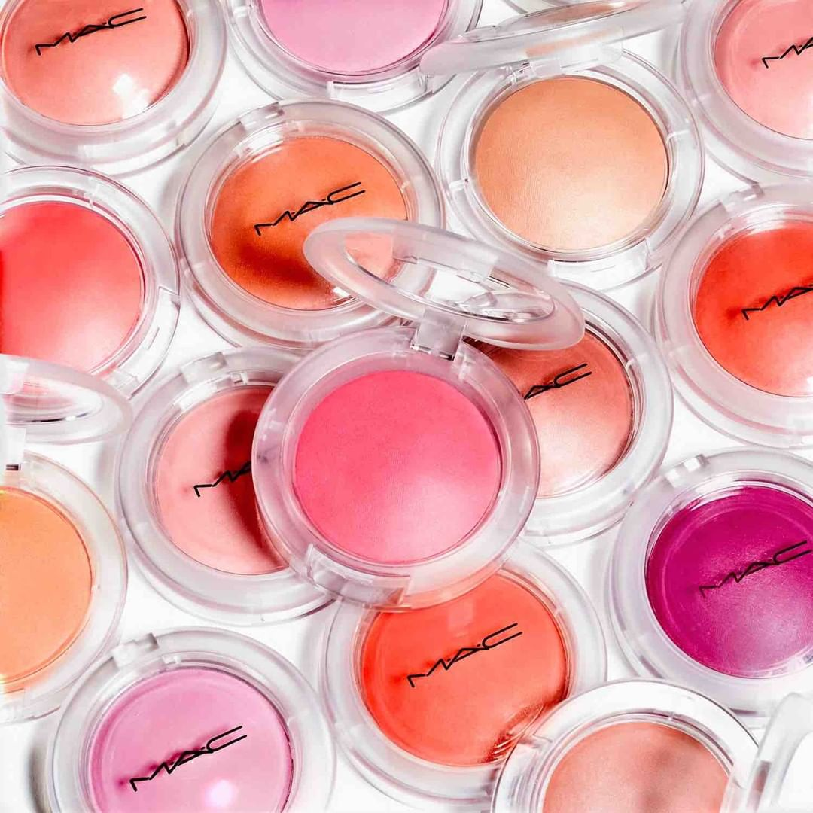

Blush is a cosmetic product that is applied on the cheeks to add a flush of colour. Blush tends to come in variations of pink, sometimes with peach undertones. Blush is important because warms up cool-toned, fair skin and makes you glow. It even adds depth to darker skin tones. Blush is applied by sweeping it from the ear down the cheekbone towards the mouth. If you add a touch of blush to the chin and blend it well, it will make your face appear longer. The blush should never extend lower than the tip of the nose.

5. Eye liner

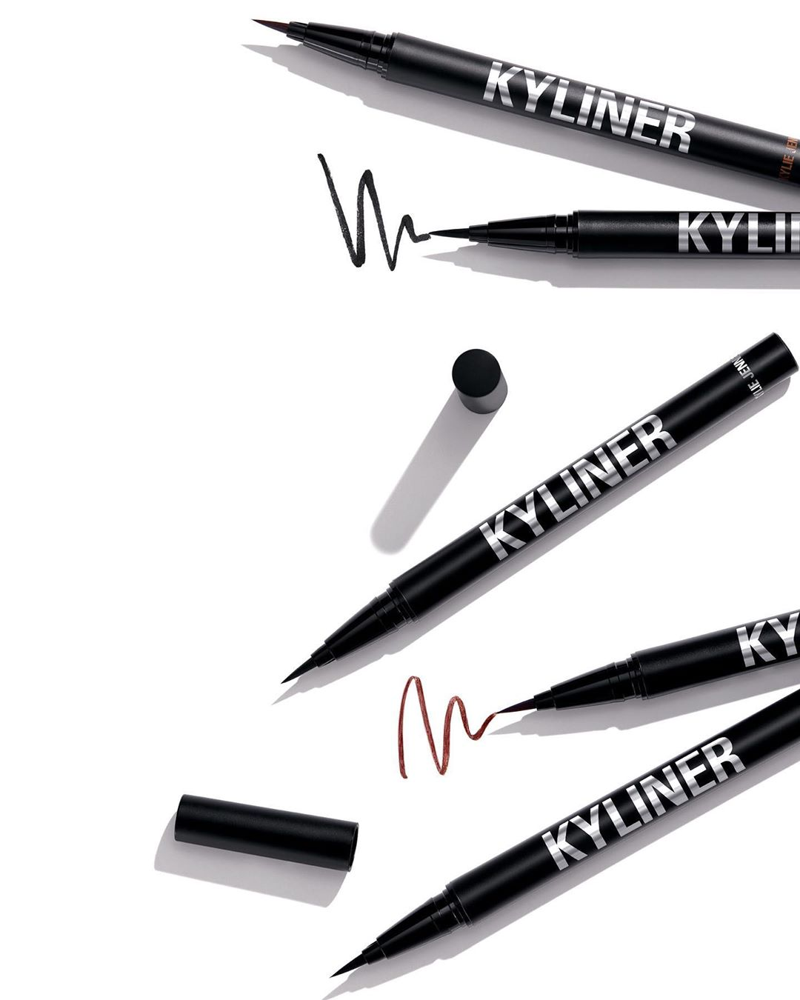

Eye liner is a cosmetic that is applied as a line round the eyes to make them appear larger and noticeable. Eye liner can be drawn above upper lashes or below lower lashes or both. Eye liner draws attention to the eye and can enhance or even change the eye's shape making the lashes to look lush.

6. Setting Spray

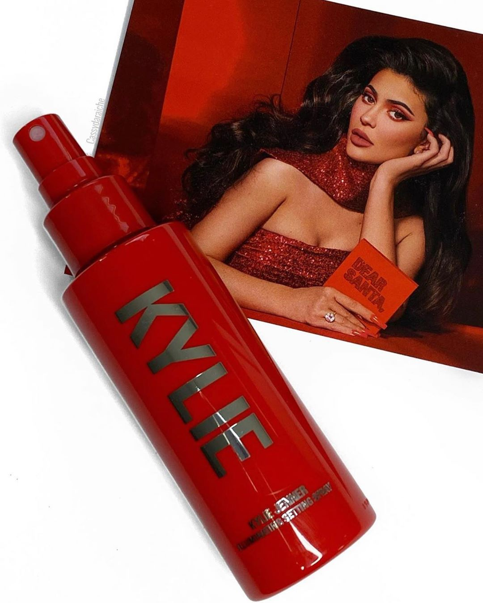

Setting spray is a cosmetic product that preserves applied makeup for long periods of time. Finishing sprays are also used but typically for the purpose of moistening the skin, that is why they are used to reset makeup during the day to prevent any cakeiness and keep it fresh for longer. Setting sprays make a big difference especially with oily skin since it helps the makeup not to fade, cake, run or settle into fine lines and wrinkles.

7. Foundation

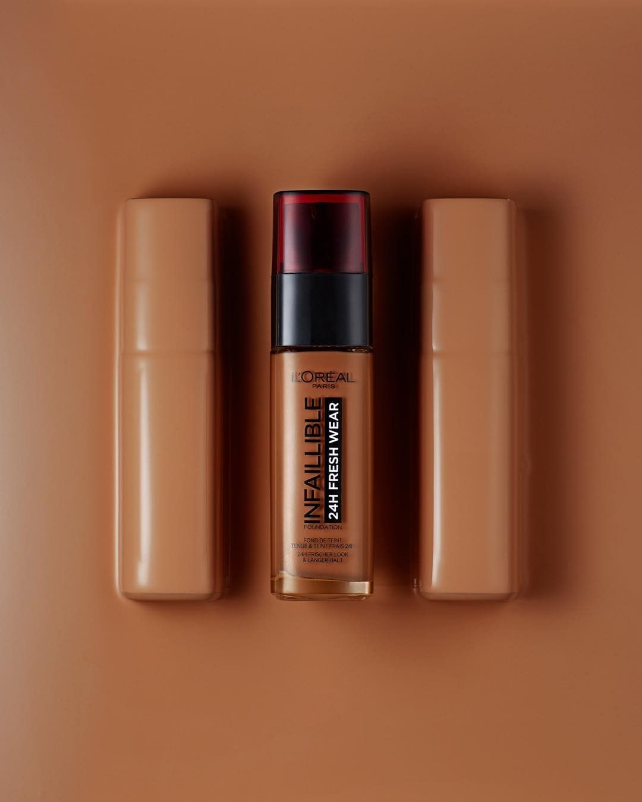

Foundation is a liquid or powder cosmetic applied to the face to create an even uniform colour to the complexion and to cover the flaws. Foundation is important because it covers imperfections and gives a dewy or matte finish. It acts as the base for easy application of other products such as blush, concealer and highlighters. Some foundations also function as moisturizer or sunscreen.

8. Highlighter

Highlighter is a cosmetic product that reflects light and is used for contouring. It is applied to the face to brighten the skin and create the perception of depth and angles. It is also used to push features back and it creates the illusion of brightness and height. Highlighter can make the darker area of your face, like under the eyes brighter, it is however not a must that you apply it.

9. Bronzer

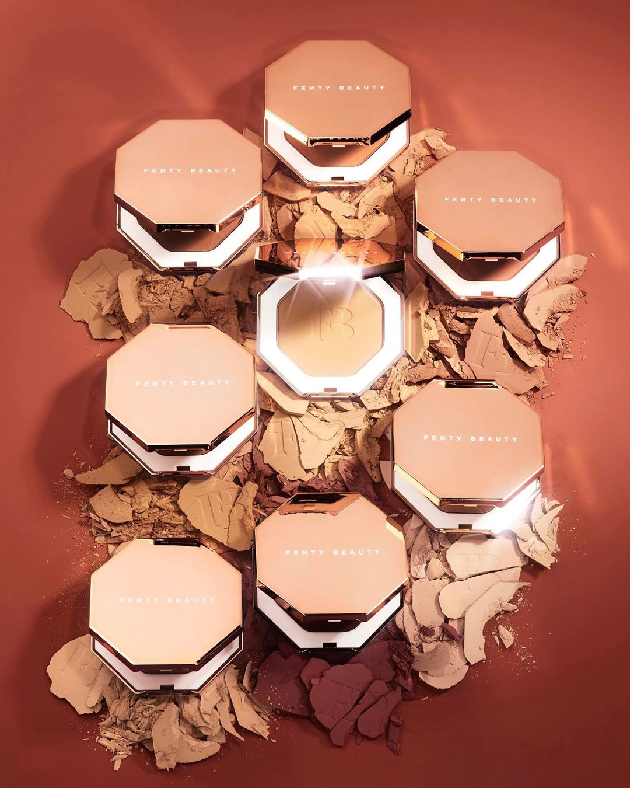

Bronzer is a cosmetic product that is used to emulate a sun-kissed glow and enhanced tan. It is used to darken areas of the skin without masking it and it makes the skin look radiant and healthy. Bronzer is typically brown or gold in colour. Bronzer is brushed on the perimeter of the face that includes cheeks, jawline, edges of the forehead and nose. Bronzer goes on after face makeup; foundation, concealer and powder but before you add blush. Using a soft brush controls your placement onto the skin.

10. Concealer

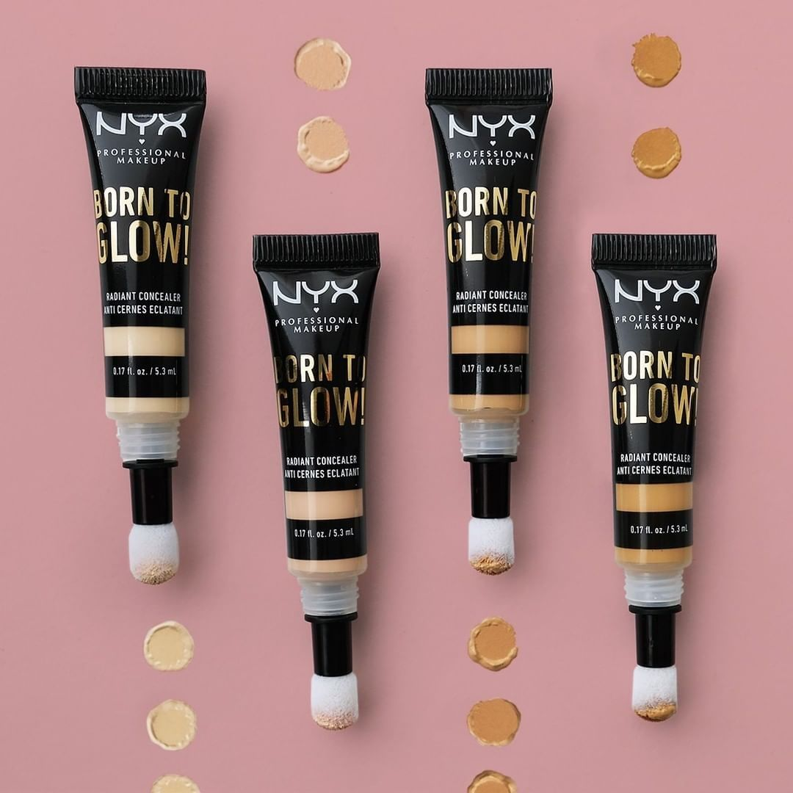

Concealer is a cosmetic product that is used to mask dark circles, age spots, large pores and any other blemishes on the skin. It is similar to foundation but it is thicker and it blends imperfection into the surrounding skin tone. Concealer is applied after foundation has been applied all over the face and it is not meant to be used on your entire face because it hides blemishes.

11. Mascara

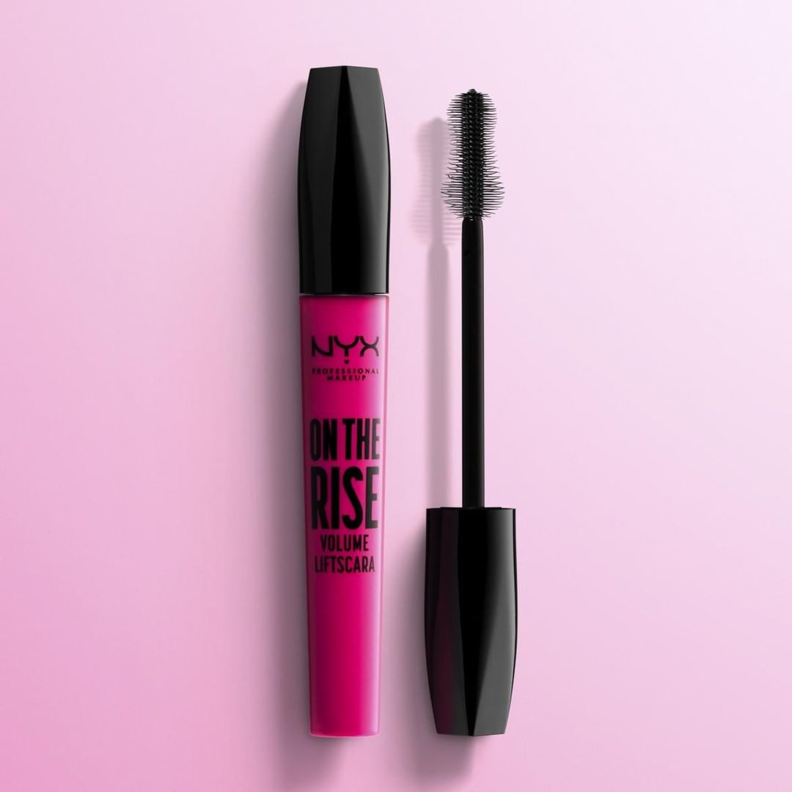

Mascara is a cosmetic for darkening and thickening the eyelashes. Mascara darkens and intensifies natural eyelashes drawing more attention to the eyes. Mascara should not be used on the daily because the continuous tugging at the lashes can cause them to become weaker and eventually make them fall out.

12. Primer

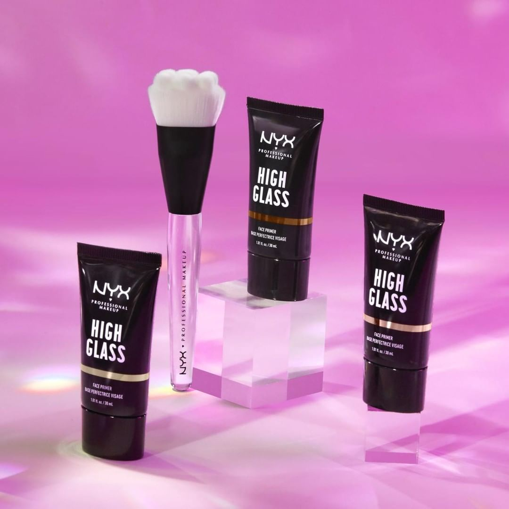

Primer is a cosmetic product that fills in small imperfections, pores, small lines and wrinkles. Using a primer allows you to use less foundation thus avoiding the heavy spackled look. Primer creates an extra layer between your skin and makeup and it helps make up last longer, smooths the skin surface and evens out the skin tone. Before applying foundattion, you should wait for around 5 minutes after applying primer. Primer is option unless your makeup has to last through a night.

13. Moisturizer

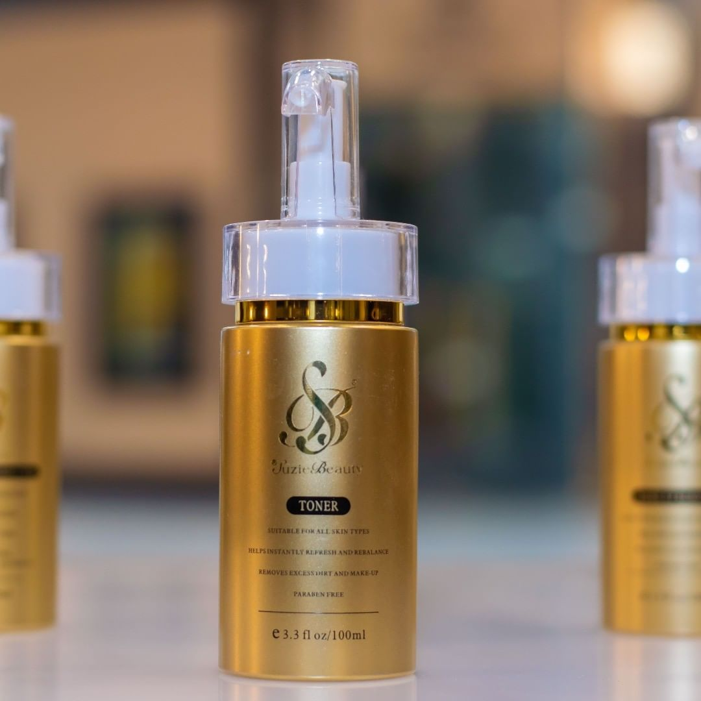

Moisturizer is important for standard routine skin care particularly the face. It helps to rehydrate the face and leaves it feeling softer and smoother which helps it retain elasticity for longer and reduces signs of aging.

14. BB cream

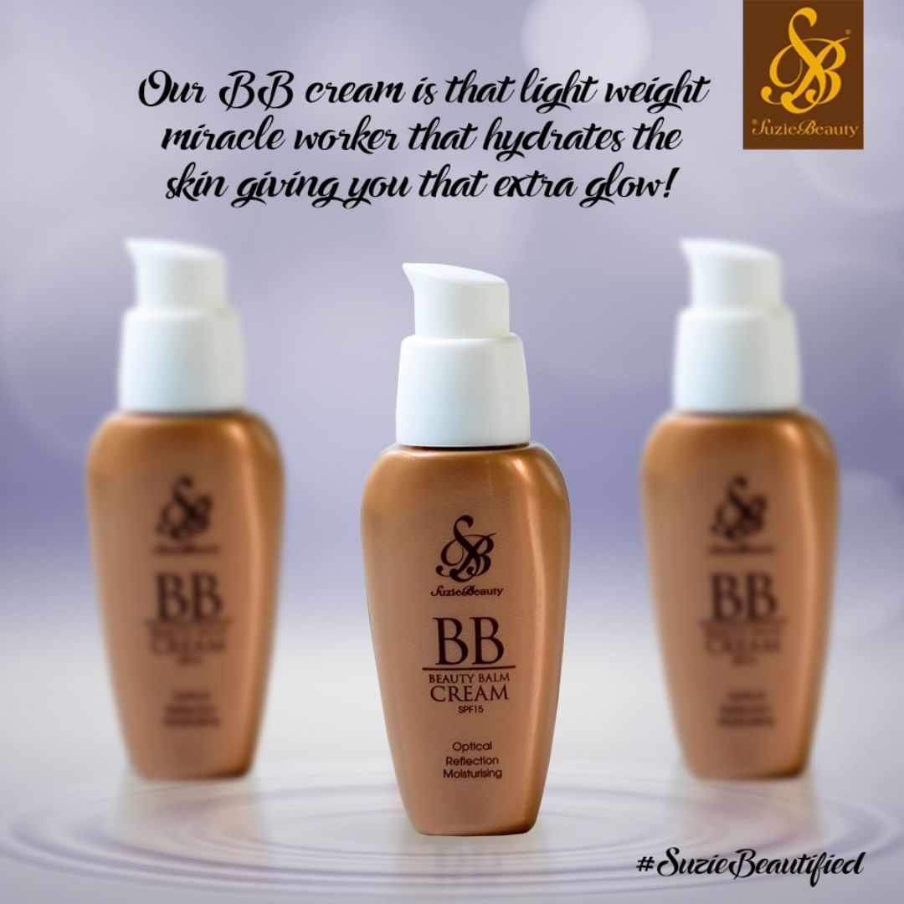

BB cream is a cosmetic product with a creamy formulation and is used to even out the skin tone. BB stands for beauty balm. BB creams are usually lighter than foundation and are used for sheer coverage. BB cream can be used daily for oily skin without looking caked. BB cream allows the skin to breathe and it can be used as a moisturizer, primer, foundation and even concealer.

15. Compact

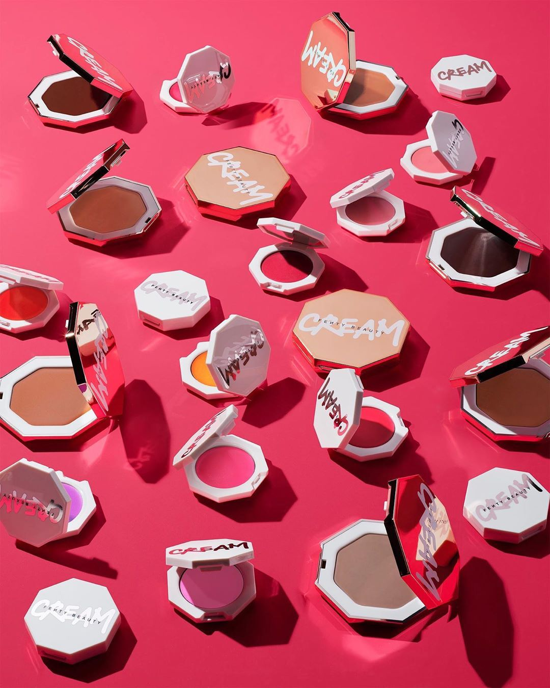

Compact is a powder box that contains a mirror, pressed or loose face powder with a powder puff. It is best used for combination to oily skin and it has to be appliedon top of your liquid or creamy foundation so that it will not slide down your face. Compact powder can be used daily provided it suits your skin and is authentic so that it does not make your skin dull or harm your skin.

16. Eye brow pomade

Pomade is a cosmetic product that is used on the eyebrows and is the secret to all the bold brows givimg it a dramatic and defined look. Pomade makes thicker brows more powerful. Pomade gives brows a more natural look as opposed to pencils.

17. Makeup remover wipes

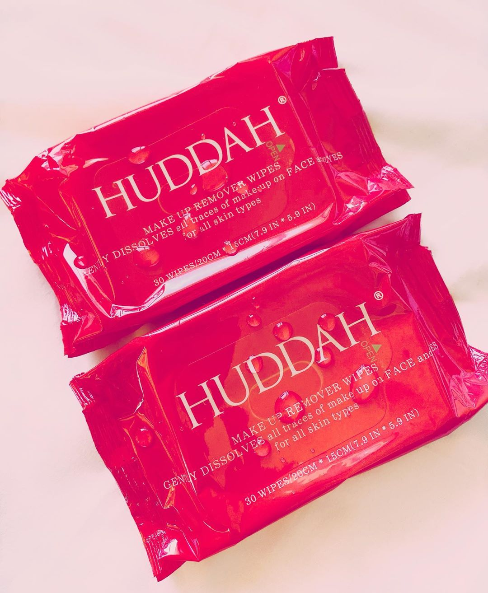

Makeup remover wipes are like moistened tissues that are used to remove makeup from your skin. It gently dissloves all traces of makeup. However, you dont have to use makeup wipes to take off your makeup, you can also use micellar water which can be dabbed onto a cotton pad and wiped across your face, eyes and lips.

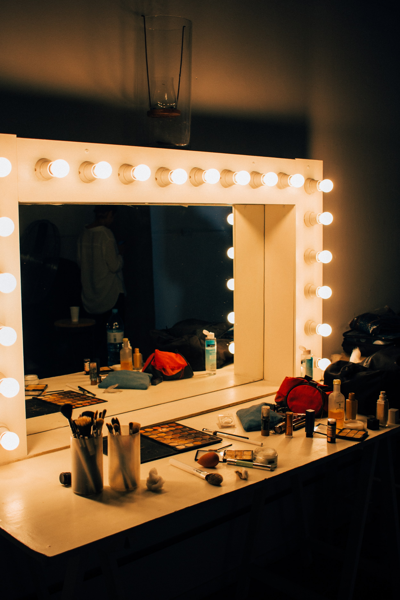
