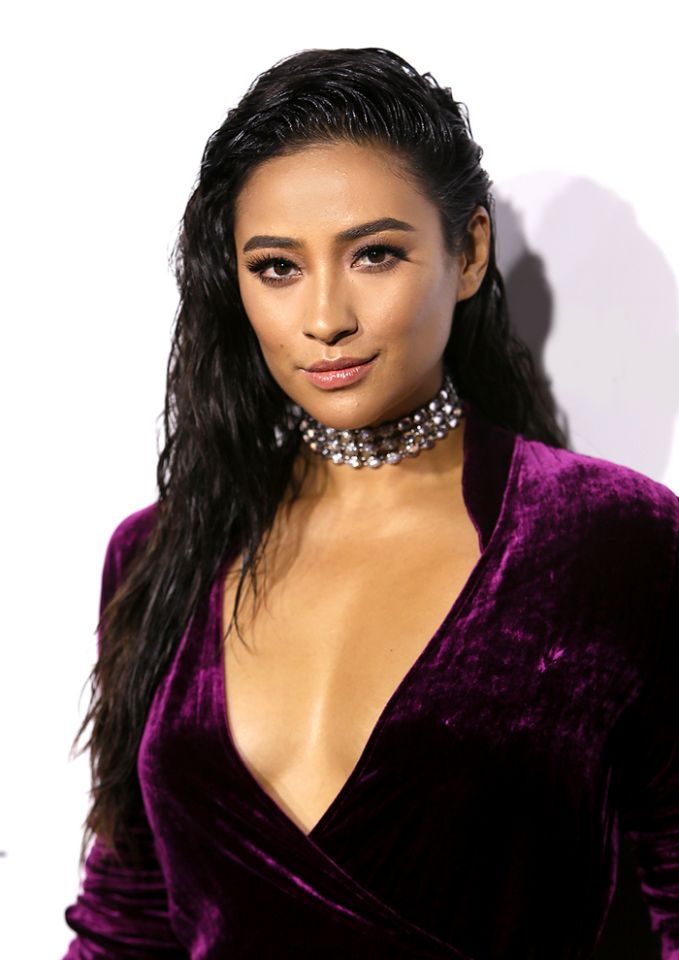
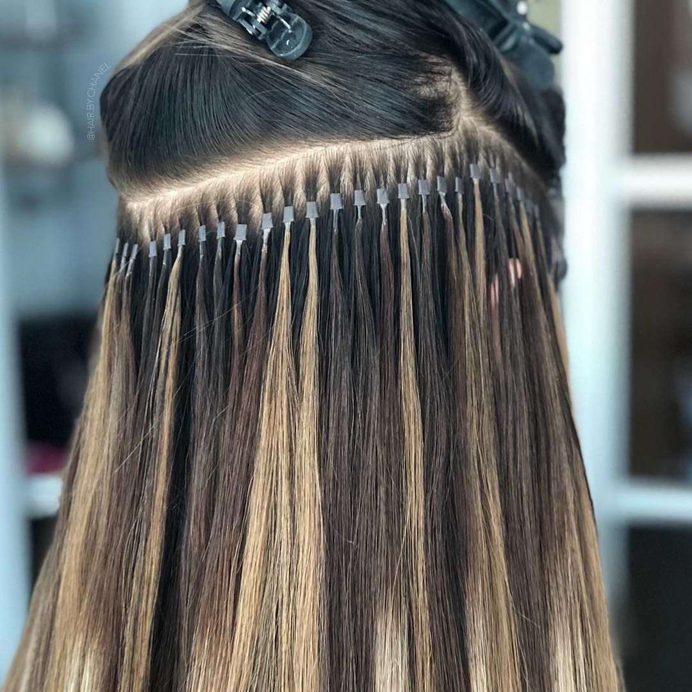
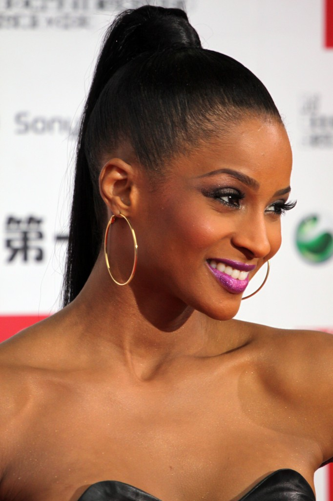
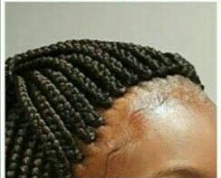
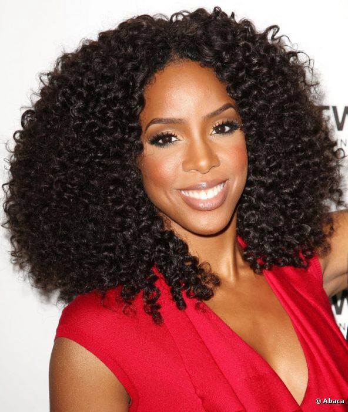

Every lady is obsessed with having the perfect edges, if you are having weak or thin hair, it may be as a result of your hairstyles. Here is a list of some of the hairstyles you may not realise are damaging your hairline.

#### THE HAIRSTYLES YOU MAY NOT BE AWARE ARE DAMAGING YOUR HAIRLINE

##### FIVE: WET HAIRSTYLES

If you wanna avoid major hairloss or thinning of hair, you should definitely avoid tying your hair upwards when it's wet. Wet hair is more easier to break off as compared to dry hair because the water makes hair softer thus can easily fall off from the roots with a simple gesture such as combing through with a hair brush. Hair products that allow you to rock the wet look also have negative side effects to the hair that may lead to it becoming damaged, they may also cause the hair to become weak. Tying your hair upwards when wet and then pulling on the hair later will definitely make your hair fall off.

##### FOUR: HAIR EXTENSIONS

Hair extensions that are permanent have the risk of damage to the roots of your hair as well as the risk of pulling, this is moreso because permanent extensions are either applied using glue or physically bonded to small strands of hair. If you use extensions regularly, you place alot of pressure on the root hairs pulling the hairs out and leading to permanent damage on the hair follicles. So regular use of extensions will cause your hair to eventually become more brittle and thin making it prone to falling off. However, not all extensions cause damage to your hair, clip in extensions for temporary use and tape in extensions for permanent use are the more advisable choice. Also you should choose the right extension dependent on your type of hair and treat your treases well to avoid hair breakage.

##### THREE: PONYTAILS

Putting your hair in a ponytail can cause damage to your hair especially if you tie your hair upwards tightly, therefore, you should definitely avoid putting your hair in the same exact position when your tying it upwards. Sleeping with your hair in a ponytail can also cause hair loss because the hair becomes constantly pulled upwards and may become weaker thus leading to hair damage.

##### TWO: TIGHT BRAIDS OR BRAIDS NEAR THE HAIRLINE

Braids are a great hairstyle that am sure many ladies have tried. However if your stylist braids your hair very tightly or braids your hair near your hairline, it will definitely lead to damaging of your hair. It is very easy to tell if your braids are tight, one you will definitely feel uncomfrtable and you will feel as if someone is pulling on your hair, also when you notice your scalp and edges have sore bumps and also sometimes you may develop a headache after your hair is done. Constant tight braiding which pulls on the hair, strains the roots leading to breakage.

##### ONE: CROTCHET BRAIDS

In order for you to have any crotchet hairstyle, your hair must first be braided with cornrows at the base. If your cornrows are braided too tightly, it can cause your hair roots to become loose because of the intense pressure leading to brittle and thin hair. Crotchet braids should not be too close to the ends of your scalp. The process of using the hook to put the add-on hair extensionss may also contribute to the damaging of the roots. If cornrow braids are tightly braided and left for too long, they can lead to loss of a lot of hair making your hairline to be pulled back.
