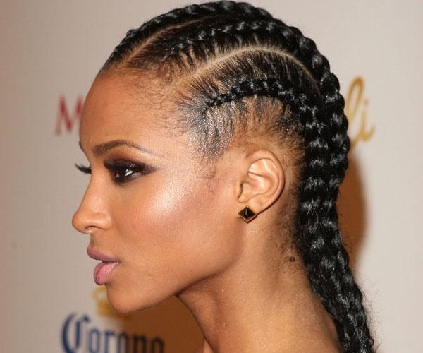
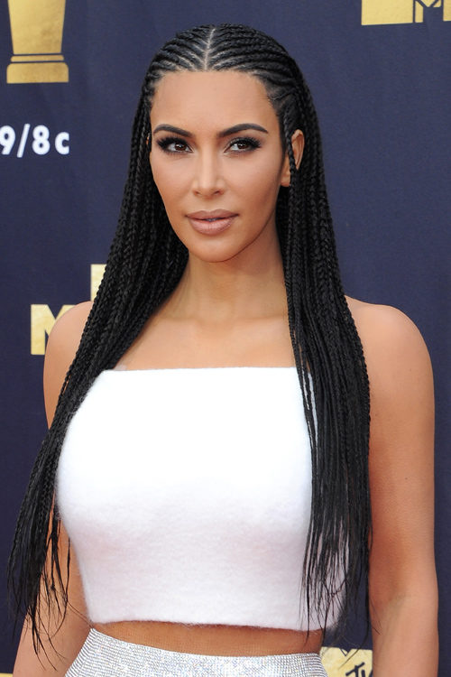
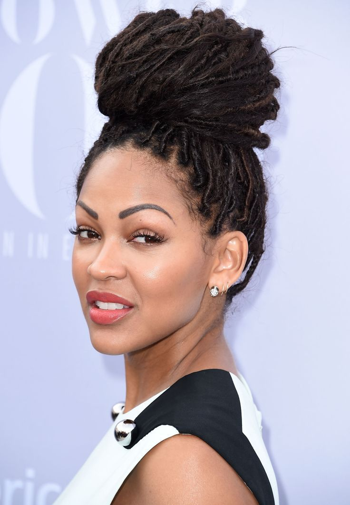
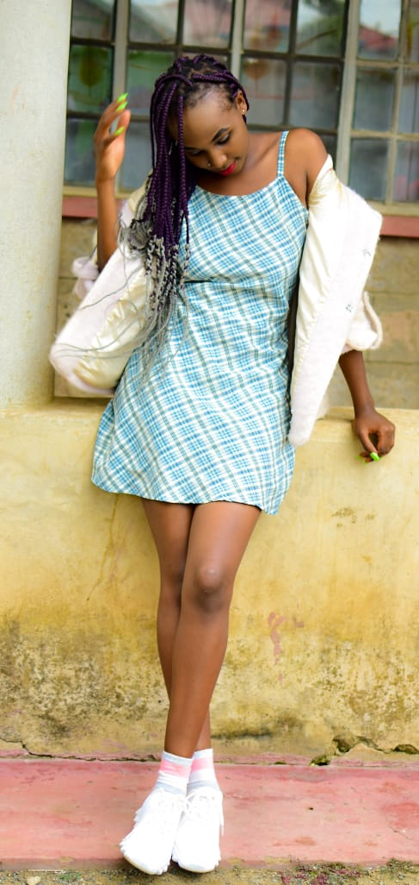
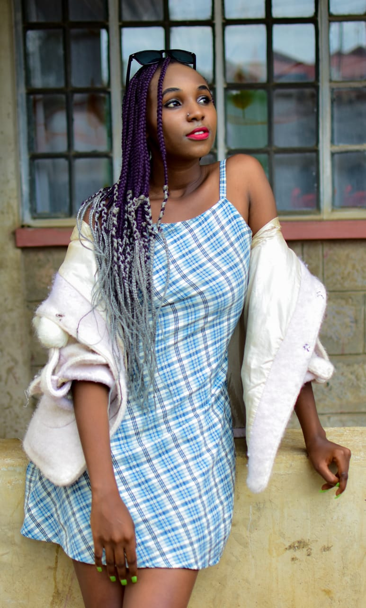
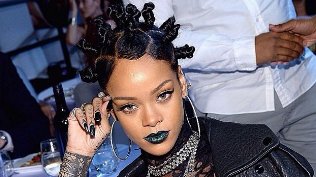
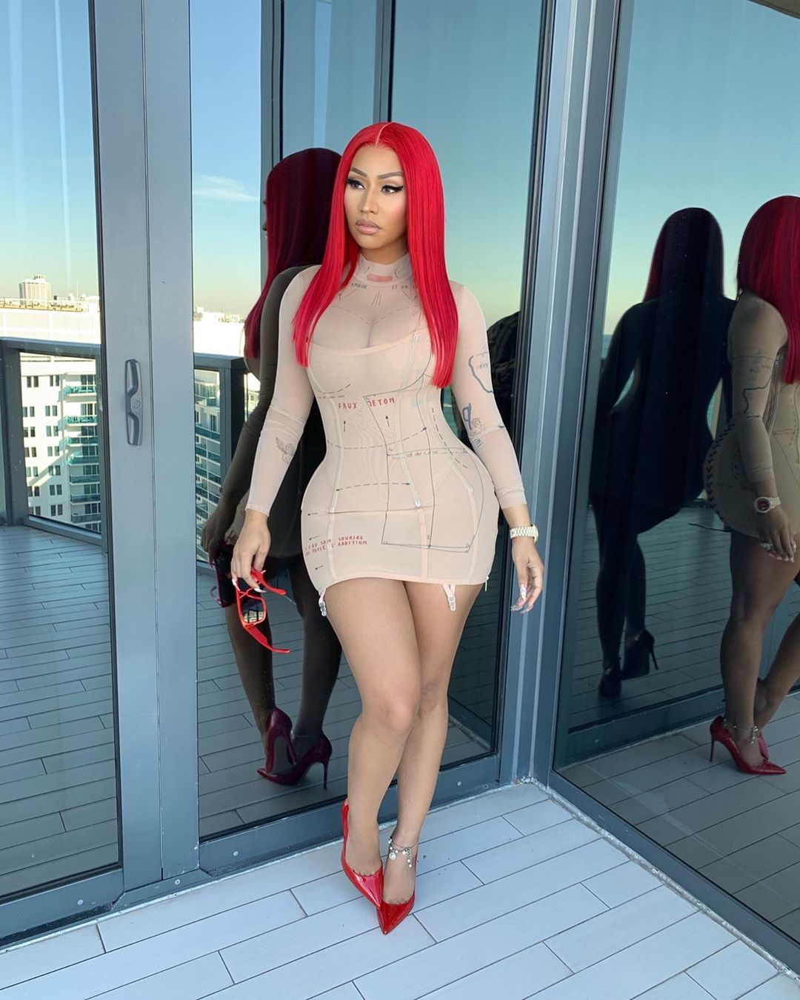

#### WHAT HAIRSTYLES PROMOTE THE GROWTH OF YOUR HAIRLINE?

There are a lot of ways to grow your hair and ensure you have a great hairline. Here are my top picks of the hairstyles i think would be the most beneficial and are quite affordable.

_**FIVE: CORNROWS**_

Cornrows are the go to hairstyle for most women simply because they do not take alot of time to get done and also they provide one with a simple yet sophisticated look. Many women use cornrows to correct hair damage and promote healthy hair growth. However, cornrows should not be tightly done because they can lesd to hair breakage if they are and they should also not be worn for long to prevent the hair from becoming dry and dull.

_**FOUR: FAUX LOCS**_

Faux locs are another great hairstyle that promote hair growth because they are low maintenance because you do not have access to hair for as long as they are in. One secret about faux locs is that they tend to look better and more natural as they age meaning one can leave them in for a while and since they have low manipulation, they contribute to length retention of your hair. Because of the way faux locs are installed, they have less tension towards your edges thus has less chances of damage resulting from tightly pulling on the hair. In as much as they are a very good protective hairstyle, you need to be aware of some of its cons such as;

(a) If your stylist grips on your hair too tightly, it may cause immense pain which may even make it difficult for you to sleep on the first day they are done. Also if they are excessively tight they can strain the hair causing damage thats why a great stylist is highly recommended.

(b) The process of installation takes a rather long time before you are done because the process is abit time consuming but this is largely dependent on the length and method. So if you do not want to spend too much time in the salon, i recommend you do the shorter length of the faux locs.

(c) Faux locs can be heavy especially if you do the much thicker and longer ones and having all this weight may be extremely uncomfortable. If you are a fun of lighter hair, you should definitely mind the thickness during installation.

_**THREE: BOX BRAIDS**_

Box braids are a very common protective hairstyle and they tend to look best when freshly installed. Since they do not involve use of thermal heat to install, they thus encourage hair growth. However, if box braids are kept in for too long, the hair grows out and causes tangles and matting which eventually damages hair. Also if they are installed too tightly and very close to the hairline, they can cause your hair to be pulled back causing immense damage to your hairline. Also if they are not properly installed, they can end up being too heavy thus straining your hair follicles leading to their damage.

_**P.S: If you are shedding or losing hair, then you should stop braiding your hair and give it a rest.**_

_**TWO: BANTU KNOTS**_

Bantu knots are a great protective hairstyle because no special hair prep is necessary for installation. Installing of bantu knots requires you to shampoo and condition your hair as you would normally do then detangle and evenly section off the hair into triangle or square shapes, smaller sections for shorter hair and bigger sections for longer hair. You should allow your hair to completely dry off before unravelling it to prevent your hair from becoming frizzy. You should also avoid oversaturating the products to prevent flaking that can ruin a great knot. This hairstyle does not damage your hair because it lasts for long.

_**ONE: WIGS**_

Wigs are one of the best and most effective protective hairstyles. Wigs protect your hair from manipulation and breaking and can help to grow thick, long and healthy hair. Wigs can also be put in for a long time without damaging your hair. Wigs allow one to clean and condition their hair for example during weekends and during weekdays, you can put your wig back on. Wigs also do not pose any damage to hair because they do not involve combing and pulling of hair. There are all types of wigs and they look more natural nowadays.

