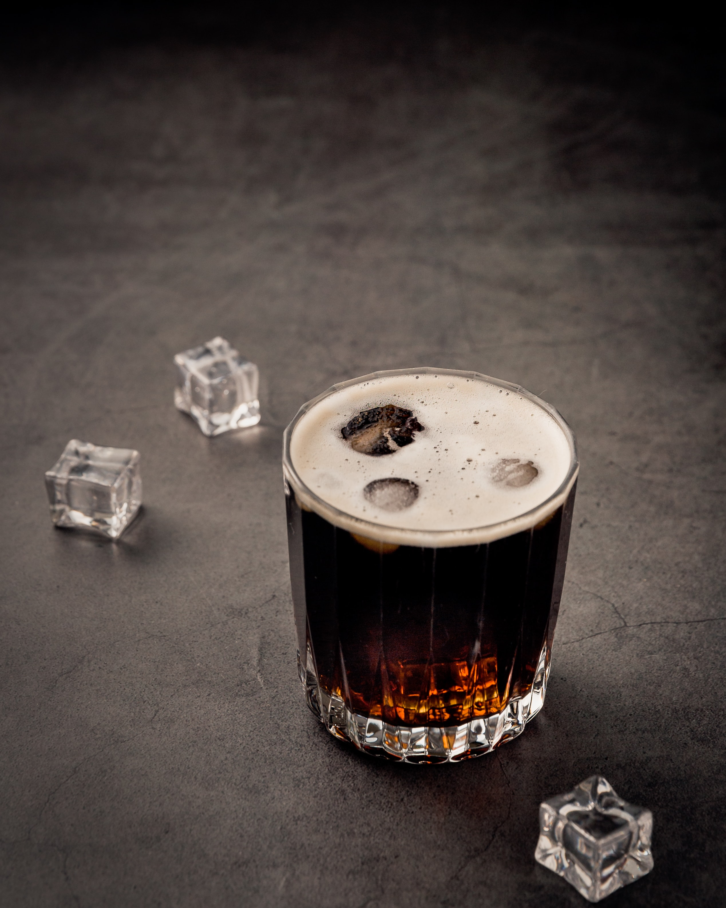
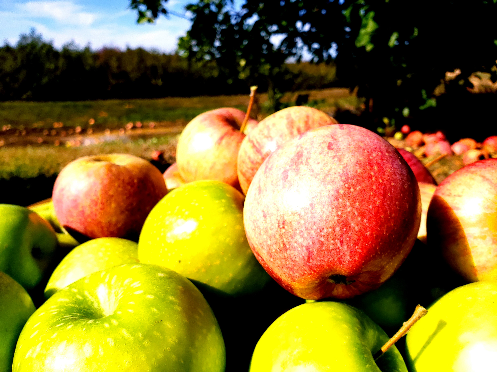
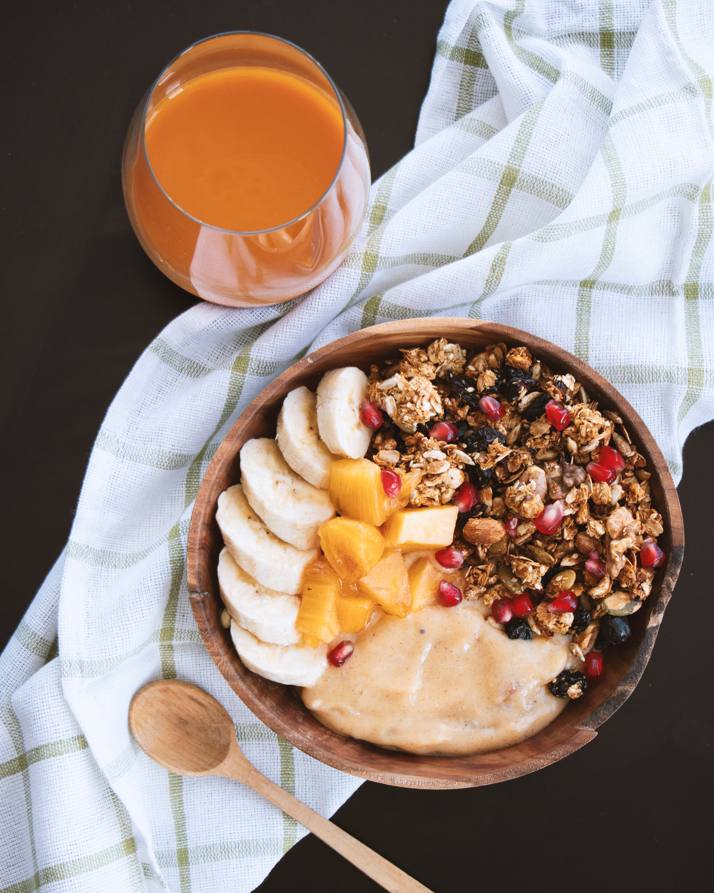
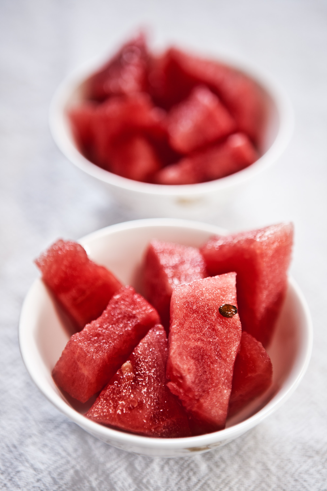

#### _**WHAT IS A HANGOVER AND HOW CAN YOU AVOID IT?**_

A hangover is a severe headache that is caused by having an excess consumption of alcohol. Some other symptoms associated with having a hangover include: feeling dizziness, excessive thirst, nausea, feeling depressed or anxious, feeling shaky and fatigue. The main cause of a hangover is the ethanol component in the drink. Ethanol is a toxic component that dehydrates your body causing you to get a hangover.

Hangovers can however be avoided by using the following steps;

1. _**Avoid drinking alcohol on an empty stomach**_

Alcohol is a substance that is quickly absorbed in the body especially by the small intestine. When you take alcohol on an empty stomach, much of the alcohol passes from the stomach to the small intestine where it is absorbed into the bloodstream. If food is in your stomach before you take alcohol, the food will slow down the absorption rate. If alcohol is quickly absorbed it intensifies the effects of the alcohol such as the inability to coordinate your body movements and your inability to think clearly and it will definitely make your hangover worse.

_**Some of the foods you should eat before taking alcohol are;**_

(a)Chow down on foods rich in proteins and fats

Eating foods rich in fats and proteins slows down the absorption of alcohol for example eggs, and other greasy foods such as french fries,onion rings and cheeseburgers.

2. _**Drink plenty of water in between taking alcohol**_

Drinking water in between taking alcohol can help reduce some of the effects of a hangover such as excessive thirst. Alcohol contains ethanol as we said earlier and this is the component that contributes most to the body losing water and feeling dehydrated, it also makes you pee alot. So if you constantly take water you reduce the chances of you feeling dehydrated thus lessening your chances of having thirst, fatigue, dry mouth and eventually avoiding getting a hangover the next morning when you wake up. Another way is by taking at least one big glass of water before going to bed.

3. _**Have plenty of sleep**_

Alcohol disrupts a person's sleeping patterns by making you sleep for lesser hours and also make you not have a peaceful nights rest. Having a good nights rest reduces the risk of you getting some of the symptoms of hangovers such as fatigue and can help your body recover.

4. _**Avoid alcoholic drinks that contain congeners**_

Congeners are substances that are produced during fermentation and they include smallamounts of chemicals such as methanol and other alcohols like acetone. Congeners are responsible for the taste and the aroma of distilled alcoholic drinks. Congeners contribute to a person getting a hangover. Drinks with a high percentage of congeners are brandy, rum and red wine and those with less include vodka and beer. It is advisable to stick to drinks that contain less congeners if you want to avoid getting a hangover the next morning.

5. _**Limit your alcohol intake or avoid drinking completely**_

Many people love alcohol because of its high thus avoiding alcohol completely for them may be difficult, for such people, it is advisable to moderate your alcohol intake. As we said earlier, hangovers are headaches caused by excess alcohol consumption therefore the more alcohol you take the more severe your hangover is going to be. The amount of alcohol needed to produce a hangover however varies from one person to the other but either way the quantity shoould be reduced depending on a person's intake levels.

6. _**Eat a good breakfast the next morning**_

Eating an apple can help you avoid a hangover. The fruit sugars and minerals such as magnesium help to speed up your body's detoxification process.

You should eat foods that rehydrate the body, replenish lost electrolytes and provide energy while being gentle on digestion. Carboyhdrates are an example of easy to digest foods that also provide the body with energy such as toast and bagels.

You should also eat fruits such as watermelons because they are very rich in water thus will rehydrate your body. Watermelons also contain useful electrolytes such as potassium which are easily depleted with consumption of alcohol.

You can also have a cup of coffee, this is because coffee contains caffeine which may help reduce headache.

