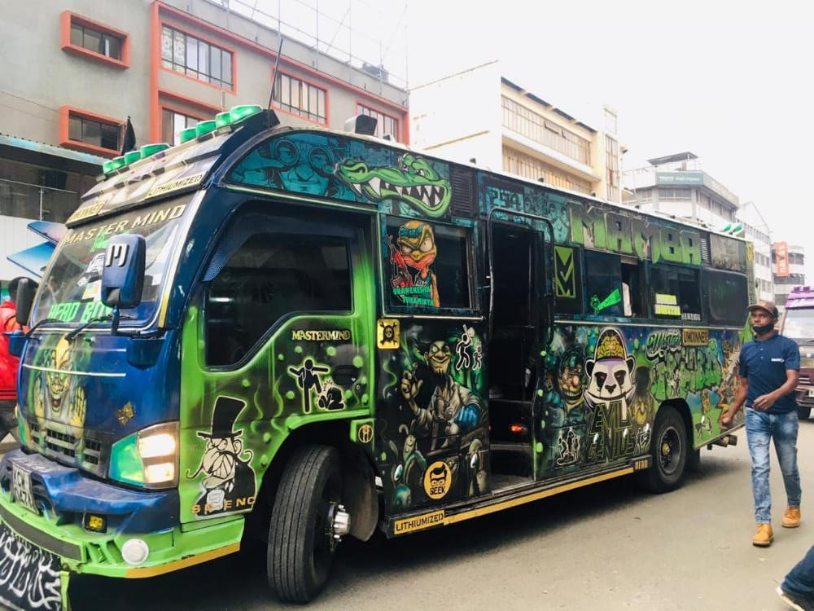
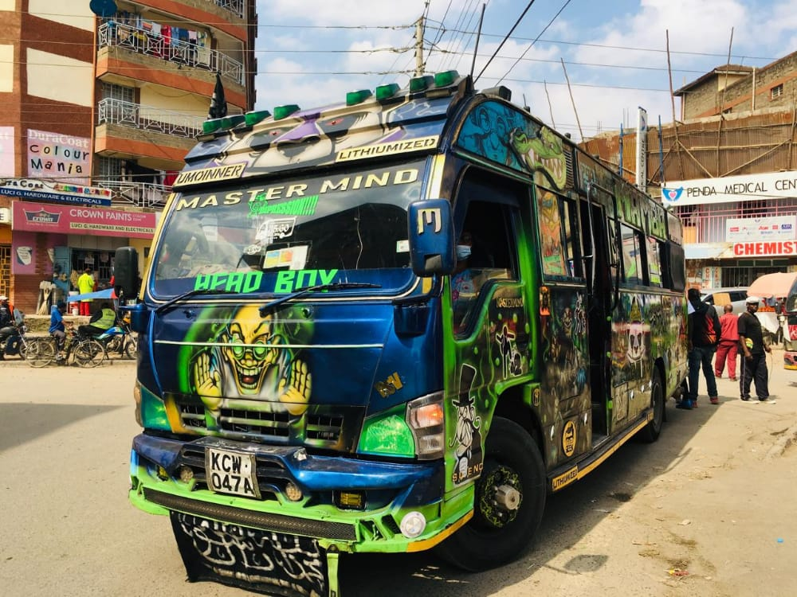
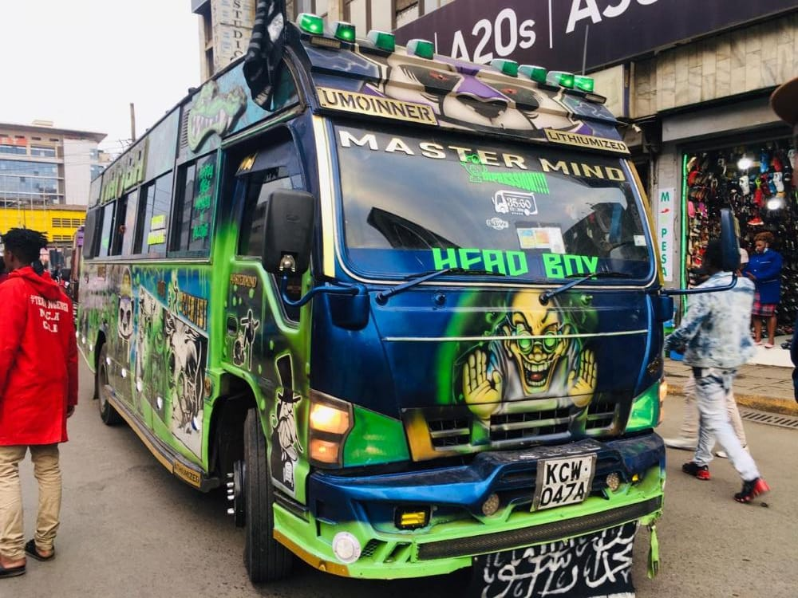
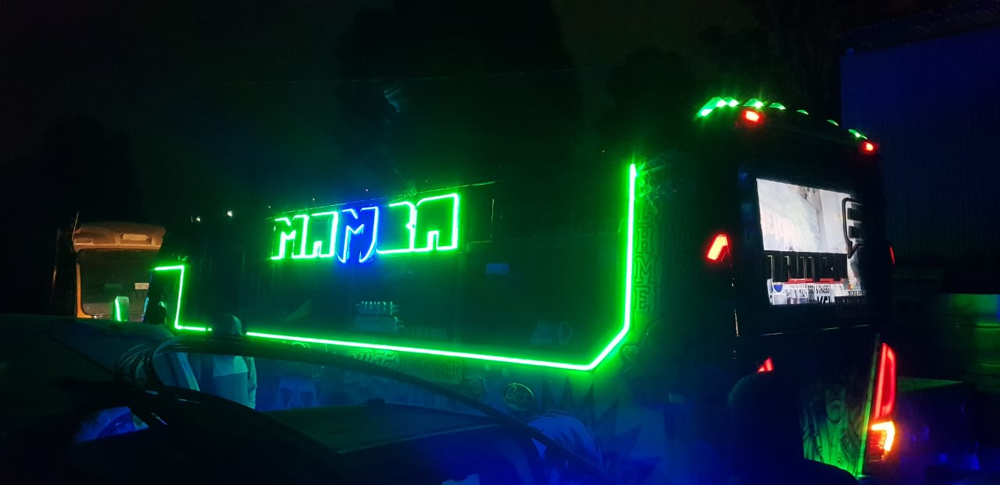
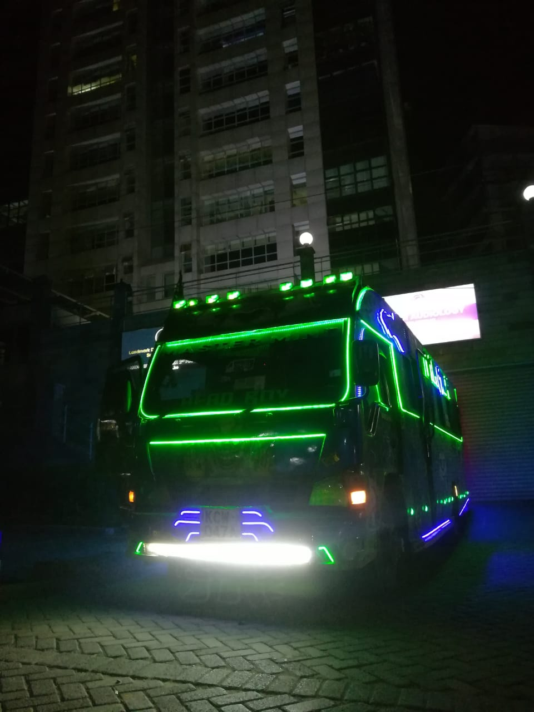
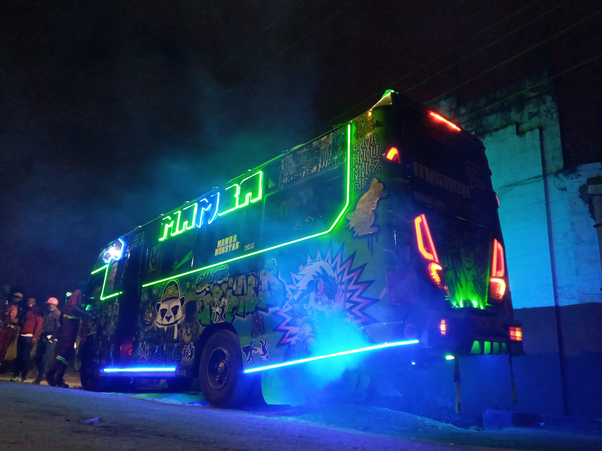
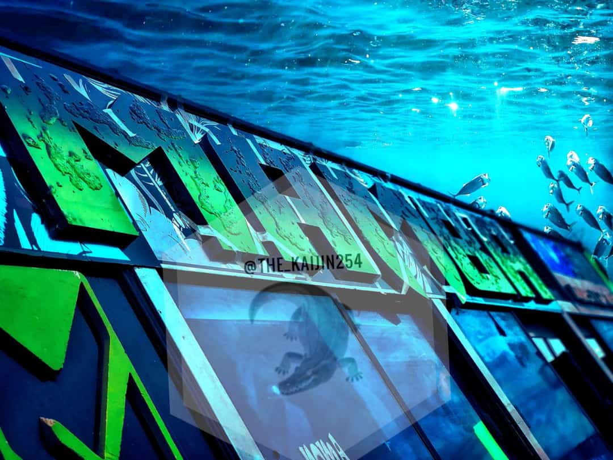

#### UMOJA'S MASTERMIND

If you've never been to Umoja Estate, you prolly gotta organize and go there one of these fine days, because they poppin up with the newest and hottest nganyas rynna, but one nganya that still has alot of people talking ever since it was launched is Mastermind, one of the hottest nganyas in Umoja that you should definitely consider taking a ride in next time you are headed that way. Its commonly referred to as 'Mamba' or 'Mkunaji Mkuu' or 'Headboy' or 'Evil Genius' among other names. Mamba has 5 43" inch screens on the side, 1 55" inch screen at the back, also known as a hater screen, a 65" inch main screen, 2 24" inch screens, 1 14" inch screen and JVC speakers.The great design of Mamba is credited to Lithum.

One unique feature about this matatu is that it's the first to have a game console for its customers, more specifically a play station outlet, giving its customers an opportunity to play video games as they listen to music in the comfort of their seats in front of the 65" inch main screen, sounds like a vibe, dont u think?

Another feature i absolutely love about this nganya is how it glows in the dark.

The blend of green and blue neons creates an illuminating presence that is very impressive.

Mastermind is a whole vibe and is definitely the one to beat because it has been reigning in Umoja ever since it first came out and even with competition from other upcoming nganyas, they all wanna dethrone Mastermind and take its place as king, but according to the analytics where the people have chosen this as they best, can they even?

_**CONTENT: Courtesy Yanna Resse and Alpha Male**_
