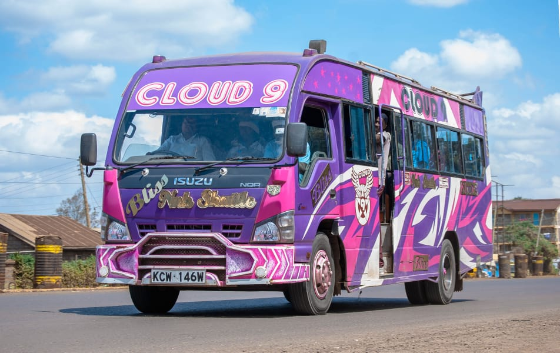
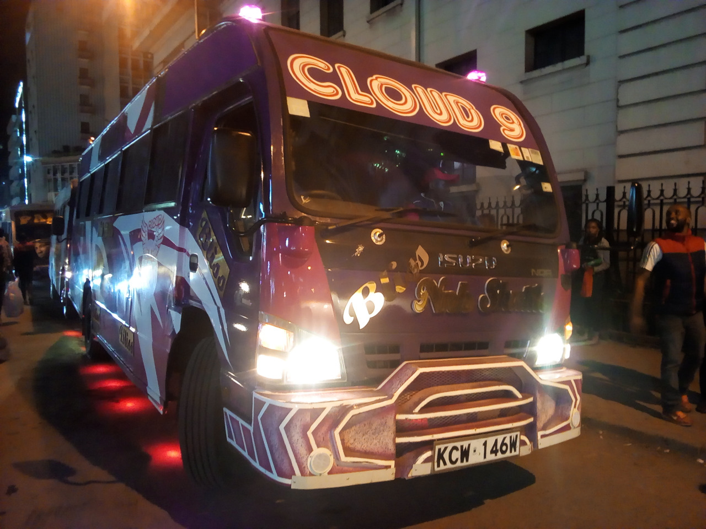
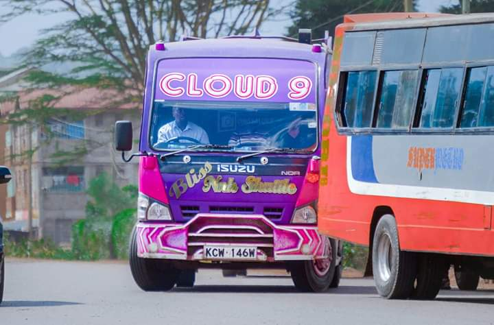

#### WAIYAKI WAY'S CLOUD 9

Cloud 9 is one of the newest matatus along Waiyaki Way. Its exterior is a blend of pink, purple and white colours. It is commonly referred to either as 'bliss' or just 'cloud 9'. Cloud 9 has a 55 inch main screen and (3)32 inch screens on the sides. It also has (4)12"Kenwood subwoofers that produce a banging sound when the music is turned on. Cloud 9 was designed by Mbugua from Mbuguz custom or better known as 'Team Chafua'.

I believe this matatu is one of the best along Waiyaki Way and i particularly like the effect of its subwoofers on the music. Indeed, being in this matatu just like the name suggests is like being on cloud nine. If you are ever heading to Safaricom, Westlands, Kangemi, Uthiru or even all the way to Kikuyu, you should definitely give Cloud 9 a try because it will not disappoint. It is also quite fast and ensures that you alight at your destination on time.

#### WHAT TO LOOK OUT FOR!

During the evenings, you have to be aware that in order for you to board Cloud 9, you have to have been in a queue, although this system helps to bring order as passengers board the matatus because of the policy of 1st come 1st served, it still sucks because if there's heavy traffic, you wait in line for quite a while before the matatu arrives at the stage.

ssss
