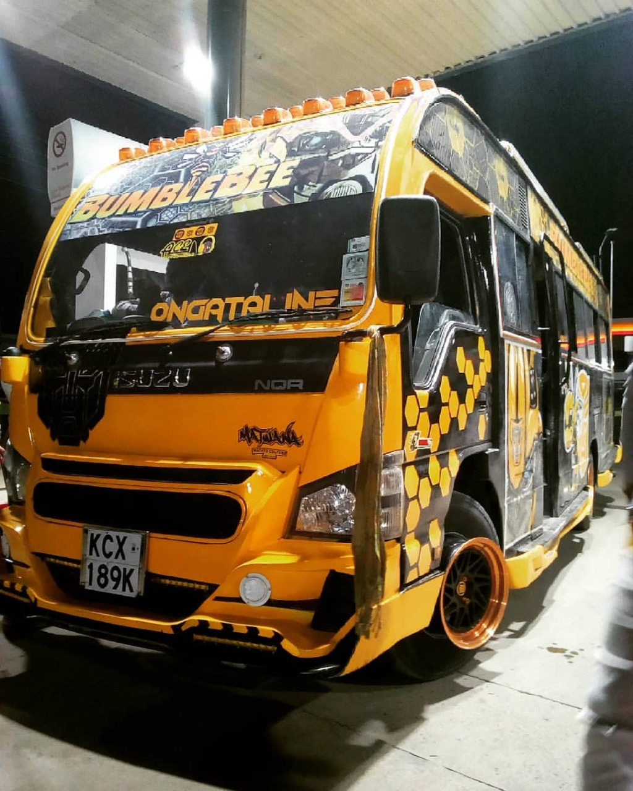
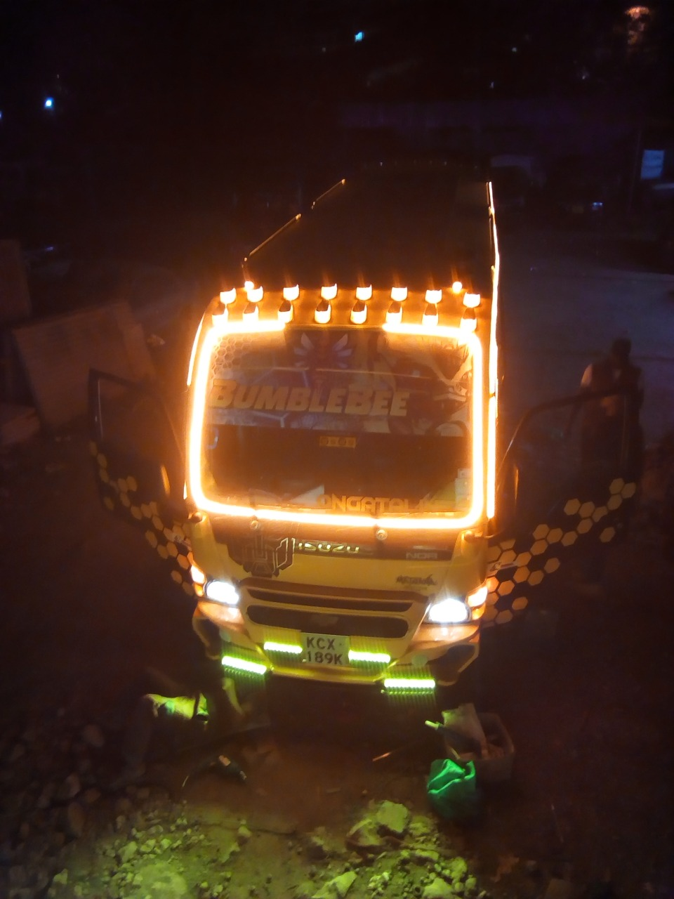

#### RONGAI'S BUMBLEBEE

Bumblebee is one of the newest and hottest nganyas in Rongai right now. Its commonly referred to as 'BB'or 'nyuki'.It has P3 Rockford subwoofer speakers of 15inches, a 65 inch main screen, 4 side screens of 43 inches each, 22(10")screens on every seat and midrange and ts pioneer speakers.The great design of Bumblebee is credited to Oby and Chief. Personally, this is my best matatu right now.

The musical effect of this nganya's speakers is what i love most about BB because it makes you have an 'in the club kinda vibe', tempting you to not wanna alight once you arrive at your destination but rather convinces you to think of having a drink as you listen to the music. The comfort of the seats only adds to the reasons why you should definitely visit Rongai to sample the matatu aside from the fact that its fast and ensures you arrive at your destination safely and within no time. You can carry a drink if you choose to and enjoy first-hand the whole BB's feel.

#### WHAT TO LOOK OUT FOR!

If you are not a fun of the Nairobi night life scene especially dundain' in the club then the loudness and refreshing effect of the music in BB is definitely not for you.

