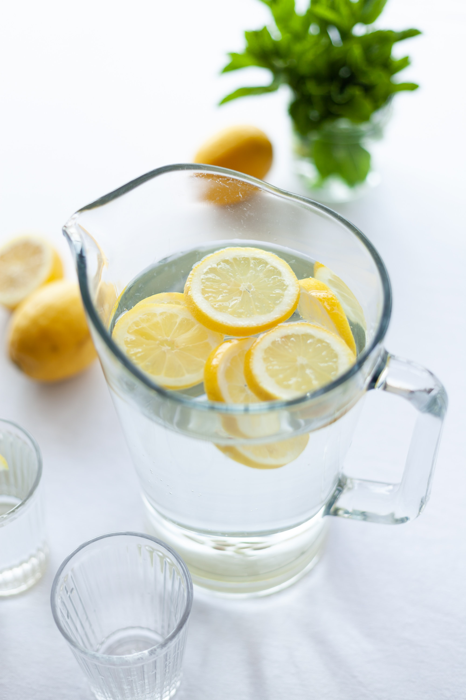
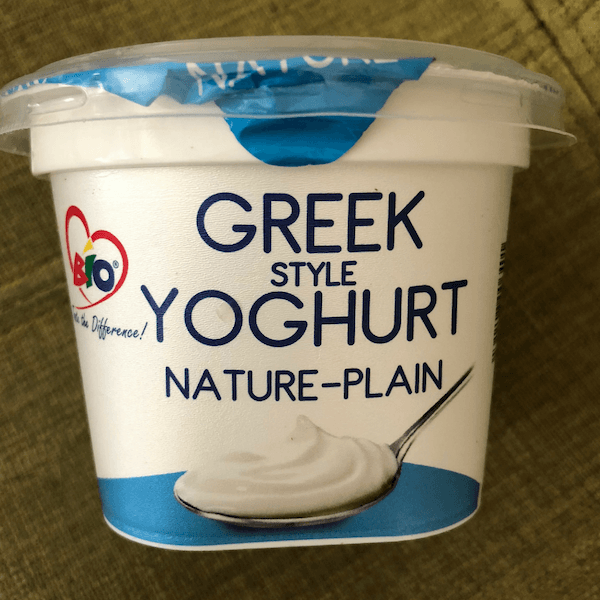
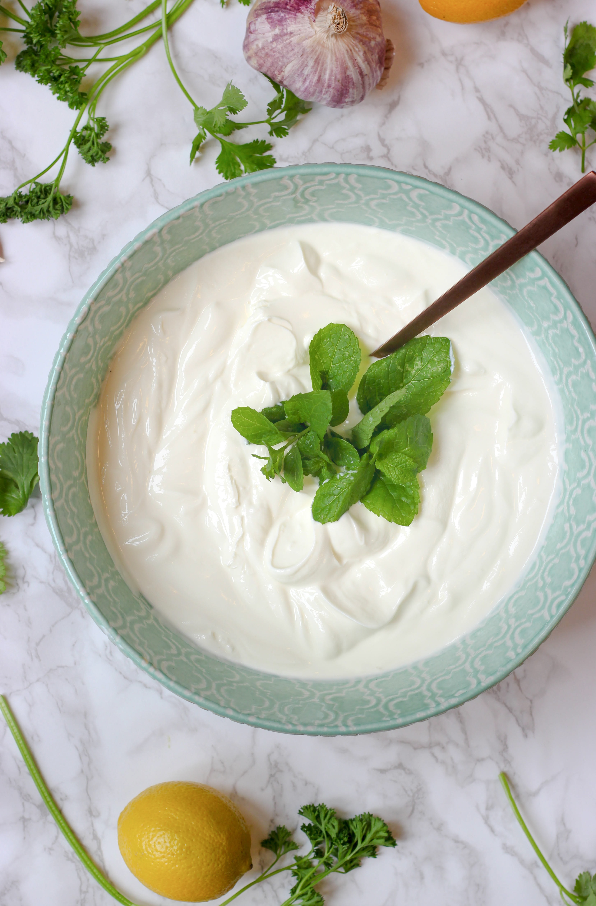
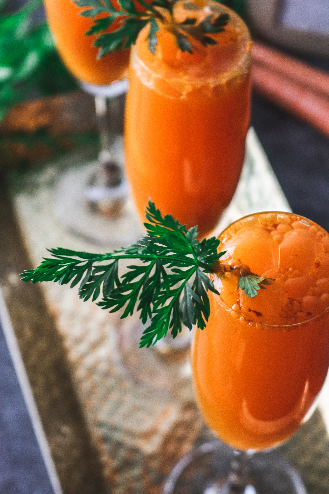

We've all heard about the COVID-19 virus by now and since there's no vaccine yet, all we can do is to strengthen our immunity as the scourge continues and hope for the best, that a cure will be found. I have outlined some of the foods that will help boost our immunity as we stay quarantined in our houses and observe all the prevention measures that were outlined by the World Heath Organisation such as washing our hands oftenly, using alcohol based sanitizers, coughing into our elbows and not touching our face among other precautions to be followed.

List of foods to help boost your immunity;

_**LEMON**_

Lemons can help to boost your immune system because it contains alot of Vitamin C. Vitamin C, helps to increase the production of white blood cells which are key in fighting infections. Lemon is washed then sliced and the juice is poured into a glass of warm water and this helps to destroy malignant cells and it reduces the duration of commom cold symptoms among other benefits, so drinking this alkaline water can definitely help your immune system to be stronger and prevent you from being prone to getting diseases. Other citrus fruits that contain alot of vitamin C are oranges, tangerines and limes.

_**GINGER**_

Ginger is another natural ingredient that helps to strengthen your immunity. Crushing ginger into a glass of warm water can be used to reduce any inflammation or irritation on your throat and many people who get sore throats usuallly turn to ginger to help ease their dicomfort. Ginger may alo decrease feeling nausea and although ginger water has a bitter taste, it is very essential in helping your immune system out.

_**SPINACH**_

Spinach is a green vegetable that is rich in vitamin C but it also contains numerous antioxidants which may increase the infection fighting ability of our immune system. Spinach should not be overcooked because when this is done, it loses the nutrients necessary for your immune system. Spinach also contains flavonoids which may help prevent common cold sypmtoms because they contain anti inflammatory properties.

_**YOGHURT**_

Yoghurt is made by bacterial fermentation of milk and these bacterias are live and active cultures. The best yoghurt are those that contain these youghurt cultures because these cultures help to stimulate your immune system and thus help in the fighting of diseases. Yoghurt also contains vitamin D which is an essential vitamin that helps the body absorb calcium which is essential in the provision of strength to the bones. Vitamin D is a mineral that can also be gotten from basking in the sun.

_**GARLIC**_

Garlic is another natural ingredient that is used as a home remedy for prevention and reduction of the severity of common illnesses such as the cold. Garlic contains supplements such as allicin which boosts the disease fighting response of some types of white blood cells when they encounter viruses such as those that cause common cold in the body. Garlic is crushed or even sliced in order to produce this compound called allicin.

_**KALES**_

Kales are another leafy vegetable that contains alot of minerals such as calcium, potassium and magnesium which are important minerals in the body. These minerals are all very essential in keeping the immune system strong by strengthening muscles and bones and also helping in supporting many body functions such as cardiac and brain functions. Kales also contain antioxidants that help to protect cells from damage and help to fight inflammation.

_**CARROTS**_

Carrots contain alot of nutients and minerals that are essential for the immune system. Carrots contain antioxidants such as vitamin C which is present in the immune cells that helps the body to fight infections. Carrots also contains fiber and potassium which helps to manage blood pressure.

_**WATERMELONS**_

Watermelons is a fruit that contains alot of vitamins such as vitamin C and A and minerals such as magnesium and potassium that aid your immune system. Other than that watermelons help you to hydrate because they contain a high water content thus watermelons are very essential to the proper functioning of your body.

DISCLAIMER

The foods mentioned above DO NOT prevent COVID-19, they just help your immune system to become stronger in order to prevent your body from becoming vulnerable to attack by diseases. So as you boost your immunity in the comfort of your homes, please observe the prevention measures outlined by the World Health Organisation in order to help reduce the spread of the disease.

