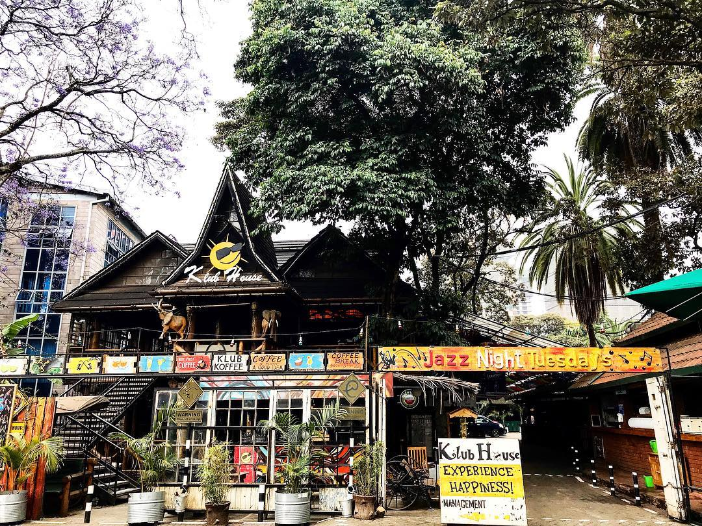
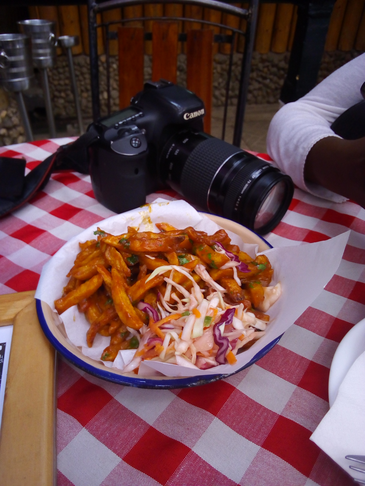
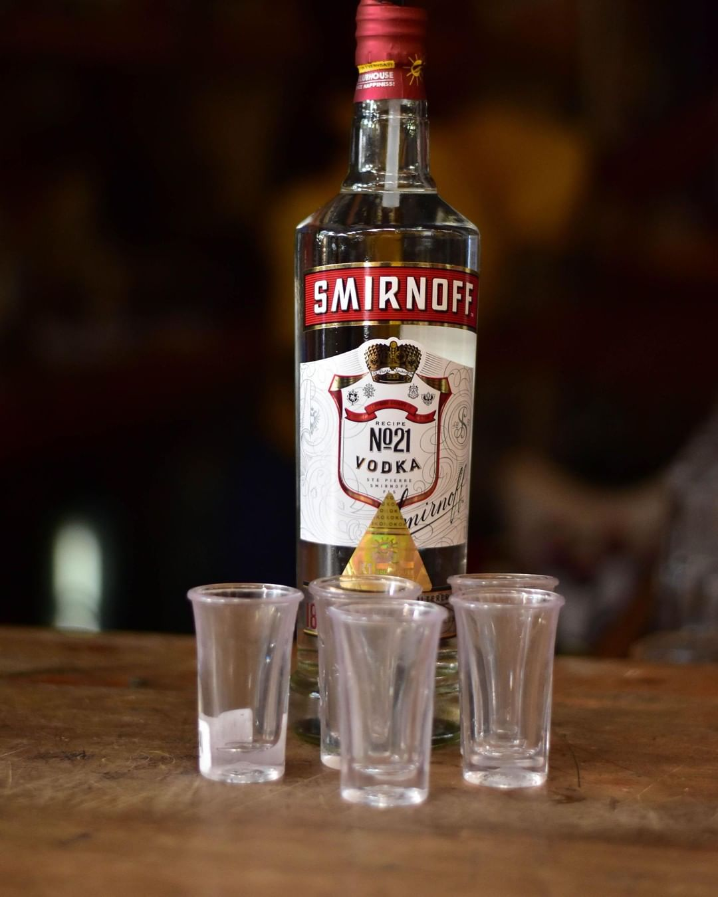
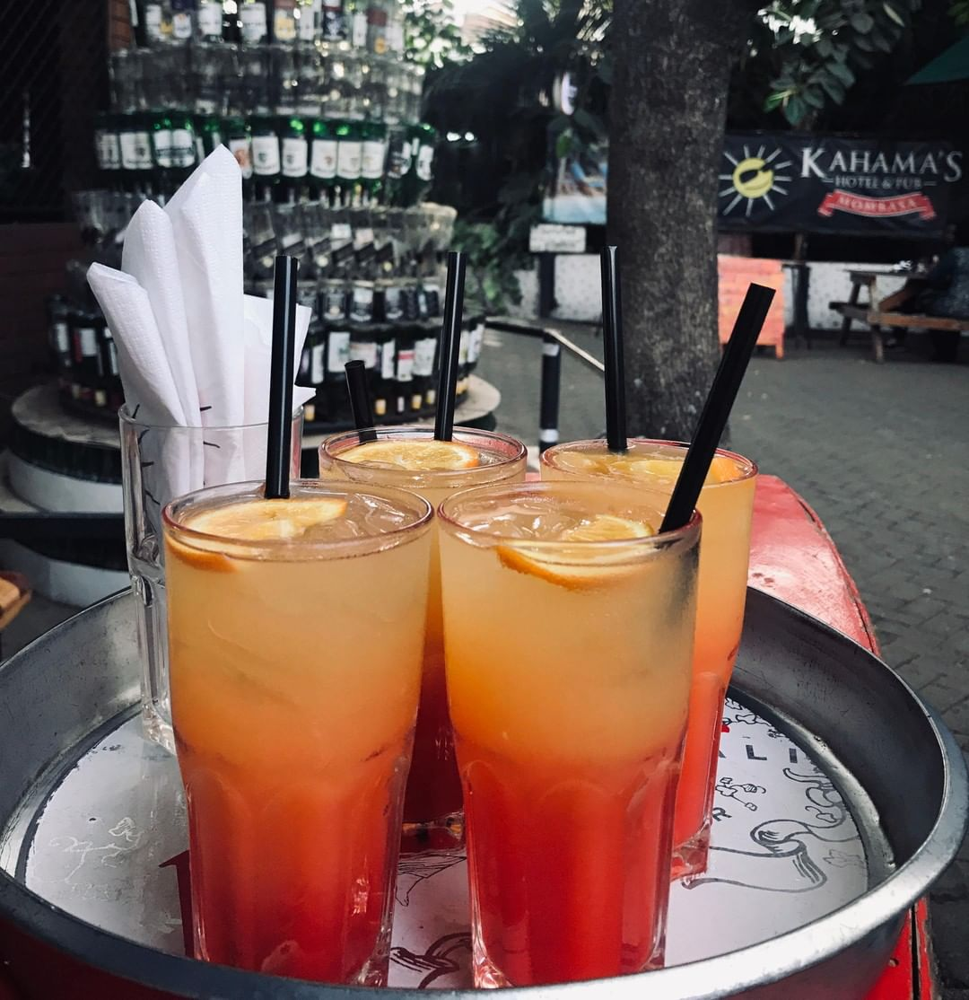
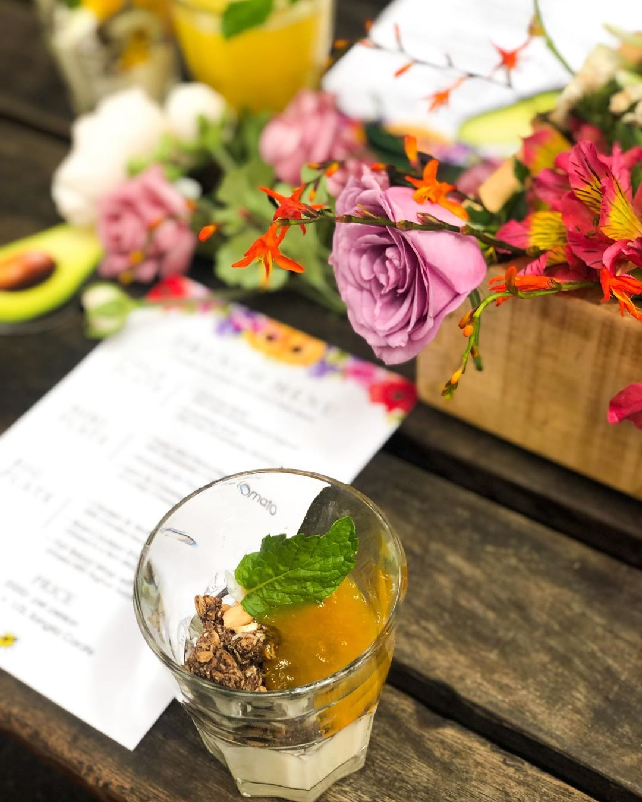

### K1 Klub House

If you are a fun of the Nairobi night life the you ought to go and enjoy a night out at The K1 Klub House located at Parklands off Ojijo Road. If you wanna try somethimg different such as listening to slow and live jazz music played by a band instead of the usual mixed dj versions played in clubs, they've got you covered, but don't get me wrong, they not only play jazz music, they play all genres of music. Aside from the music and partying element of the club, they also have a great food menu and since am a big fan of fries, i decided to order chips masala. Chips Masala takes fries to a whole other more tasty level. They are crispy, saucy, spicy and they contain masala which is used to perfectly coat the fries improving their flavour. At K1 Klub House, the chips masala is usually served with a bit of salad on the side and is taken with any drink. It can also be taken with fried foods such as chicken.

In addition to having amazing food, K1 Klub House has a wide variety of drinks to choose from inclusive of drinks such as smirnoff vodka, beer, whiskey, you name it, they got it.

Their cocktails taste better in pairs and thats why they have a cocktail and wine happy hour which starts at 4pm and runs all the way to 9pm.

K1 Klub House has a treat for everyone,if you are looking for a venue to take great photos, the whole environment and scenery around K1 Klub House is perfect for taking great and professional photos or even photos display on your instagram page.

K1 Klub House is full of interesting surprises for everyone. Ever had of DRUNCH? Well, K1 Klub House is launching it on 1.03.20. Drunch comes from the words drinking and lunch, it's almost similar to brunch but it involves having drinks as well. For those who love day drinking, you should definitely visit K1 Klub House and get shwatsy between breakfast and lunch on the 1st of March 2020.

