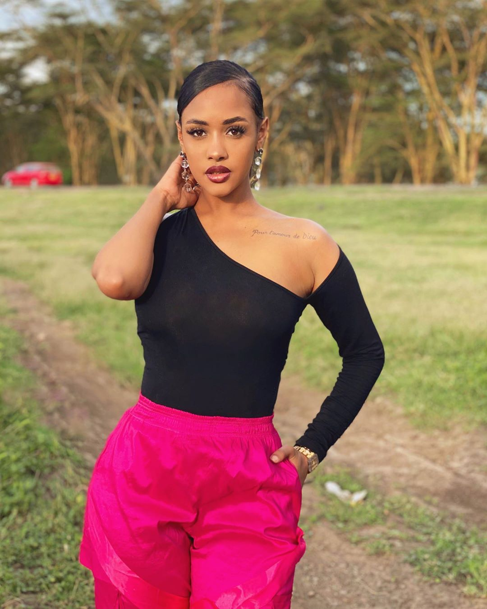
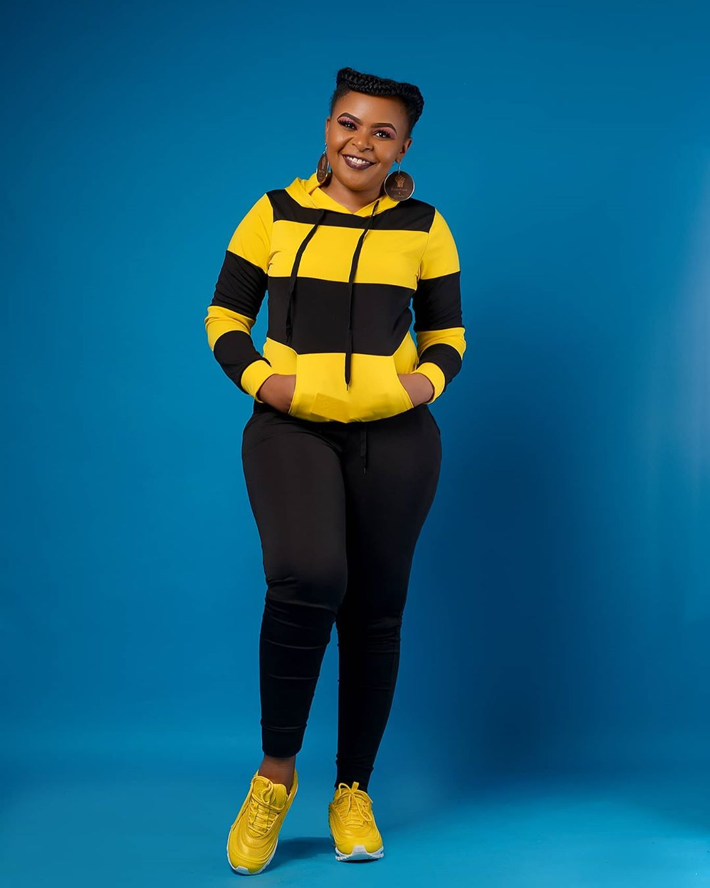
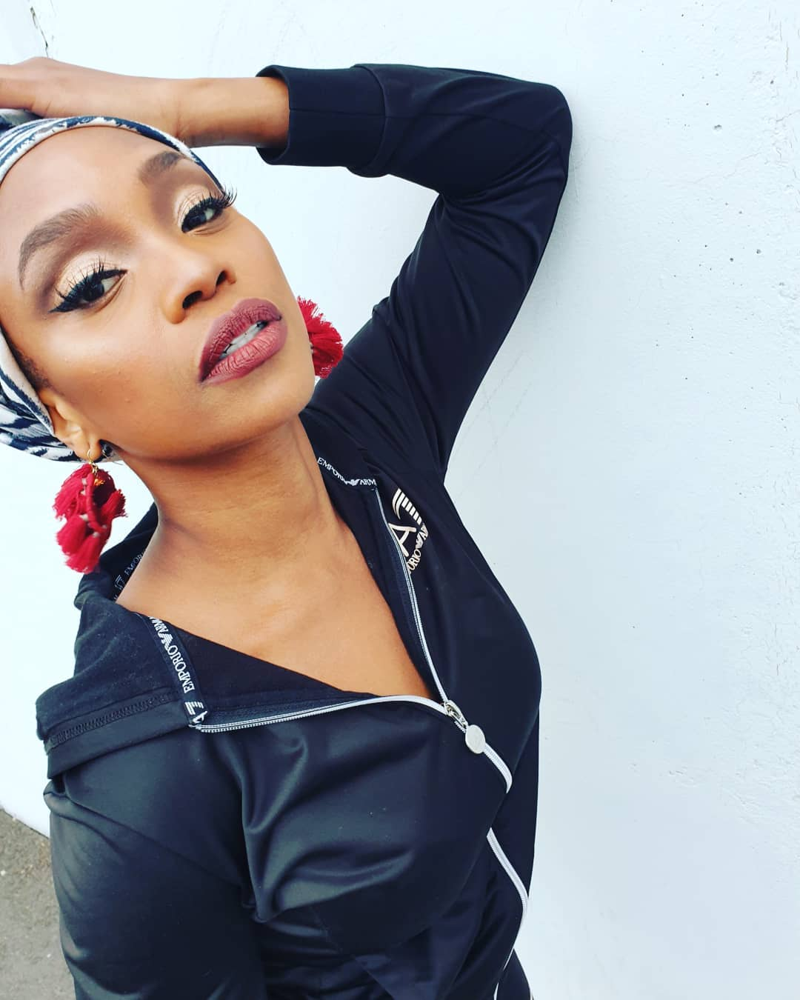
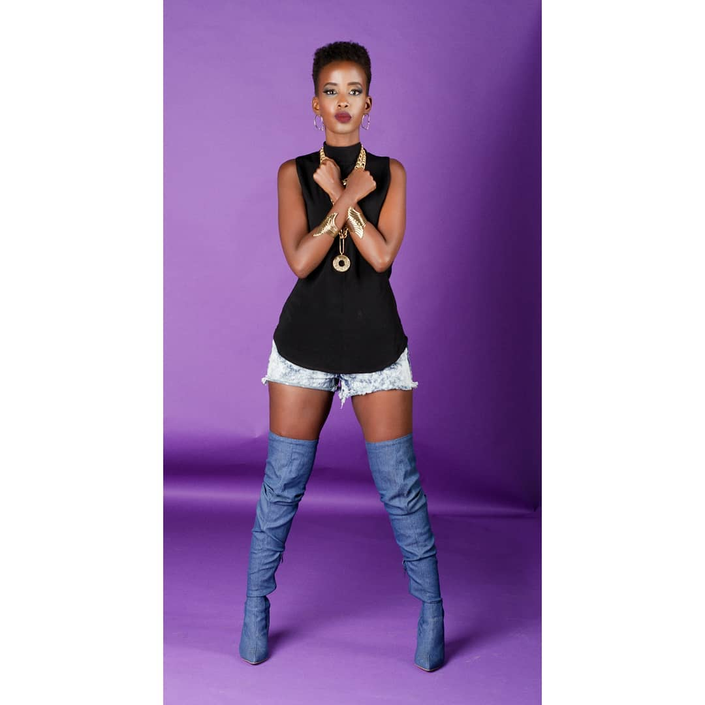
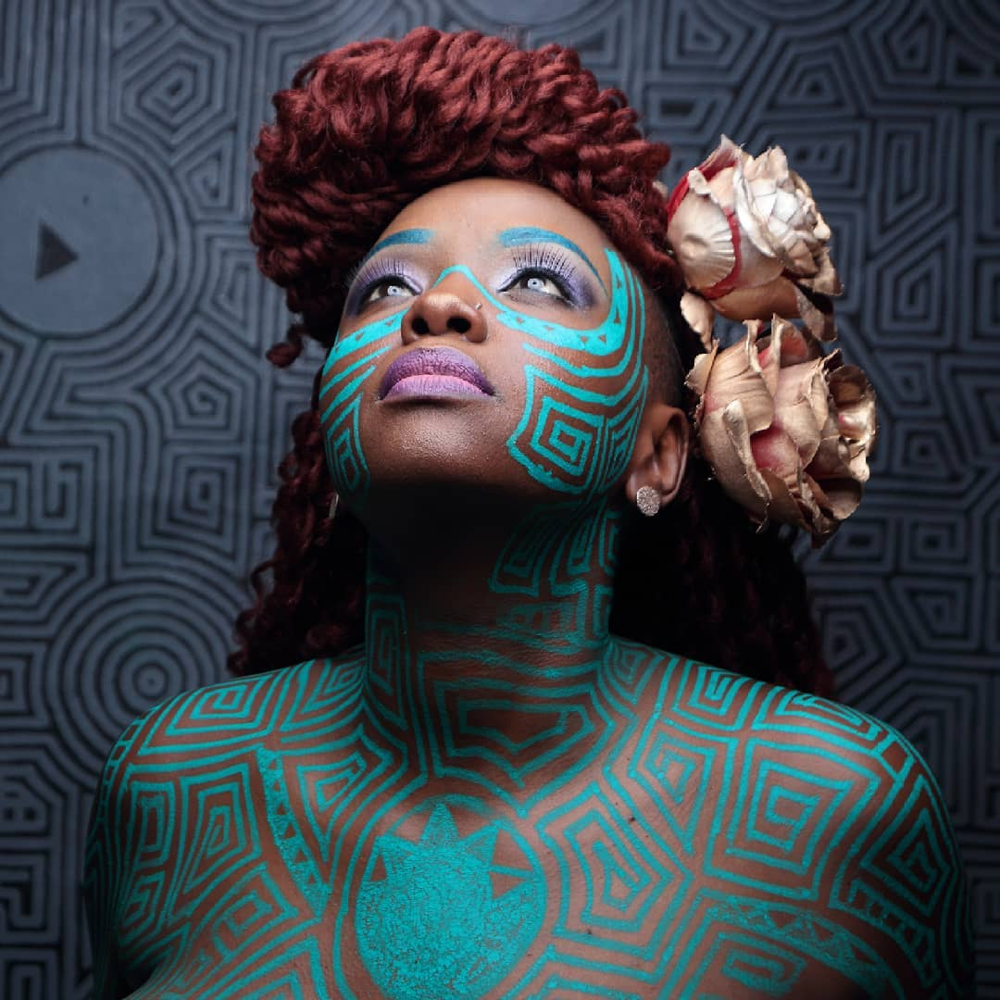

#### The list of female artistes who ride solo!!!

Kenya also has a variety of female artistes, each with amazing talent and unique sound. The female artistes who are working towards either securing the bag or lifting and blessing people's souls through their heartfelt music include the following:

_**TANASHA DONNA**_

Tanasha Donna is a kenyan pop singer. She joined the game recently and has been making big moves in the music industry. She has produced a couple of hit songs such as,'La Vie', 'Nah Easy', 'Radio' and 'Gere'. She also recently dropped her EP known as Donna Tella which is her first album. She was initially a radio presenter at NRG radio before she decided to join the game. Her real name is Tanasha Donna Barbier Oketch but she is commonly known as just 'Tanasha'. She is one of the few celebrities with numerous instagram followers of 1.9 MILLION. She has an outstanding sense of style and this is shown in her fashion choices.

_**SIZE 8**_

Size 8 is a kenyan singer and songwriter. When she initially joined the game, she was a secular artiste and she produced various hit songs such as 'Vidonge', 'Shamba Boy' and 'Moto'. Her real name is Linet Masiro Munyali. She then got saved and changed her genre of music from RnB and Afro Pop to contemporary christian music where she still released numerous hit songs such as 'Mateke', 'Jemedari', 'Ni Yesu' and 'High bila Ndom' among other songs. She has 1.7 MILLION instagram followers and she continues to amaze people with her talent as she touches different souls through her music.

_**AVRIL**_

Avril is a singer and songwriter who was formerly signed to Ogopa Deejays music label and is currently an independent artiste. She has produced numerous hit songs such as 'Yule Dame', 'Chokoza', 'Hello Baby' and 'Nikimuona' among other songs. Her real name is Judith Nyambura Mwangi but she is commonly known as just 'Avril'. She has produced a couple of albums within her music career such as; Hakuna Yule (Missing You), That Horse Must Be Starving, Members Only and Avril EP. She has 1.2 MILLION followers on instagram.

_**WAHU**_

Wahu is one of the earliest female musicians in the game. She began her carrer as a secular pop artiste and she produced hit songs such as,'Niangalie', ' Still a liar' and 'Sweet Love' among others. She later got saved and changed her genre of music to contemporary christian music where she sort to bless souls in her music and she produced hit songs such as,'Power Power' and 'Sifa' among other songs. Her real name is Rosemary Wahu Kagwi but she is commonly referred to as just as 'Wahu'. Aside from music, she is also an enterpreneur and a former fashion model. She has a large audience on instagram with 1.1 MILLION followers.

_**VICTORIA KIMANI**_

Victoria Kimani is an entertainer who was previously signed to Nigerian Record Label, Chocolate City. She is signed to Blue Pie, D&C Ghana, Kimani Music and 51 Lex Records Ltd. She is popularly known because of her numerous hit songs such as,'Number 1', 'Ayaya', 'Oya' and 'Lover' among other songs. Her real is Victoria Kimani and that is still what she is commonly known as. She has 712K followers on instagram and she is well known because of her sense of style aside from her hit songs.

_**SANAIPEI TANDE**_

Sanaipei Tande is a kenyan singer and songwriter. She gained popularity after winning the East Africa Coca Cola Popstars Talent. She has produced numerous hit songs such as,'Amina', 'Mfalme Wa Mapenzi', 'Najuta' and 'Niokoe' among others. Her real name is Natasha Sanaipei Tande and she is commonly known as 'Sana'. Aside from music she is also a karaoke host and radio personality. She has produced albums such as; Sanaa by San and Angeles del Rock&Roll. She has 152K followers on instagram.

_**STL**_

STL is a kenyan-norwegian rapper ans songwriter. She has quite unique sound which is kinda hard to miss. She has produced numerous bangers such as,'Haba Haba', 'So What', 'Biashara' and 'Lookie Lookie' among others. Her real name is Stella Nyambura Mwangi but she commonly goes by 'STL'. She has produced a couple of albums such as; Kinanda, Living For Music, No Games and Stella Mwangi EP. She has quite a large audience on instagram of 109K followers.

_**WANGECHI**_

Wangechi is a rapper and singer who is signed to Nuke Recordings record label. She has produced a couple of hit songs such as,'Sana Sana', 'Play', 'Alright' and 'Fast Lane' among others. She has also produced a couple of albums such as; Don't Consume If Seal Is Broken, Chakula Ya Soul, Lega Mega Sega and Homemade among others. Her real name is Wangechi Waweru and she is commonly known as 'Wangechi'. She has 88.3K followers on instagram.

_**TRINA MUNGAI**_

Trina Mungai is an upcoming entertainer in the music industry. Her love for music is what drove her to join the game and she has produced a couple of hit songs such as,'Twenty Four', 'Pale Pale', 'Tonight' and 'Winnie Mandela'. If she continues putting in the work, she will become quite a huge name in the music industry. She has a loyal fanbase on instagram which will probably grow with time but she currently has 9730 followers. She is popularly known as 'Meremeka'.

_**AMANI**_

Amani is a singer and songwriter who was initially signed to Ogopa Deejays. She has produced many hit songs such as,'Tonight', 'Papii' and 'Missing My Baby'. She earned a couple of awards such as in the Best Female Category in the 2009 MTV African Music Awards. She later turned on a new leaf, got saved and changed pop music to contemporary christian music and produced other hit songs which would bless people's souls such as,'Jina Lake Yesu' and 'My God' among others. Her real name is Cecilia Wairimu but she is known as 'Amani' and she has 56.8K instagram followers.

_**MUTHONI THE DRUMMER QUEEN**_

Muthoni The Drummer Queen is a female kenyan hiphop rapper who is signed to Yotanka, Africa Unsigned, Muthoni Drummer Queen and Muthoni Music Ltd. She was nominated in the MTV African Music Award in the category of Best Breakthrough Act. She has produced numerous hit songs such as,'Suzie Noma', Time Bomb', 'Game Changers' and ' Criminal' among others. She has also produced a couple of albums such as; She, The Human Condition, MDQ Upgraded and Welcome To The Disco. Her real name is Muthoni Ndonga and she has 40.7K instagram followers.

