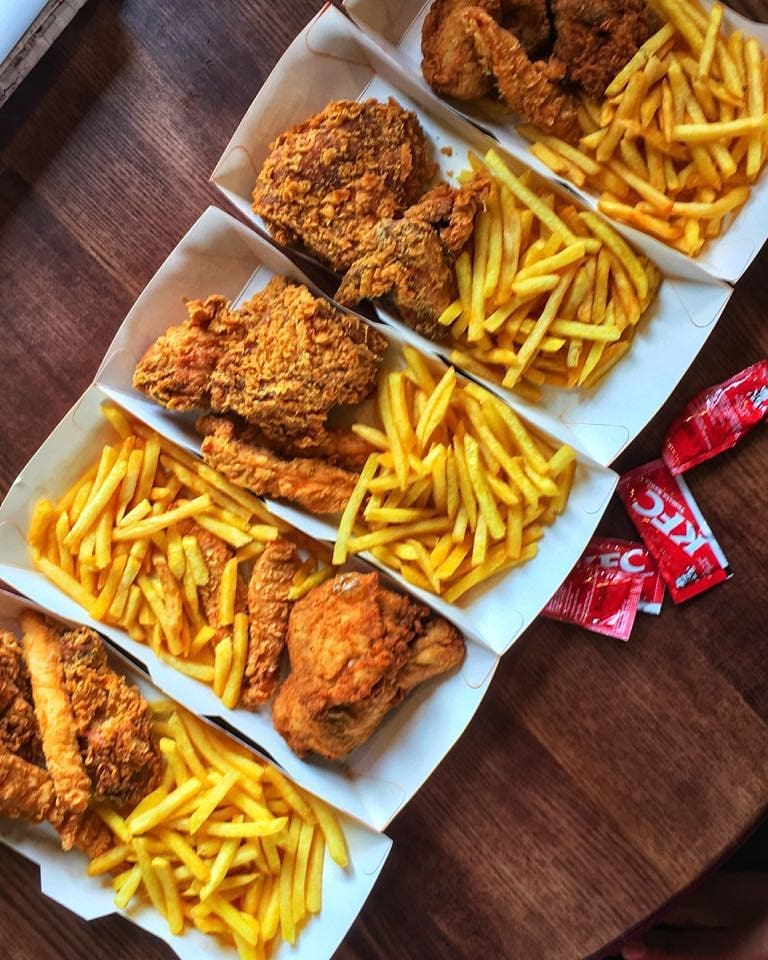

KFC is by far the best chicken serving restaurant in Nairobi. KFC is a fast food joint that has branches all over the country. Since am a sucker for spicy food, i had the chilli chicken flavour at the KFC outlet which is at Kimathi Street. The 'with chilli' chicken is tender and juicy but it is also crispy, hot and peppery which makes is zesty and yummy. Since not everyone is a fun of food that has chilli, KFC has a 'without chilli' chicken as well. The 'without chilli' chicken is equally tasty and also has a tender and juicy texture.

KFC chicken is definitely fingerlicking and their perfectly sliced fries also have a unique mellow taste, not to mention their secret sauce which has a divine taste once in your mouth. Once you take your first bite of the KFC chicken, you taste only ambrosia, a sweet rich taste that is beyond imagination.

You think you've had enough of KFC, well, they not only offer chicken and fries, they also offer other foods such as burgers, onion rings and even milkshakes which are commonly known as Krushers. My favourite is the Oreo Krusher. The Oreo Krusher is made up of ice cold slush, soft serve, oreo cookies and dark chocolate sauce all blended to make a delicious creamy Krusher

