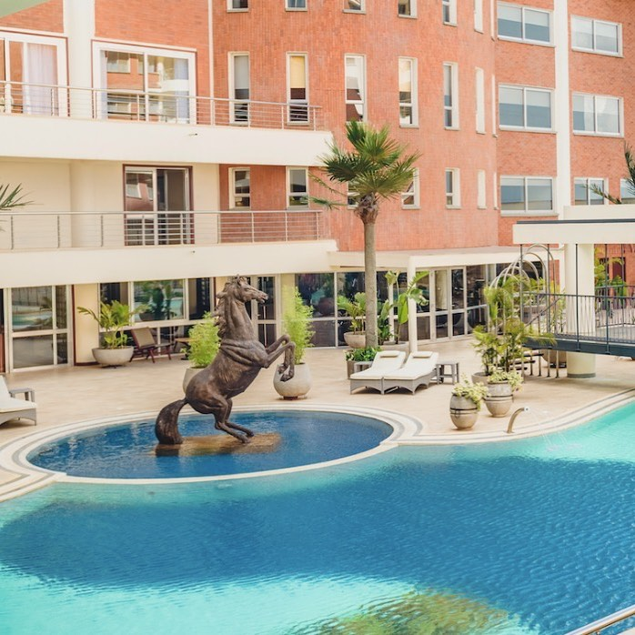
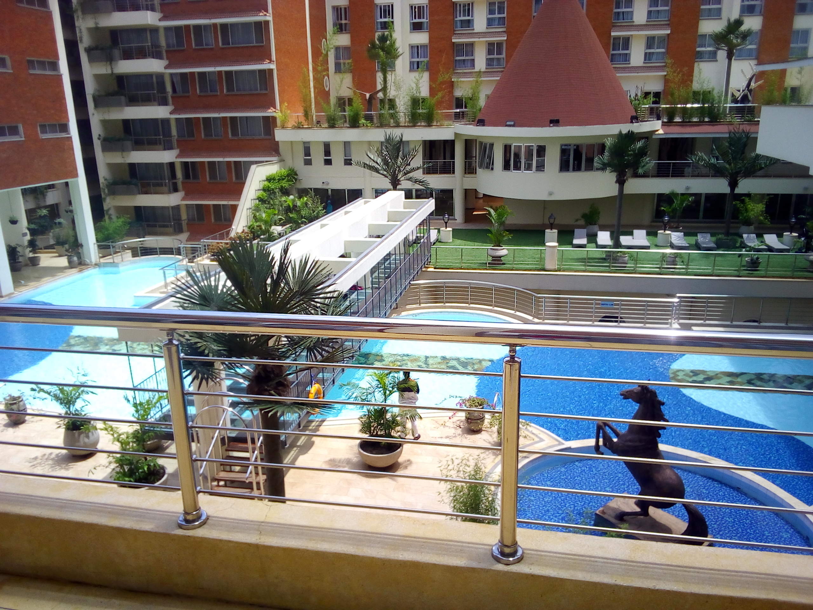
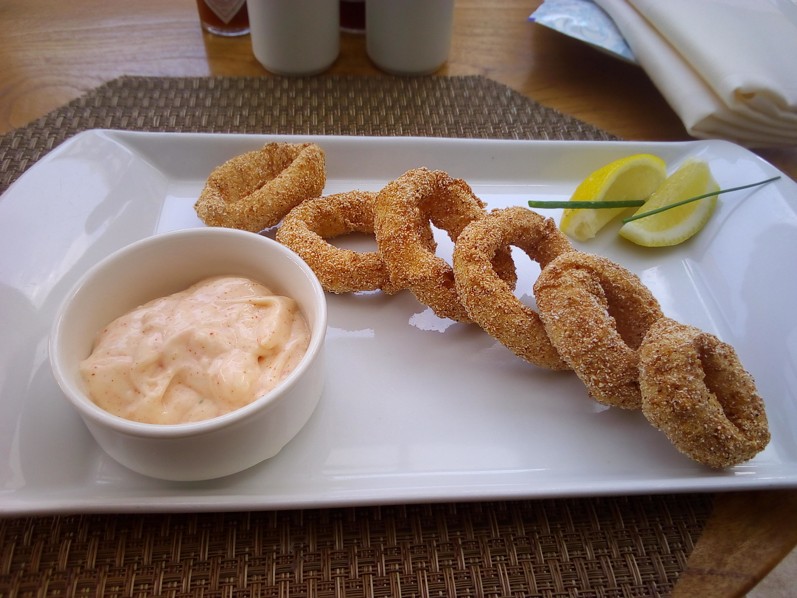
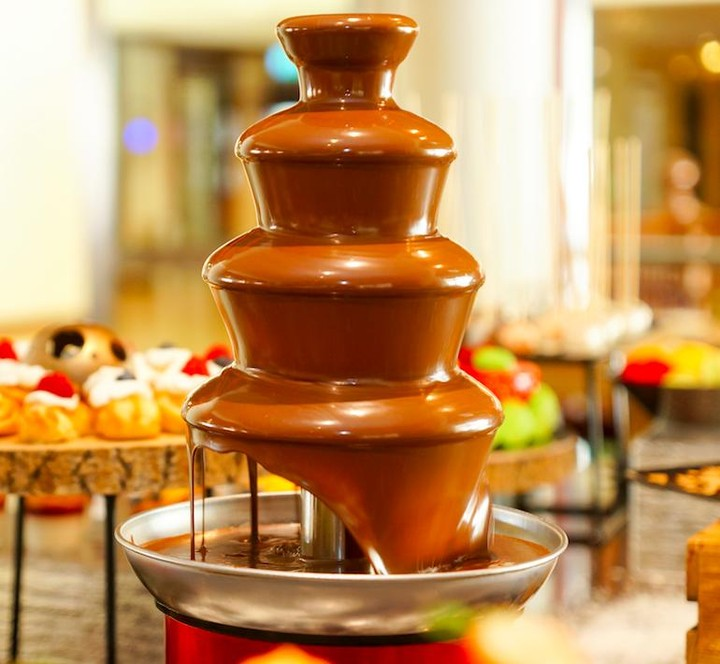
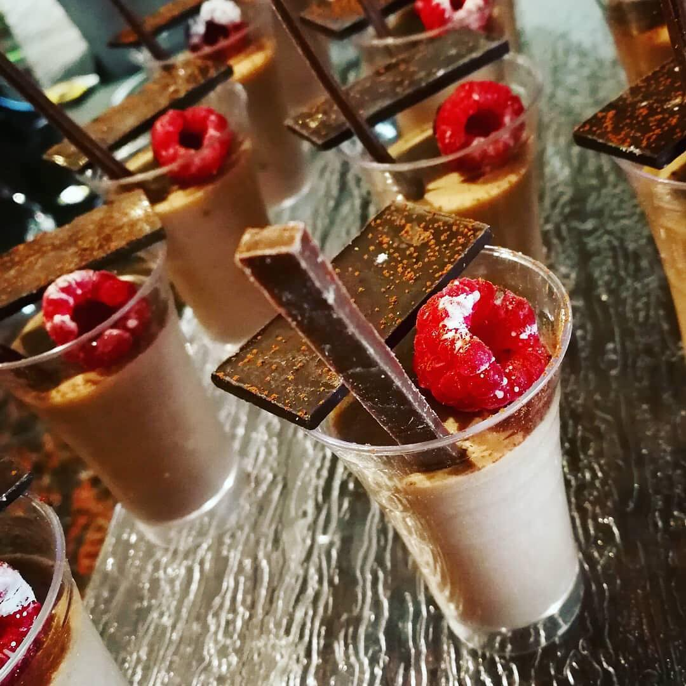
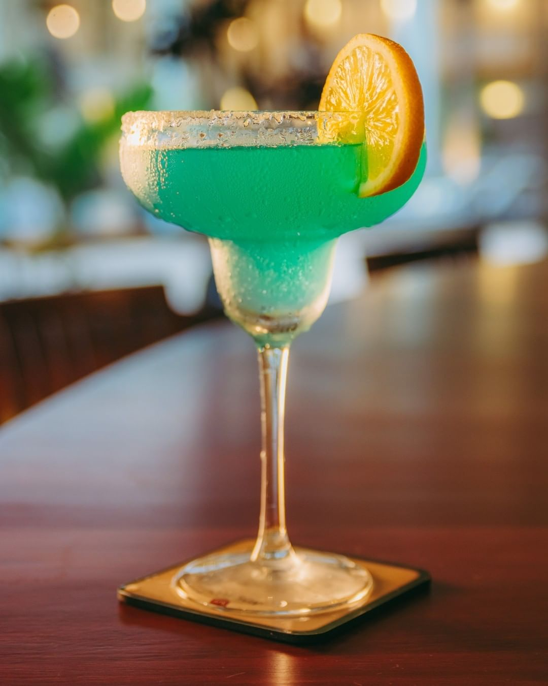
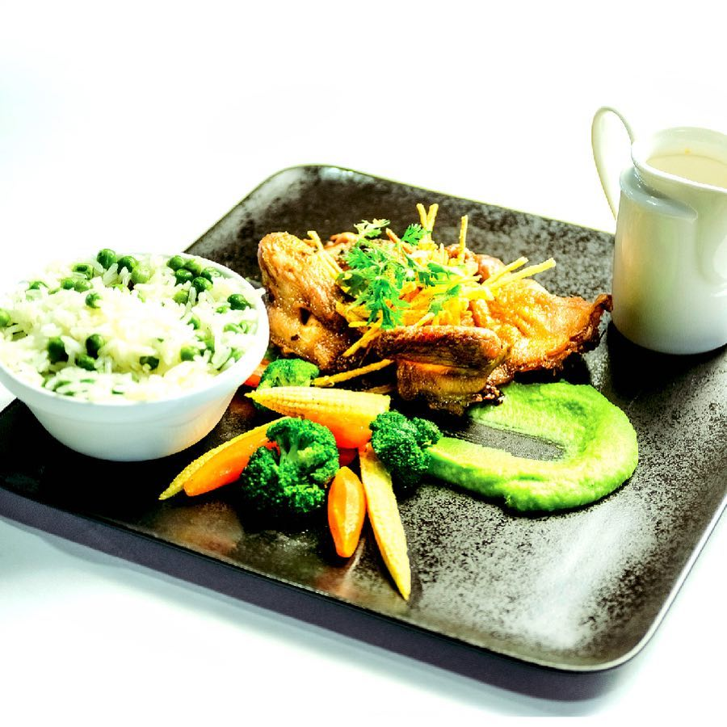

Movenpick Hotel is a 5 star hotel located in the heart of Westlands. It has amazing scenery and it is definitely a place worth visiting.

It has luxurious conference rooms which are absolutely amazing and serein, it also does not disappoint in terms of having a very strong WIFI connection. Other than the beautiful scenery, Movenpick Hotel also has great food and i loved their calamari rings. Calamari comes from the Italian word 'squid'. To prepare the calamari rings, the squid has to be cleaned by removing the head, viscera and inner cartillage 'squill' along with the fins and skin. The tentacles and body are the edible portions. The squid body is sliced crosswise which yields the characteristic shape of the rings. Calamari rings are usually prepared quickly to prevent it from being tough and rubbery. They are then served with a lemon slice and parsley and also either marinara sauce, tartar sauce or aioli. Trust me i know it may sound disgusting especially if your not a fan of or have never tried sea food before, but these dish is absolutely delicious and is definitely worth trying because it's not gonna disappoint. Calamari rings taste rather mild, slightly sweet and almost producing a nutty flavour. THey are also kinda crunchy because of the batter coating and rather firm and gummy.

If you are a chocolate addict, Movenpick Hotel has an interesting surprise for you with their chocolate hour which is on a daily basis at the lobby from 4PM-5PM.

You get to enjoy the savoury taste of the chocolates as they melt in your mouth filling it with sweetness.

Movenpick also has amazing cocktails at the Kijani Bar that you all should definitely have a taste of, not forgetting their leisurely and delicious brunch at Baluba Restaurant every Sunday from 12.30PM-4PM.

#### WHAT TO LOOK OUT FOR

Movenpick Hotel and Residences is a really great place to be at but the service was a bit lagging.

