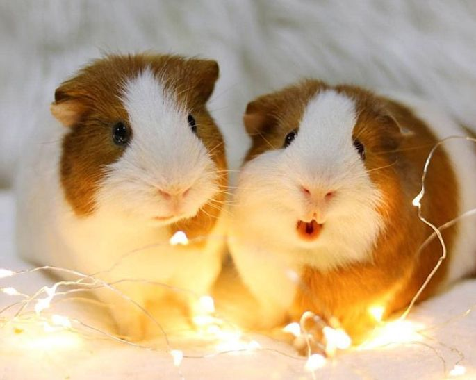

Most of us at some point in our lives we've had pets as companions. Having an animal as a pet is great although pets require constant attention and also they need to be well taken care of and regularly taken to the vet. But if you are usually alone most times then having a pet with all its responsibilities won't be much of a big deal to you because lets face it, what better thing do you have to do. I broke down a list of some very cute and somewhat low maintenance animals you can have as pets.

_**CUTEST ANIMALS TO HAVE AS PETS**_

_**BIRDS**_

There are a variety of cute birds you can keep as pets such as: Finches, Canaries, Parakeets, Cockatiels and even Parrots. Parakeets have very colourful feathers and are very gentle and easy to handle. They can also learn songs and words from their human companions. Finches and Canaries are also very beautiful and fascinating to watch and they provide soothing music with their soft chirps and chatter. Cockatiels are excellent at mimicking whistles and words. Parrots are very talkative and also very good at mimicking people. If you are a bird person, there is a very large variety to choose from and also, birds do not require alot of work and their colourful feathers only add beauty to your homes.

_**FISH**_

I bet we've all seen Finding Dowry/Nimo. The fish in that particular animation are very colourful and are usually kept in an aquarium. Some of the common pet fishes are; Golfdish, Guppy, Neon Tetra, Green Swordtail among others. Fish are known to provide a calming effect when you watch them glide through the water and they are also less expensive to take care of in terms of feeding them compared to other pets so they are a very good investment.

_**GUINEA PIGS**_

Guinea Pigs are very cute and they are also very social and love human company. THey are low maintenance as well and they take up a little space because they live in a cage. THey are also highly intelligent and can be taught tricks during their floor time. THey are also very quiet and are big cuddle lovers.

_**RABBITS**_

If you are looking for cuddly pets, rabbits may be just what you need. They are very social and form srong bonds with humans. They are also very quiet and take up a little space once they are put vin a cage. They are also low maintenaance and are really not a bother to have around.

_**CATS**_

Cats are a popular choice for a pet for many people. Cats are wonderful pets because they will keep your house pest free and also are very photogenic, so if you love taking photos, you can take hilarious photos with your cats in it. Cats are also low maintenance and very playful and they groom themselves.

_**DOGS**_

Dogs are also a popular choice for people who are looking for pet companions. I f you are not a cat lover, most prolly you love dogs instead but there are some people who are also afraid of either all are a particular breed of dogs such as the german shepherd. My personal favourite dog breeds is the Poodle,Cavalier King Charles Spaniel, Chihuahua, among others. Dogs are very good companions and they are very loyal to their owners, they are also very good snuggle buddies.

_**HAMSTERS**_

Hamsters are small enough to be carried with ease and they are also always on the move, so they will keep themselves in shape. THe more you play with your hamster, the friendlier they will be.
