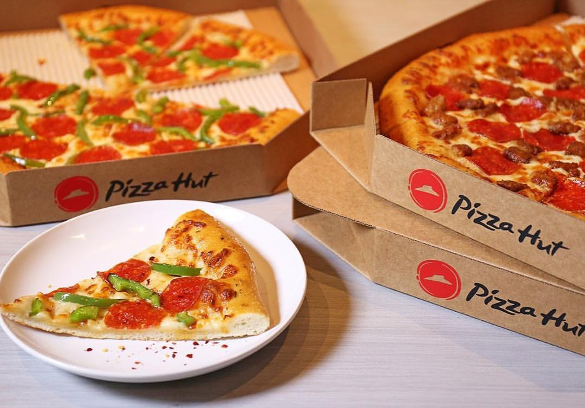
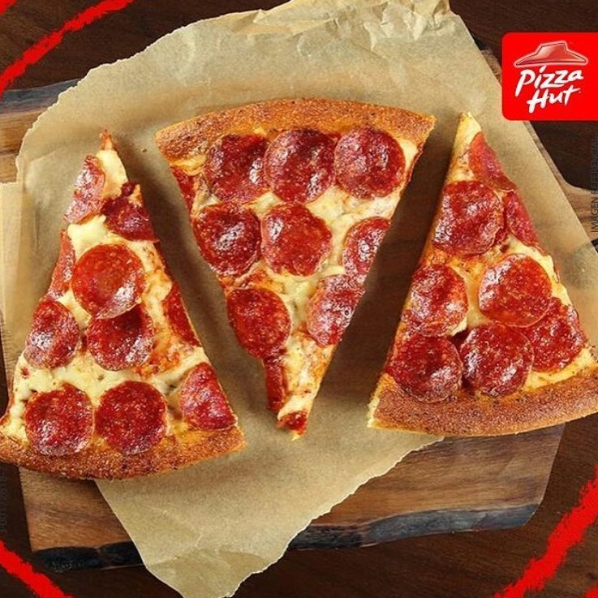
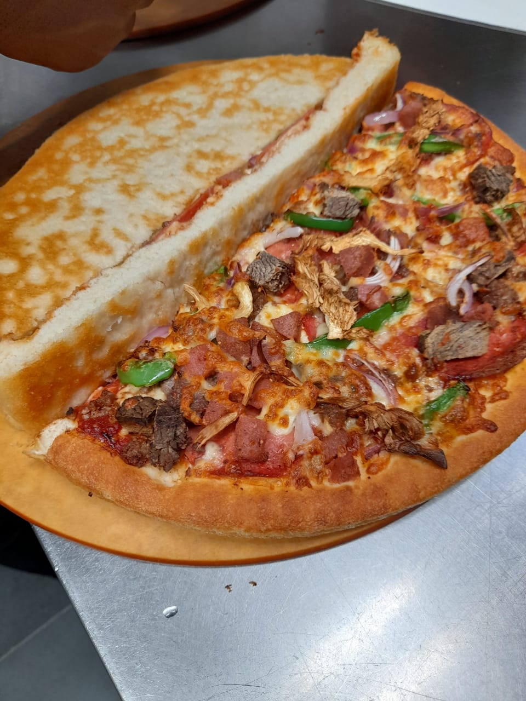
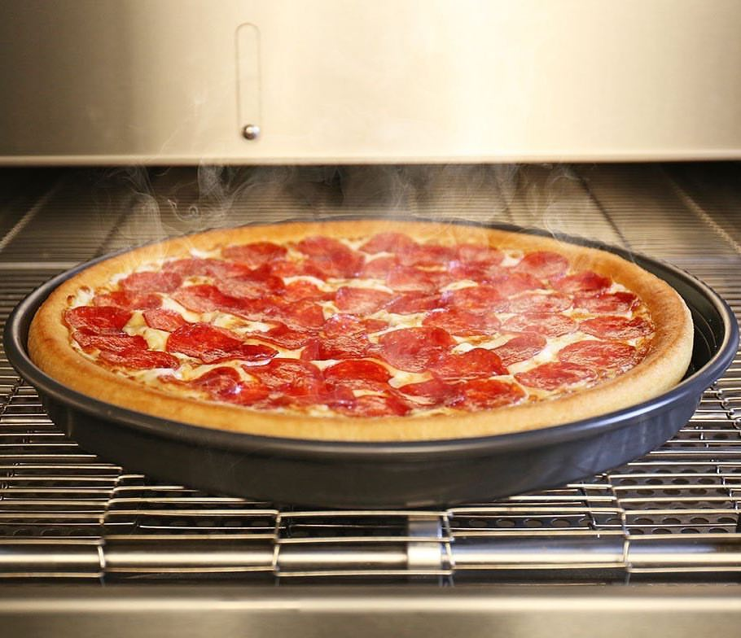
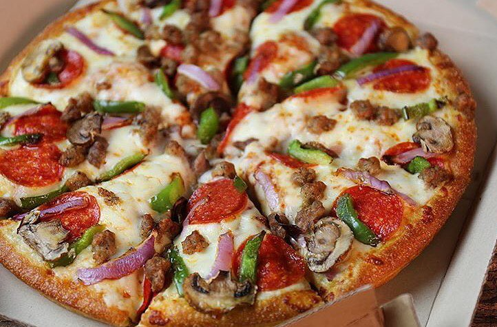

So yes, i love pizza and i have had my share of trying out different pizza joints but yall gottta trust me on this one, pizza hut has absolutely amazing pizza. I wonder why i hadn't try it out earlier. Pizza hut is one of my favourite pizza joints right now and if you haven't tried their pizza, then meeehn you missing out on a whole lot of flavour mixing up in your mouth.

I have tried a couple of flavours from pizza hut but my absolute favourite flavour is the pepperoni pizza, you can never go wrong with pepperoni. The crust is cooked to perfection, not that thick and not that thin, the toppings and pepperoni add a meatiness and spice and is so delicious and the cheese, lets just say it all melts in your mouth. I really don't like cheese but on pizza, it adds an awesome twist to the flavour.

Pizza hut has amazing offers that you would definitely not wanna miss out on, so next time, you wanna buy pizza, try something different and order your favourite flavour at pizza hut to get a mouth watering experience, i mean you can prolly eat their pizza, all day everyday. Pizza hut has a couple of branches in the following places; Yaya Center, Westgate Mall and Village Market. 

