#### PSYCHOLOGICAL THRILLER MOVIES OF ALL TIME

If you love movies that have obssessive psycho's in it, then i may have just made your day by outlining some of the movies that you have to have seen by now, if you haven't well, have a seat and lemme blow your mind.

_**YOU**_

You is a thriller series with 2 seasons and its composed by Blake Neely. Its story is about a brilliant male bookstore manager, Joe who crosses paths with an aspiring female writer and he tries to answer the question, what would you do for love? A charming yet awkward crush becomes something even more sinister when the writer becomes the manager's obsession. Using social media and the internet, he uses every tool at his disposal to become close to her, even going so far as to remove any obstacle, including people that stand in his way of getting to her. Sounds chilling, right? I f you haven't seen this one, oh man you need to hop on netflix rynna and binge watch the heck outta this show.

_**TELL ME A STORY**_

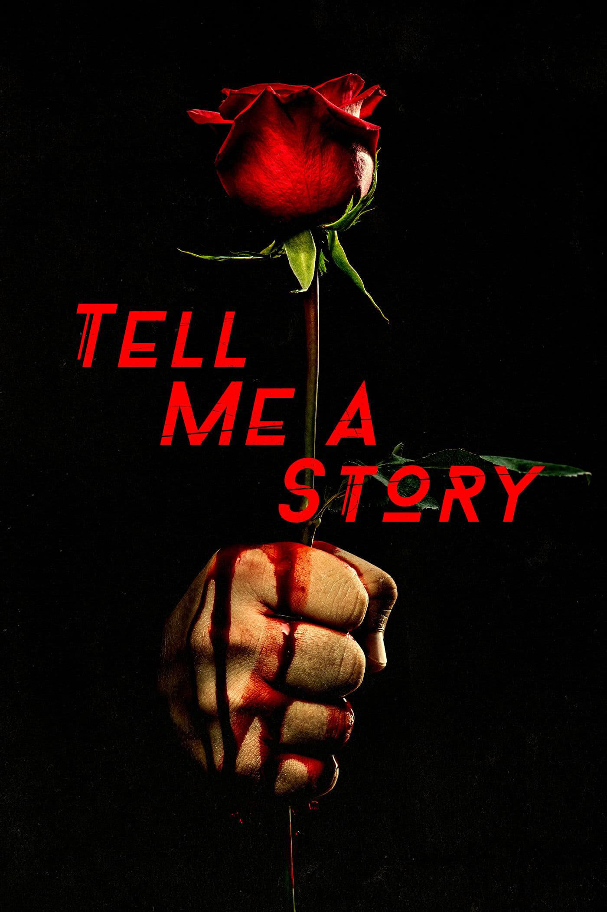

Tell Me A Story is another thriller series with 2 seasons. Its a combination of different fairy tales intertwined into a tale of love, loss, greed, revenge and murder. The first season narrates, The three little pigs, Little Red Riding Hood and Hansel and Gretel and the second season narrates Beauty and the beast, Sleeping beauty and Cinderella. The series is not actually these fairy tale stories because unlike those stories, these ones have an added twist and alot of obessive stuff going on that you should definitely take your time and see.

_**DEXTER**_

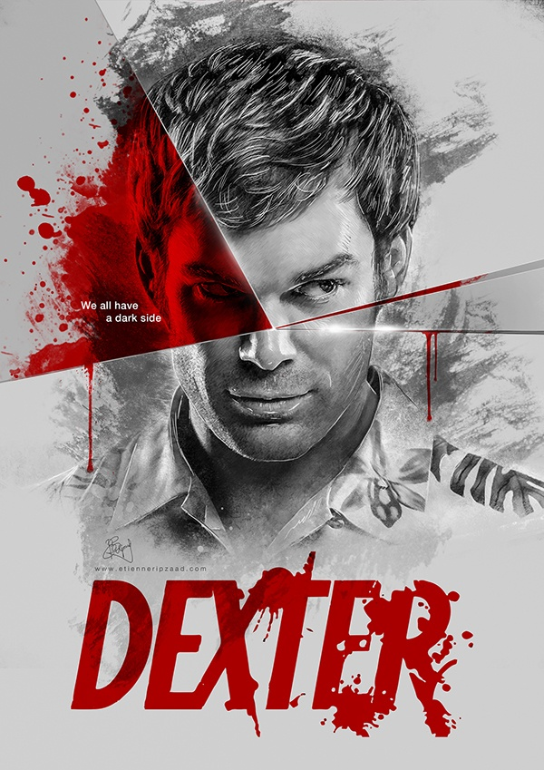

Dexter is a yet another series with 8 seasons. The series is about Dexter Morgan, a man with homicidal tendencies who lives a double life. He works as a forensic technician for the police department during the day and kills heinous perpetrators in his free time. I kinda have chills talking about it, but am definitely intrigued and definitely would wanna watch this series again and so should you.

_**GERALD'S GAME**_

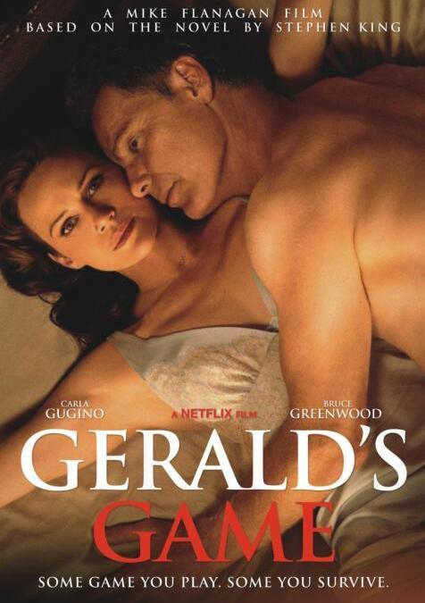

Gerald's Game is a movie that was directed by Mike Flanagan and its story is about a woman who accidentally kills her husband during a kinky game. Handcuffed to her bed with no hope of rescue, she begins hearing voices and seeing strange visions. Don't miss out seeing things getting strange in this movie.

_**WHEN THE BOUGH BREAKS**_

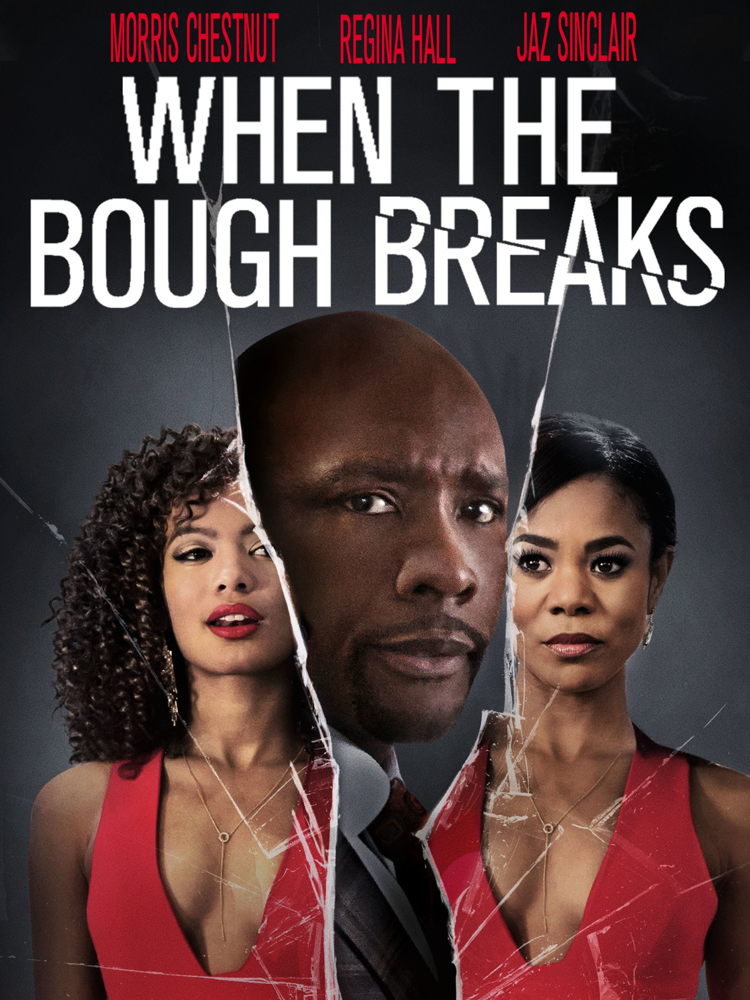

When the Bough Breaks is another rather interesting thriller movie and it was directed by Jon Cassar. Its story is about John and Laura Taylor who hire Anna to be a surrogate mother for them. But Anna hampers her boyfriend's plan of demanding money from them when she develops a psychotic obsession for John. Ya'll need to watch this story as it unfolds before your eyes and get mind blown.

_**THE ROOMMATE**_

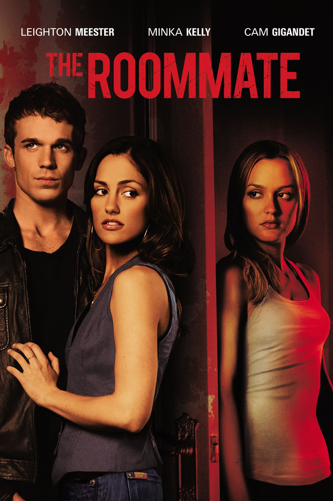

The Roommate is yet another thriller movie that was directed by Christian E. Christiansen. Its story is about Sara, a college student, who meets Rebecca and shares a room with her. They start off as friends but things turn deadly as Rebecca becomes obsessed with Sara and begins to target people in her life. Yaaasss, psycho stuff once again, but if you are a fan, you need to find and tune in to watch this movie.

_**THE FALL**_

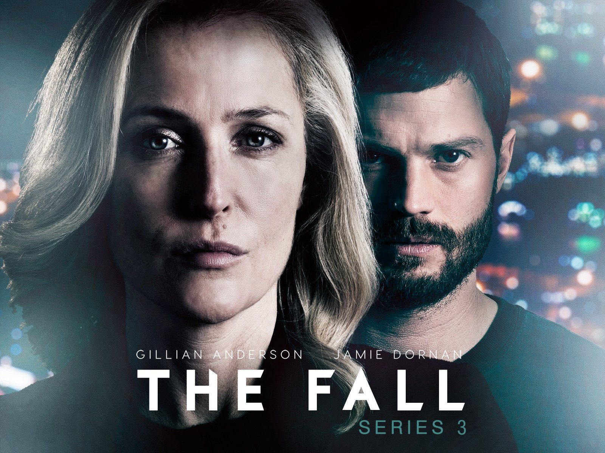

The Fall is a crime thriller with 2 seasons. Its story is about the lives of two hunters, one is a serial killer whp preys on victims in and around Belfast, Northern Ireland, and the other is a female detective drafted from the London Metropolitan Police to catch him. The local authorities have no suspects and no experience with cases involving sexually motivated serial killers; DSI Stella Gibson has. She heads a taskforce dedicated to solving the crime spree, with a simple motto: Anyone not part of the solution is a part of the problem. The killer? He's Paul Spector, a father and a husband leading a double life, as viewers learn from the outset. He's hiding in plain sight, the protagonist in a cat and mouse game that is every police officer's worst nightmare.

_**CASTLE ROCK**_

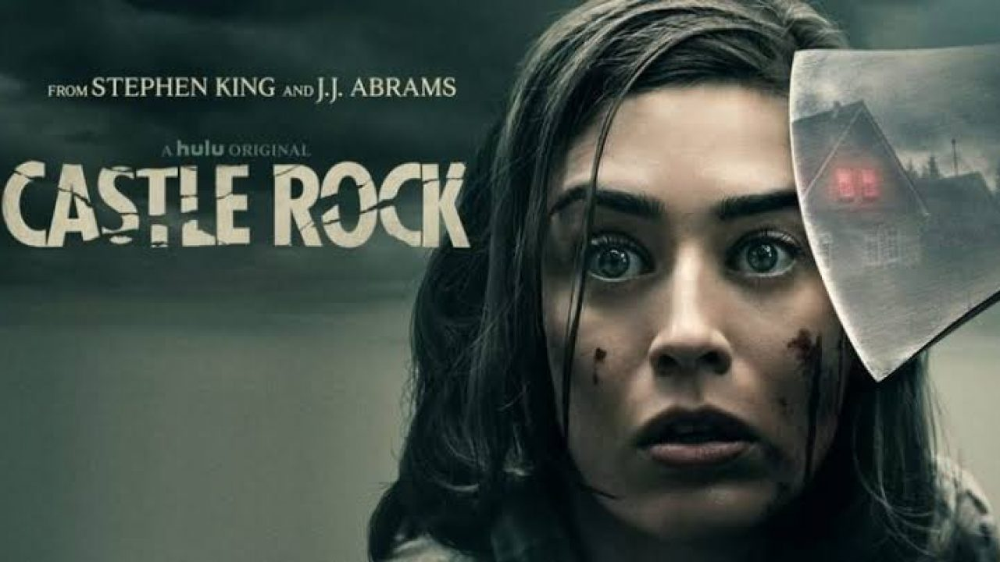

Castle Rock is a sci-fi thriller with 1 season. Its story explorers themes and worlds that unite King's canon, including the infamous Shawshank Prison. An anonymous phone call lures death-row attorney Henry Deaver back to Castle Rock. He is unsettled by his hometown, but he returns to help a sinister, mostly mute man being kept in a cage underneath Shawshank.

_**BATES MOTEL**_

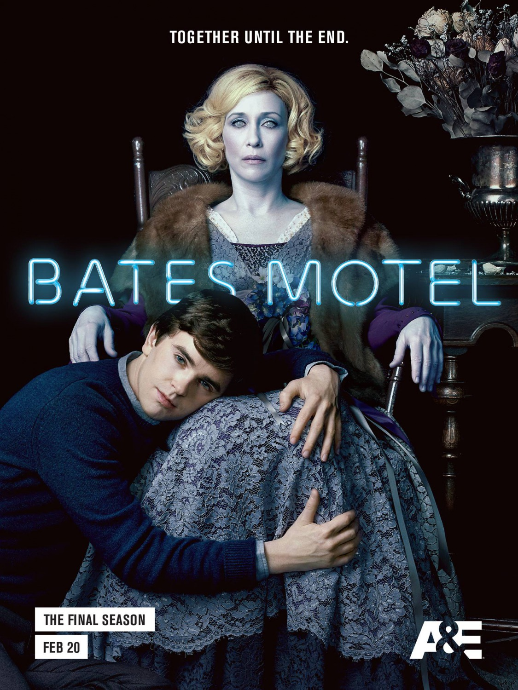

Bates Motel is more of horrorish and it has 5 seasons. Its story is about Norman Bates whose life spins out of control when his mental health deteriorates. Meanwhile, his mother, Norma, tries to get him the help he neds and protects him from the people around them.

_**BENEATH THE LEAVES**_

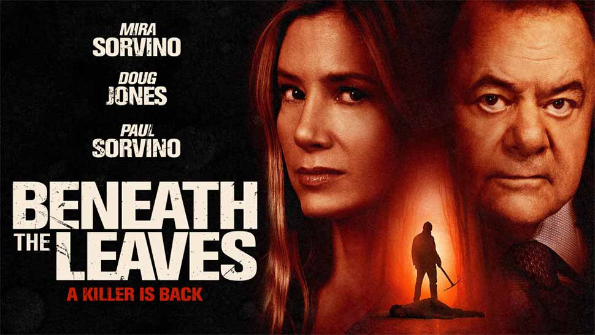

Beneath The Leaves is a thriller movie that was directed by Adam Marino. Its story is about a deranged psychopath who had been incarcerated for years for attempting to murder four boys and he escapes prison determined to finish the job.

_**MY TEACHER, MY OBSESSION**_

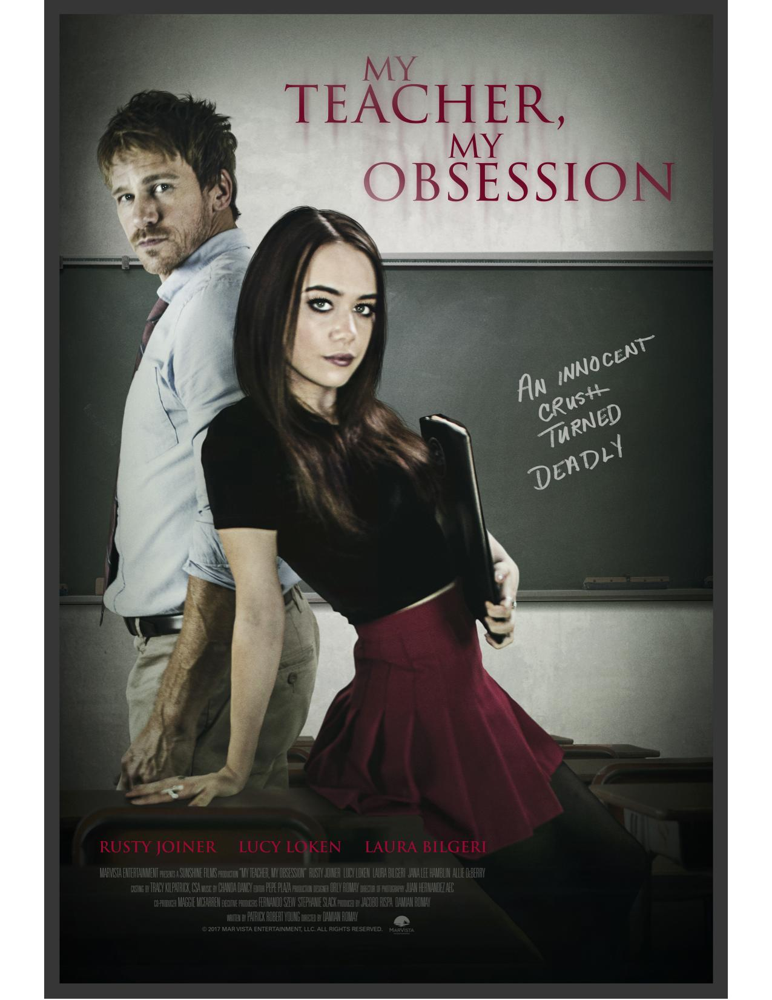

My Teacher, My Obsession is a thriller film that was directed by Damian Romay. Its story is about a girl names Riley who struggles to meet friends after transferring to a new high schoolwhere her father is an English teacher. When she meets Kyla, a fellow loner, they become close friends until Riley learns that Kyla is obsessed with her father.

_**IN THE SHADOW OF THE MOON**_

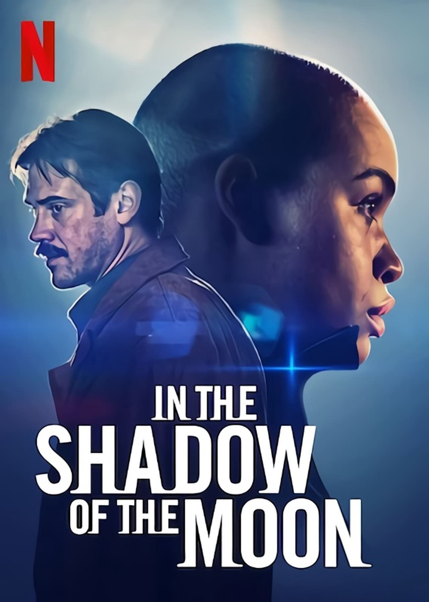

In The Shadow Of The Moon was directed by Jim Mickle. Its story goes back to the year 1988 and is about a police officer who is hungry to become a detective and begins tracking a serial killer who resurfaces every nine years. But when the killer's crimes defy all scientific explanation, the officer's obsession threatens to destroy everything.

_**SECRET OBSESSION**_

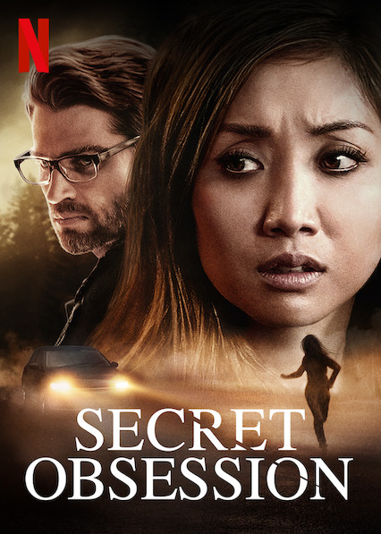

Secret Obsession is yet another thriller movie and it was directed by Peter Sullivan. Its story is about a girl named Jeniffer who wakes up with amnesia after a traumatic attack and her husband takes care of her but she soon realises that her being in danger is far from over.

_**ONLY MINE**_

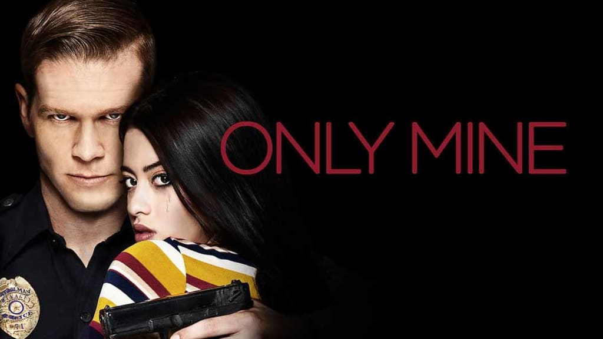

Only MIne is a thriller film that was directed by Michael Civille. Its story is about a small town girl who must find a way to save herself from the violent retalliation of the cop he dated who turned into an obsessive stalker.

_**OBSESSED**_

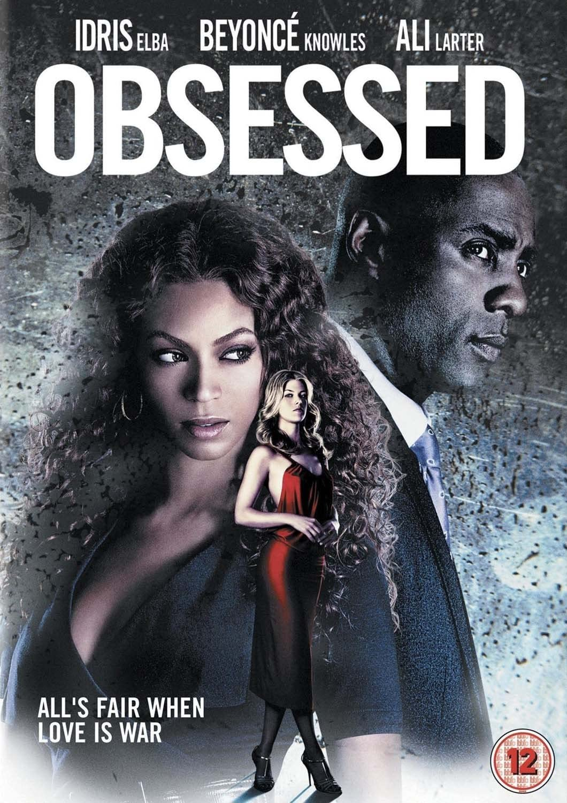
Obsessed is a thriller movie that was directed by Steve Shill. Its story is about an asset manager who leads a happy and stress free life with his wife. Things take a turn when his colleague starts stalking him, threatening to ruin his career graph.
