#### LIST OF REALITY SHOWS FOR EVERYONE!!!

"I think i have watched everything on netflix and youtube!". This is probably what most of ya'll are saying right now. We don't have that much to do since we've probably done everything we can to have fun in the comfort of our homes and that may not be enough for most of us. We always need something to do each and every single day to keep our sanity in check. Well, if you feel as though you have watched everything on netflix or youtube, am certain that you have boxed yourself to watch things that you are usually into and that's the problem, why don't you try watching something you have never thought you'd watch. For example, if you are not a big fan or have never attempted to watch reality shows, well i have a list that will literally blow your mind because there is something for everyone.

_**SURVIVOR**_

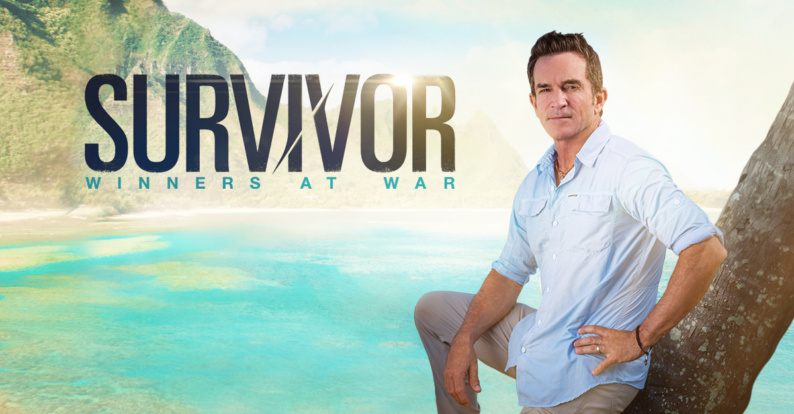

Survivor is an adventure reality show with 39 seasons. The reality series is hosted by Jeff Probst and it stars surving contestants whereby they are taken to an island and here they have to compete to become the ultimate survivors for example for this season, they were taken to the Edge of Extinction where players who have never been voted out are pushed further than ever for a chance to get back in the game. The castaways compete against each other with the ultimate goal to outwit, outplay and outlast each other in an attempt to become the Sole Survivor, again. If you like seeing people competing for something then this show is definitely one that you should give a try before we go back to our everyday busy lifestyles.

_**SHARK TANK**_

Shark Tank is a reality show that was first created in 2009 and it currently has 10 episodes. The executive producers of the show are; Mark Burnett, Laura Roush, Kate Ryu and Clay Newbill among others. Shark Tank is about aspiring enterpreneurs from around the world who pitch their business models to a panel of investors and persuade them to invest their money in their ideas. If you are a business minded person, you should definitely give this show a try because you can get amazing business ideas that can even help you start or improve your business, so you it will kinda be like your working towards trying to improve your business in the comfort of your homes.

_**LOVE AND HIPHOP ATLANTA**_

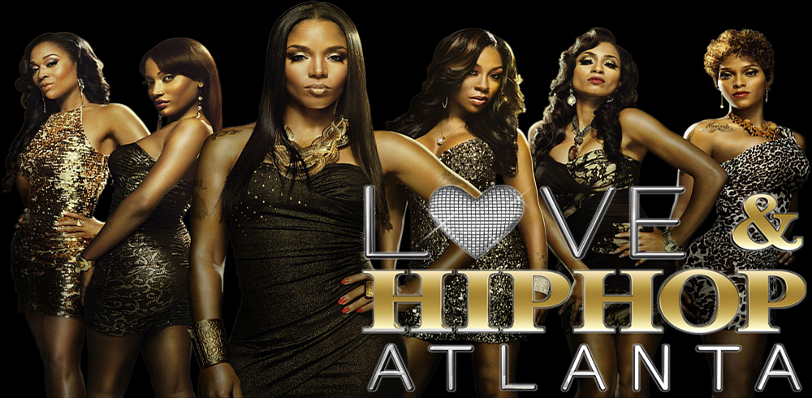

Most of ya'll are prolly familiar with this particular reality show. Love and Hip Hop Atlanta has 5 seasons and it was produced by; Mona Scott-Young and Stefan Springman. The show is about the tale of striving for stardom in the rap game while trying to survive relationships and family struggles. The competition to take the next step in the careers of these fiery women is fierce and they're not about to let any obstacle, be it personal or professional stand in their way. Common names you may run into in this show include; RnB singer Karlie Redd, Stevie J and Mimi Faust among others. If you love drama, don't wait for your neighbours to create some, tune in to Love and Hiphop Atlanta and get entertained at home.

_**CATFISH**_

Catfish is a reality TV show with 7 seasons. It is produced by Ariel Schulman and it first aired in 2012. The show is about helping emotionally entanled people discover whether their online relationship is real or not. The hosts who help them find out are Schulman and Joseph. Well, alot of ya'll right now are in online relationships, if you watch this show, you will be in a better position to know if you are being played or not, so tune in to find out the clear tell signs of the stste of your online relationships instead of just assuming he/she is the one and getting your feelings hurt in the process.

_**LOVE AND HIPHOP MIAMI**_

If you are a fun of the love and hiphop franchise then you prolly heard of this one. Love and Hip Hop Miami has 3 seasons and it was produced by; Mona Scott-Young, Toby Barraud, Stefan Springman and Mala Chapple among others. The show is about highlighting the bold, edgy, gorgeous and diverse city of Miami and it delves into its rich culture while featuring tales of striving for stardom in the hiphop, Latin and reggaeton music scenes. Some common names in this show include; Trina, Trick Daddy, Amara La Negra and Gunplay among others. Well, the drama in this series is enough to make you not wanna go out and rather stay glued to your screen.

_**THE CHALLENGE**_

The challenge is yet another adventure series that has 34 seasons. It is hosted by T.J.Lavin. This show brings together veterans of other shows and they compete to prove they still know what it takes to win battling rookies from various reality competition shows such as; The Bachelor, Big Brother and Love Islan among others. Thirty four competitors in all face grueling, physical and mental challenges for their share of \$1 MILLION in prize money. This show is definitely for you if you love winning because you will get tips on knowing what it takes to win more than once in different challenges.

_**AMERICAN IDOL**_

American Idol is a musical reality show with 17 seasons. It is hosted by Brian Dunkleman and Ryan Seacrest. The show is about several participants from America who showcase their musical talents in front of a panel of esteemed judges to win the title of American Idol and a record label deal. If you are a music lover and think yoy have talent, you should definitely tune in to this show and you may even get tips to help you improve your talents and given the opportunity, you would showcase them like a professional.

_**ARE YOU THE ONE?**_

Are You The One is a reality show that was created in 2014 and it has 8 seasons. It has been hosted by Ryan Devlin and Terrence J. In this show, modern technology is used to help people find love, 20-plus single men and women try to find their perfect match. A dating algorithm is used to help quantify compatibility, using a process that includes in depth interviews, questionairres and compatibility testing. That data is used to identify the ideal pairs among the participants but the results are kept secret from the singles who get to know one another socially and undergo weekly tests to try to pick their ideal mates while living together. If the mates they choose do not match that of the data, they must start their search over. If all of the singles are able to match up with their predetermined partners, their share a cash prize and wealk away with a potential life partner. If you lost hope in finding love, this is definitely a MUST SEE show for you, because at least it will give you hope that your love life indeed can be saved.

_**KEEPING UP WITH THE KARDASHIANS**_

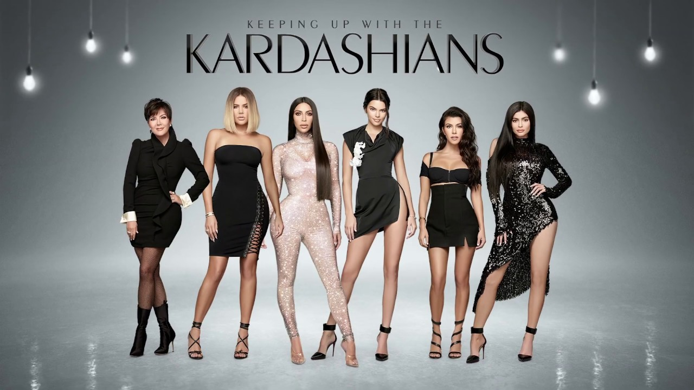

KUWTK is one of the most famous reality shows. It is a drama reality show with 15 seasons. It is produced by Kim Kardashian, Kourtney Kardashian, Khloe Kardashian and Kris Jenner among others. KUWTK is about high profile celebrity members of the Kardashian-Jenner family and they give us a glimpse into their personal lives and they reveal secrets about their family and relationships. If you haven't watched this one yet, you really need to because it got lots of drama which usually ends up trending on various social media platforms.

_**EXTREME MAKEOVER:HOME EDITION**_

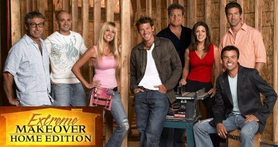

Extreme Makeover Home Edition is a reality show with 10 seasons. It is hosted by Ty Pennington and Jesse Tyler Ferguson. The show is about a weekly race against time as a team of designers, contactors and several hundred workers have just seven days to rebuild an entire house. Well, i'd say this show is suitable especially for those of us who are or aspire to be architects and engineers, this show can give you plenty of ideas with your projects.

_**SAY YES TO THE DRESS**_

Say Yes To The Dress was created in 2007 and it has 16 seasons. It is narrated by Roger Craig Smith. It is about sales associates, managers and fitters at various stores across Manhattan who help brides to be to choose the perfect dress for their wedding. Ladies, this is a MUST WATCH if you desire to get married someday because you will get insight to how to choose the perfect dress for your wedding without going through alot of trouble when that time comes.

_**AMERICA'S NEXT TOP MODEL**_

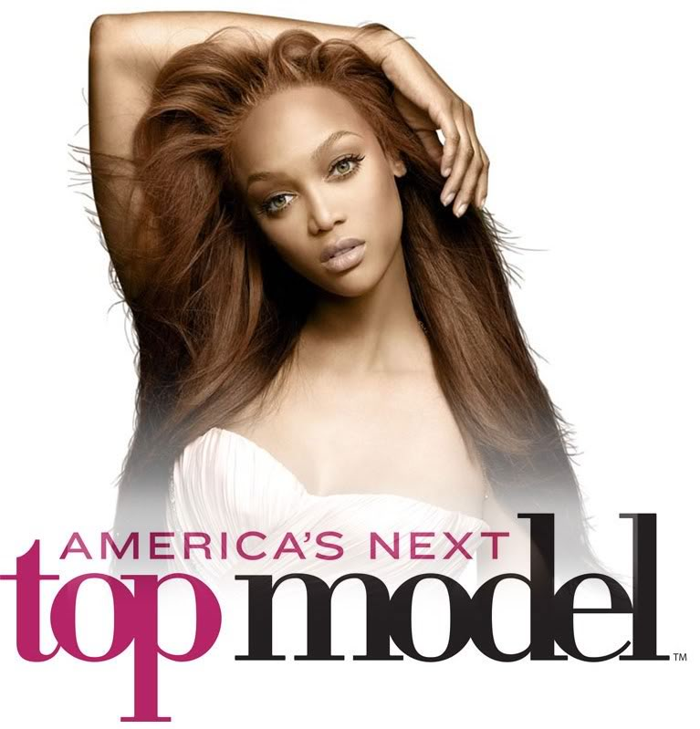

America's Next Top Model was created in 2003 and has 24 seasons. It is hosted by Tyra Banks and Rita Ora. It is about aspring models who compete against each other in a series of challenges in order to win lucrative career opportunities in the modelling industry. The judges who help determine the winners are; Janice Dickinson, Nigel Barker and Nole Marin. If you are a model or aspire to be one, this show will definitely give you tips on how you can brush up on your weaknesses before trying out for a modelling gig.

_**EX ON THE BEACH UK**_

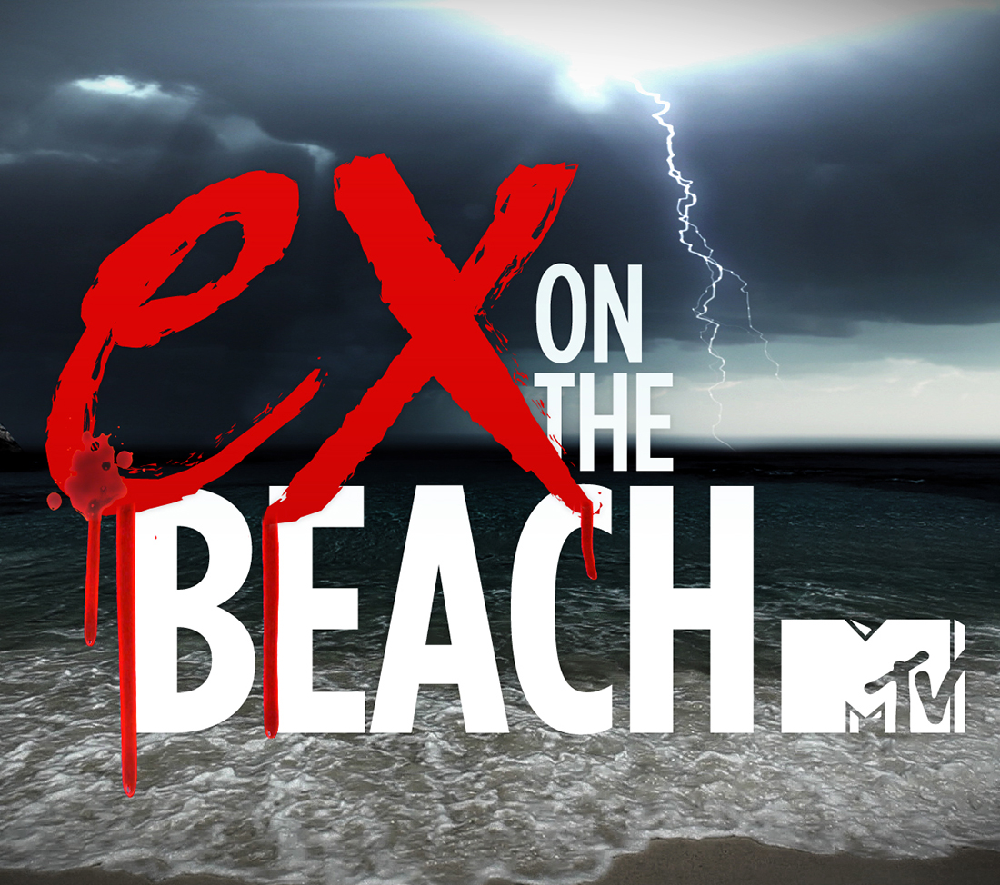

Ex On The Beach is areality series that first aired in 2014 and it has 9 seasons. It is about 8 single guys and girls who head to the beach to enjoy summer holiday in paradise until their exes turn up. We've all most prolly been in realtionships at one point or another and 'our exes' is usually one very touchy subject and talking about them may give u chills, this show helps you get tips on how to deal with your exes in case you randomly run into them in unexpected places.

_**THE AMAZING RACE**_

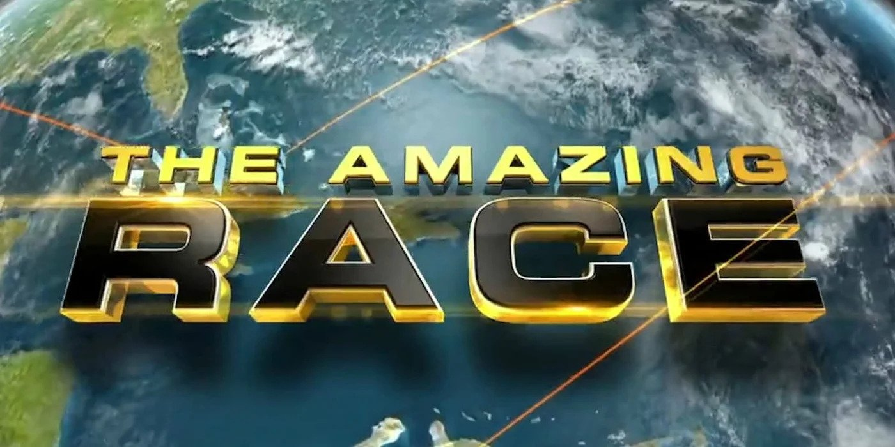

The Amazing Race is yet another adventure series with 31 seasons. The show is hosted by Phil Keoghan and is about teams of two people who compete against each other in a race held in different parts of the world and they strive to win a grand prize. If your bored and need something to watch, this show will definitely make things interesting for you because you get to root for your favourite team of two and follow their journey till the end to see if they win or lose.

_**THE REAL HOUSEWIVES OF ATLANTA**_

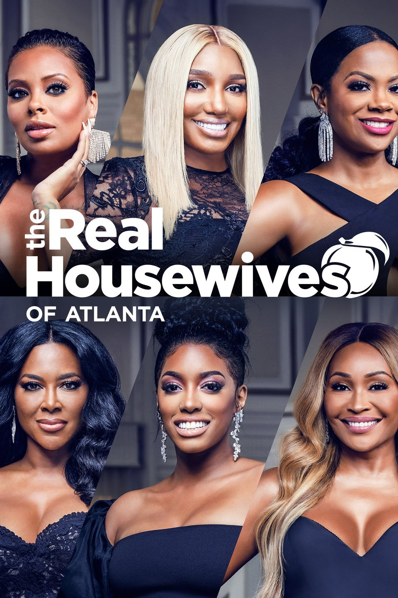

The Real Housewives Of Atlanta was created in 2008 and it has 11 seasons. This show is about Atlanta housewives and their relationships which are the main subject of discussion as their love lives experience ups and downs. The women enterpreneurial spirits are also in full bloom as they juggle their personal and professional lives along with their busy personal calendars. Yet more drama for ya'll to get into while in the comfort of your homes.

_**BASKETBALL WIVES**_

Basketball Wives is a reality show with 7 seasons. It was created by Shaunie O'Neal and Lisa Shannon. The show is about best friends who are either the wife, ex-wife or girlfriend of an NBA superstar. Though they drive expensive cars, live in mansions and wear designer clothes and jewellery, their life is not always glamourous. They have to protect all that they have from groupies, dealing with the jealous kind and trying to find stable ground in their often unstable world.This just sounds like a reality show with alot of drama to unpack during this quarantine period.

_**THE BACHELOR/THE BACHELORETTE**_

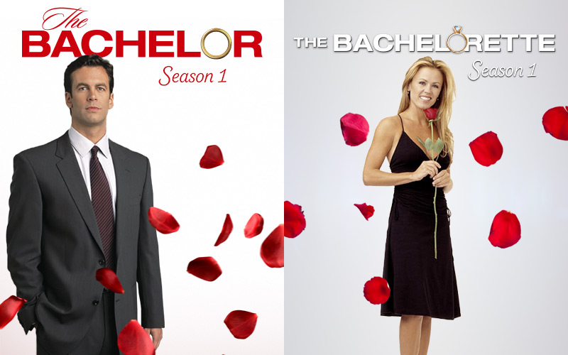

The Bachelor is a romantic reality show with 22 seasons. The show is about a bachelor/single man who dates a group of women over several weeks to find his true love and life partner. These women compete in a series of challenges that are meant to prove their compatibility with him.

The Bachelorette is a drama and romance reality show with 10 seasons. The show is about a bachelorette/single woman who gets a chance to date various men over a period of several weeks in a quest to find true love and decide whom she will marry.

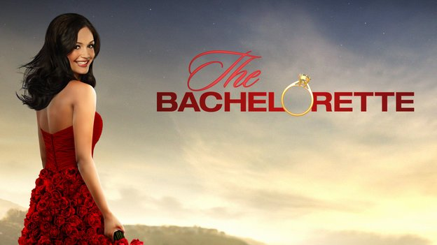

Both of these shows revolve around love so if you are a sucker for romcoms then this reality shows have got you covered as you take a chill pill in the crib.

_**LOVE AND HIPHOP NEWYORK**_

Love and Hiphop NYC is yet another show from the love and hiphop franchise and it has 10 seasons. It is directed by David Wolfgang and Josh Richards. The show is about women who have supported their men on the road to hiphop stardom while they themselves remain in the background. These women are now looking for their share of the spotlight and alot more respect. The show features young talented artists and managers who are hungry to make it big in NYC.If you love the love and hiphop franchise and haven't given this show a shot then you most definitely have to and see tdrama unfolding before your eyes.

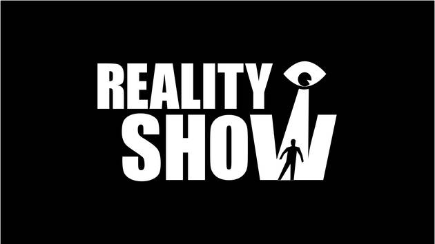
