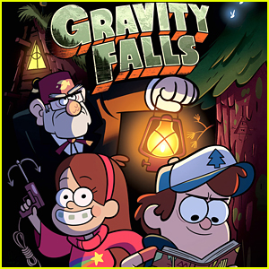
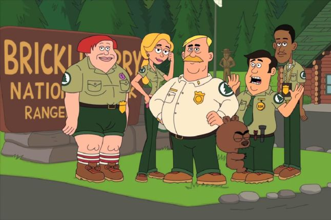

For all the animation lovers, you are probably wondering what type of animations should i watch next. Well, here is a list of my top 10 greatest animations of all time that will keep you busy and laughing constantly during your free time.

#### TEN: _**AMERICAN DAD**_

At 10th position,American Dad is an American sitcom with 16 seasons. It was created by Seth MacFarlane, Mike Barker and Matt Weitzman. It's about the Smith's family which consists of four members which include a freaky goldfish that has the mind of a German football player and an alien called Roger. Smith, along with the CIA, tries to save America from every threat.

#### NINE: _**LEGENDS OF CHAMBERLAIN HEIGHTS**_

Legends of Chamberlain Heights is an American sitcom with 2 seasons. It was created by Quinn Hawking, Josiah Johnson, Brad Ableson, Michael Starrbury and Mike Clements. It's about best friends Grover, Milk and Jamal who may just be benchwarmers on their basketball team at Michael Clarke Duncan High School, but they have lofty dreams. The freshman want to earm their peers' respect and become legends at the school, but they have a long way to go to achieve that status. They have to prove themselves to be champions, both on and off court, to ascend the social ladder. Former college basketball players Quinn Hawking and Josiah Johnson served as the inspiration for the characters.

#### EIGHT: _**GRAVITY FALLS**_

Gravity Falls is a sitcom with 2 seasons. It was created by Alex Hirsch. Its about twins Dipper and Mabel who travel to the mysterious town of Gravity Falls in Oregon for their summer vacations but are shocked after they discover some strange occurrences.

#### SEVEN: _**BRICKLEBERRY**_

Brickleberry is also an animated sitcom with 3 seasons. It was created by Roger Black, Comedy Central and Waco O'Guin. It's about fledgling Brickleberry National Park which is facing its demise as a tourist attraction, its future in the hands of a dysfunctional group of forest rangers. To help save Bricleberry, top ranger Ethel Anderson is summoned from Yellowstone. Her park skills, not to mention her sex appeal, are seen as a threat to reigning ranger of the month, Steve Williams, who does everything in his power to make Ethel look bad. The head ranger, Woody Johnson, is a hapless sort who always has the park's best interests in mind, even if his ideas on how to run it aren't nearly the best. Woody takes comfort in his pet, Malloy, a vulgar and spoiled grizzly cub who loves to put down the other rangers especially Steve.

#### SIX: _**SOUTH PARK**_

South Park is a very funny sitcom with 22 seasons. It was created by Trey Parker and Matt Stone. Its about four young schoolgoing boys, Stan Marsh, Kyle Broflovski, Eric Cartman and Kenny McCormick, who live in South Park set out on various adventures.

#### FIVE: _**ARCHER**_

Archer is an American Sitcom on FX, FXX networks with 10 seasons. It was created by Adam Reed. It's about Suave international spy Sterling Archer and his cohorts at a New York based intelligence agency battle rival spies, exotic enemies and their own dysfunctional personalities.

#### FOUR: _**THE BOONDOCKS**_

The Boondocks is a comedy series with 4 seasons. It was created by Aaron McGruder. It's about cantankerous Robert "Granddad" Freeman who is the legal guardian of his grandsons, 10 year old revolutionary Huey and 8 year old Riley, a product of contemporary rap culture. After moving the family from Chicago's South Side to the safety of suburban Woodcrest aka the boondocks, granddad hopes to ignore the grandkids and enjoy his golden years in peace. But the kids have different plans, torturing each other and provoking others in the neighborhood. No matter how wild they get, Huey and Riley are no match for the eccentric elderly man.

#### THREE: _**SIMPSONS**_

Simpsons is one of the oldest and greatest sitcoms of all times with 30 seasons. It was created by Matt Groening. It's about a working class father, Homer Simpson and his dysfunctional family deal with comical situations and the ups and downs of life in the town of Springefield.

#### TWO: _**FAMILY GUY**_

Family Guy is one of the best adult animations with 17 seasons. It was created by Seth MacFarlene. It's about Peter Griffin and his family of two teenagers, a smart dog, a devilish baby and his wife who find themseleves in the most hilarious scenarios.

#### ONE: _**RICK AND MORTY**_

Rick and Morty is the best adult animated American sitcom with 4 seasons. It was created by Justin Roiland and Dan Harmon. It's about Rick Sanchez who after having been missing for nearly 20 years, arrives at daughter Beth's doorstep to move in with her and her family. Although Beth welcomes Rick into her home, her husband Jerry, isn't happy about the family reunion. Jerry is concerned about Rick, a socipathic scientist, using the garage as his own personal laboratory. In the lab, Rick works on a number of sci-fi gadgets, some of which could be considered dangerous. But that's not all Rick does that concerns Jerry. He also goes on adventures across the universe that often involve his grandchildren, Morty and Summer.
