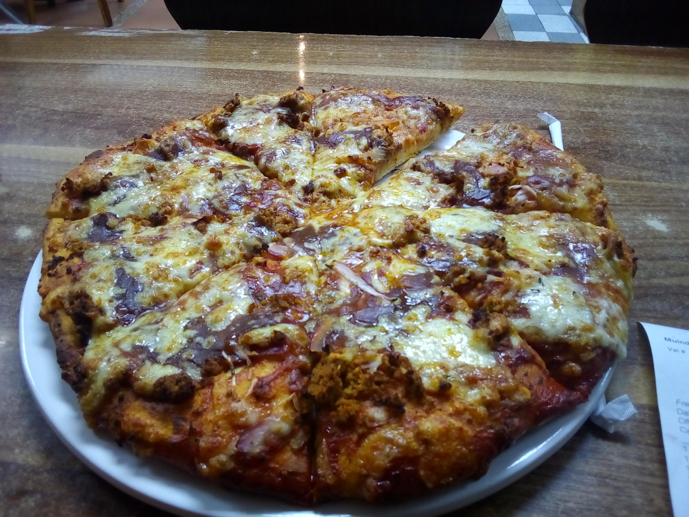
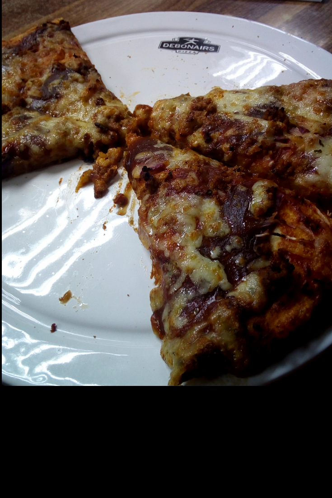

#### Debonairs

Debonairs is a pizza serving restaurant located in a few places in Nairobi such as 27 Muindi Mbingu Street, Total ABC along Waiyaki Way, Ngong Road Uchumi Hyper and at Kiambu Road Quickmart. My experience was at 27 Muindi Mbingu Street which s in town near the Jevanjee Gardens.

Debonairs Pizza offers an opportunity to try something amazing with their variety of pizzas and mind-blowing offers to decide on. Since am a big fan of chicken, my favourite flavour was The Tikka Chicken. The pizza tastes chewy and crispy with the debonairs special sauce the slightly fiery hot chicken pieces and cheese. All these different textures combine with the sauce in every bite to give you an umami savoury effect. The thickness of the pizza based on preference, for me I go with thick and the additional toppings only make the pizza be more to die for. The pizza is usually taken with any fizzy drink of your choice, for me, my preferred option was the Fanta Passion fizzy drink. Debonairs Pizza is one of my favourite pizzerias because of their finger-licking pizza, their special debonairs sauce which is a unique characteristic differentiating them from other pizzerias and they also have fast and exquisite service.

#### WHAT TO LOOK OUT FOR!

They may have delicious pizza but they only have a few outlets within Nairobi which may be strenuous for some people to get to those places just to enjoy a slice of pizza especially for those people like me who prefer having the whole restaurant feel and experience. In as much as they have a free delivery service, the service only applies to a few kilometres from the restaurant.

